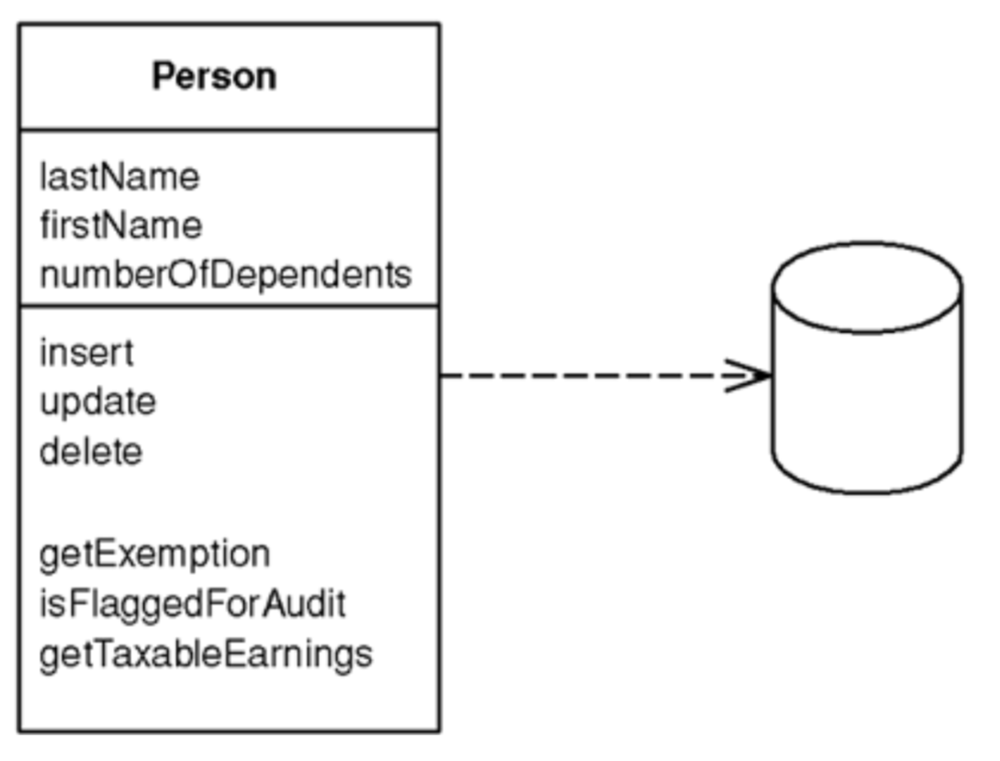
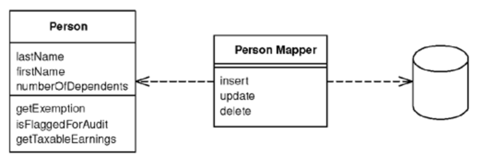
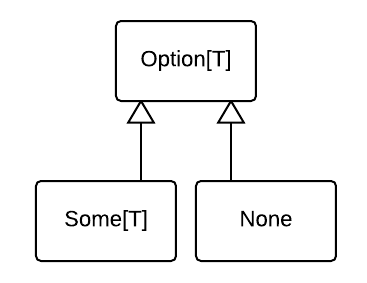
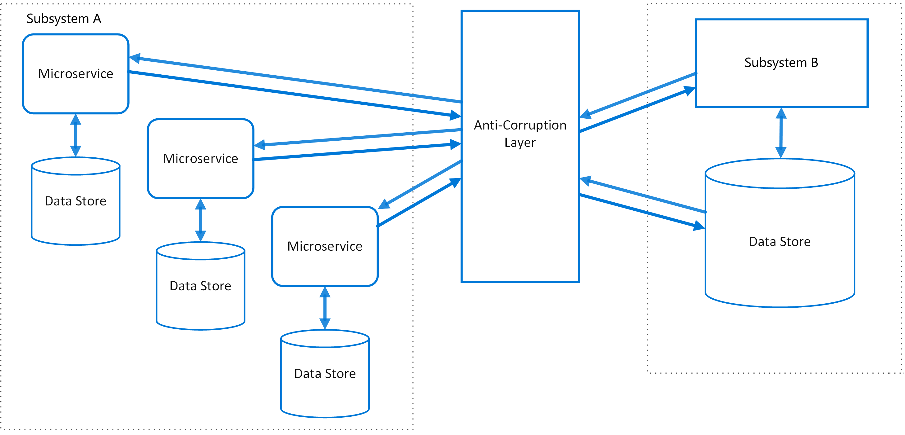

# Table of contents
1. [为什么全局或者静态对象是邪恶的？能够有代码的例子?](#q1)
2. [介绍一下控制反转(IoC)，它是如何提高代码设计的?](#q2)

<div id="q1"/> 

## 1 为什么全局或者静态对象是邪恶的？能够有代码的例子?

对于一个对象，其影响范围越小越好，也就是说其作用域越小越好。对于全局变量，对于所有的模块都有可见性；而静态成员，对于其所有的实例成员也都有可见性，这些将会增加软件的维护的复杂度。
```go
// tiger.go
package animal
var count = 0
func CreateTiger(){
    count++
}
// lion.go
package animal
func CreateLion(){
    count++
}
```
在这里`count`为包`animal`的全局变量，那么包类所有的成员都能访问该对象，一旦对`count`做出修改，就会影响包类全部使用该变量的成员。

<div id="q2"/> 

## 2 介绍一下控制反转(IoC)，它是如何提高代码设计的？
控制反转(`Inverse of Control, IoC`)是将程序控制流交出去，比如使用控制台进行用户信息请求输入
```ruby
puts 'What is your name?'
name = gets
process_name(name)
puts 'What is your quest?'
quest = gets
process_quest(quest)
```
`process_name` 和 `process_quest` 两个函数处理流都是用户程序控制，如果使用window窗口界面完成用户信息请求
```ruby
require 'tk'
root = TkRoot.new()
name_label = TkLabel.new() {text "What is Your Name?"}
name_label.pack
name = TkEntry.new(root).pack
name.bind("FocusOut") {process_name(name)}
quest_label = TkLabel.new() {text "What is Your Quest?"}
quest_label.pack
quest = TkEntry.new(root).pack
quest.bind("FocusOut") {process_quest(quest)}
Tk.mainloop()
```
现在所有的程序控制逻辑交给了`TK.mainloop`，`process_name` 和 `process_quest` 被绑定到相应窗口的控件，至于什么时候执行相应的函数无法控制。

框架(`framework`)是控制反转的代表，框架包含了大量的抽象设计，应用程序在使用过程中，自定义所需的行为，然后被框架调用，整个自定义行为的动作控制流程为框架所接管。在`.NET`中，通过事件`Event`机制，用户注册相应的事件即可完成控制反转。

## 3 迪米特法则（Law of Demeter）表述每个单元最外部了解的越少越好，编写违反这个原则的代码，说明它是不好的设计模式，并且修复它。<a name="q3"></a>

迪米特法则也就是最少知识原则，该原则认为任何一个对象或者方法，它应该只能调用下列对象
- 该对象本身
- 作为参数传进来的对象（也可以是该对象的字段）
- 在方法内创建的对象

这个原则用以指导正确的对象协作，分清楚哪些丢向产生写作，哪些对象则对于该对象而言又应该是无知的。现在假设一个购物的场景，主要有客户(Customer)，收营员（Paper Boy）负责收钱。

```C#
public class Customer {
    public string FirstName { get; init; }
    public string SecondName { get; init; }
    public Wallet Wallet { get; init; }
}

public class Wallet {
    public double Balance { get; set; }
    public void AddMoney(double deposit) => this.Balance += deposit;
    public void SubtractMoney(double debit) => this.Balance -= debit;
}

public class Paperboy {
    public void Pay(Customer customer, double payment)
    {
        Wallet wallet = customer.Wallet;
        if (wallet.Balance > payment)
        {
            wallet.SubtractMoney(payment);
        }
    }
}
```

对于 `PaperBoy` 而言，`Wallet` 不满足迪米特法则的三个条件中的任何一个，让 `PaperBoy` 与 `Wallet` 对象直接交互是错误的行为，`Wallet` 是 `Customer`的隐私，不能交接交给收银员。从职责角度来看，对于收银员，他的职责是负责收钱，而不用管客户钱包的钱是否足够。信息专家模式告诉我们，信息的持有者为操作该信息的专家，数据和行为应该封装在一起。

所以我们应该这样重构，将 `pay` 的方法移动到 `Customer` 中

```diff
public class Customer
{
    public string FirstName { get; init; }
    public string SecondName { get; init; }
-   public Wallet Wallet { get; init; }
+   public Wallet Wallet { private get; init; }

+   public void Pay(double payment)
+   {
+       if (Wallet.Balance > payment)
+       {
+           Wallet.SubtractMoney(payment);     
+       }
+       else
+       {
+           //money not enough 
+       } 
+   }
}
```
在这里，我们将 `pay` 的责任交给了 `Customer`，并且我们不再需要暴露 `Wallet` 这个属性。

判断一段代码是否违背了迪米特法则，有一个小窍门。查看代码中是否出现形如 `a.m1().m2().m3().m4()` 子类的代码，在 **Refactor** 一书中，称之为消息链条。但是对于 `Linq` 组成的处理流，我们称之为 *流畅接口或者连贯接口(Fluent Interface)*，两者的区别是这些是否返回相同的对象。

## 4 活动记录(Active-Record)是一种设计模式，它表述了代表数据库中表的对象应该拥有`Insert`,`Update`和`Delete`等相关操作。在你的观点和工作经验中，这中设计模式有什么限制和缺陷？<a name="q4"></a>

`Active Record`通常用在`MVC`或者`MVVM`模式中的`M`，也就是`Model`层，它将对象的业务层和持久化层封装在一起，每一个实例对应数据库表中的一行，每一个字段对应这个数据库表的中列。同时也包含数据库操作的`CRUD`操作。在一些不复杂的业务逻辑中，这种模式大大的提高了开发效率，在`Ruby on Rails`框架中广泛使用。但是这种设计模式违反了`Single Responsibility Principle`原则，将业务层和持久化层耦合在一起，如果更换数据库，所有的的`Model`都需要修改，而且还不利于编写单元测试。

## 5 数据映射(Data-Mapper)是另外一种设计模式，它鼓励使用`Mapper`层用来在内存对象和数据库之间移动数据，用来保证各自的独立。这个与活动记录`Active-Record`模式相反，你对这两种设计模式怎么看？在什么情况下使用其中一个，而不是另一个？<a name="q5"></a>

与`Active Record`模式不同，使用`Data Mapper`通过增加`Mapper`层，将业务层的数据对象和持久化层的数据进行解耦，使它们相互独立。对于包含复杂的业务逻辑和多个对象关联，使用`Data Mapper`能够有效减低系统的复杂度，但是`Mapper`层如何访问数据对象的需要考虑，通常使用反射机制，但是反射性能比较差。

## 6 为什么说引入`null`类型是一个`Billion dollar mistake`，你能说说有什么技术来避免它？比如在`GOF`书中提到的`Null Object Pattern`方法，`Option` 类型。<a name="q6"></a>
`null`可以理解两层含义：
- 无效的
- 空值
  
正因如此，在程序运行中中出现 `NulPointerException` 的异常，比如`Java`中实例对象调用方法的时候，如果实例为`null`，抛出NPE；在程序编写过程中，包含大量的 `obj != null` 的判断语句；而且在设计`API`过程中，如何正确地处理`null`类型也需要单独设计。

通常`NPE`出现的问题在于程序员在开发过程中，并没有区分两者的正确含义，对于空值，正确的做法应当是抛出异常；或者采用`go`语言中返回多个值，其中最后一个`error`接口表前面的返回值是否有效。在`GOF`中的`Null Object Pattern`模式，定义了`Option<T>`类型，包含了两个子类型：



```go
// interface
type Option interface {
    GetValue() interface{}
    IsNull() bool
}

// `Some` struct
type Some struct {
    val interface{}
}

func (s *Some) GetValue() interface{}{
    return s.val
}
func (s *Some) IsNull() bool {
    return false
}

// `None` struct
type None struct{

}
func (n *None) GetValue() interface{}{
    return nil
}
func (n *None) IsNull() bool {
    return true
}
```

## 7 许多观点是这样的：在面向对象编程(`OOP`)中，组合往往是比继承更好的选择，你观点是怎样的？<a name="q7"></a>

继承(`Inheritance`)是面向对象编程的基础，如果没有继承就不能面向对象编程，另外两个是`封装`和`多态`。
组合(`Composition`)几乎所有语言都支持，也是人们思维的方式，比如一张椅子，包含了四条腿；一堵墙由砖头和水泥合成等等。

继承包含了语义上的继承，通常将一个概念从抽象到具体化排列开来，通过一个子树的形式将继承的组织起来；而且继承也将对象中的字段和方法
能够被重用。
继承往往被错误使用，下面的例子
```java
class Stack extends ArrayList {
    public void push(Object value) { … }
    public Object pop() { … }
}
```
这个类完成`Stack`功能那个，这个类只需要提供 `pop` 和 `push` 方法，但是通过继承的方式，也获得了`get`, `set`, `add`等方法，这样通过继承获得缺陷有：
- 在语义上，`Stack`并不是`ArrayList`, 也就是不满足`is-a`的条件；
- 在机制上，继承破坏了封装，`ArrayList`的应该向`Stack`使用者隐藏起来；
- 通过`ArrayList`来实现`Stack`，这是一种跨领域的关系，`ArrayList`是随机访问的结构，而`Stack`则是`FILO`访问的结构。

那么下面再举一个误用继承的例子
```java
class CustomGroup extends ArrayList<Customer> {
    //....
}
```
这也是一个跨领域继承，`ArrayList<Customer>`是一个集合，是一个`implmentation`类，而`CustomGroup`则是`domain`类，
任何`domain`类应该使用`implementation`类，而不是继承它们。
总而言之
> 除了你在创建`implementation`类，否则都不应该使用继承。

## 8 什么叫反腐化(`Anti-corruption`)层？<a name="q8"></a>
当一个应用程序从从原先的设计中向新的架构设计迁移，因为迁移的过程是逐步的，所以新的架构仍然需要调用原先接口。但是新的架构维持调用接口是非常费时费力，所以在调用中间增加一个反腐化层（`Anti-corruption Layer`)。同样问题也会出现在我们调用的外部模块的接口，该模块在设计上有质量的问题，通过反腐化层，来避免设计上的缺陷。
下图是反腐化层设计的示意图：

上图中应用程序包含了两个子系统，子系统A在调用子系统B的时候通过了反腐化层。子系统A和反腐化层的通信使用的子系统A的数据模型和架构，而反腐化层和子系统B的通信使用子系统B的数据模型和架构。在使用反腐化层设计的时候，需要考虑以下几点：
- 反腐化层可能增加两个子系统之间调用的延迟；
- 反腐化层增加的服务必须可以被管理和维护的；
- 考虑反腐化层如何扩展；
- 考虑是否可以增加多个反腐化层，因为可能将一个功能拆分成多个服务；
- 确保在反腐化层数据一致性保证可监控；
- 考虑反腐化层需要处理不同子系统的消息；
- 考虑反腐化层在架构迁移后是否退出整个应用程序；

那么反腐化层设计和设计模式的`Adapter`模式和`Facade`模式有什么区别呢？反腐化层用在哪些设计有缺陷的子系统或者模块中，而`Adapter`模式和`Facade`模式则不认为原先设计有什么问题，而是目前的需求无法满足，需要进行改造来完成特定需求。


## 9 单例模式设计模式限制了每一个类只能创建唯一的对象，你能否写一个线程安全的单例模式？<a name="q9"></a>
在`go`语言中，使用字母大小写来控制访问权限，因此最简单的单例模式是将类型的和字段名全部小写，使在`package`外面无法构造实例，通过唯一的`Instance`方法获取实对象实例。同时为了保证线程安全，使用锁机制。
```go
package animal
type dog struct {
    name string
}

var instance *dog
var mux sync.Mux

func Instance() *dog {
    if instance == nil {
        mux.Lock()
        defer mux.Unlock()
        //double check
        if instance == nil {
            instance = new(dog)
        }
    }
    return instance
}
```
该单例模式事项为`懒汉`模式，在需要的时候调用`Instance`方法才会构造单例，还有一种方法是`饿汉`模式，在初始化的时候就创建好单例。在`go`中，每一个`package`包中`init`函数是初始化执行的。因此我们可以这样设计：
```go
package animal
type dog struct {
    name string
}
var Dog *dog
func init(){
    if Dog == nil {
        Dog = new(dog)
    }
}
```
那么所有引用这个`animal.Dog`都是同一个实例对象。

## 10 如何处理依赖灾难（`Dependency Hell`) <a name="q10"></a>
依赖灾难主要有以下几种形式：
1. 大量依赖：一个应用程序依赖大量的外部模块，运行程序需要安装外部依赖，这些依赖占用大量的磁盘空间，而且很多应用只使用了一小部分功能；
2. 长依赖链：一个应用程序依赖`liba`，它又依赖`libb`, 而他又依赖`libc`等等，运行程序需要依次安装多个依赖，一旦这些依赖产生冲突就会导致接下来的问题：
3. 依赖冲突：如果应用程序A依赖`libfoo 1.2`，而应用程序B依赖`libfoo 1.3`，那么应用程序A，B将不能同时安装运行；
4. 循环依赖：如果应用程序`application A`依赖于应用程序`applicaiton B`，而应用程序`application B`却依赖于应用程序`applicaton A`；

解决方案
1. 语义化版本管理，软件版本通常用`x.y.z`表示，其中`x`为`Major version`，当发生`API`不兼容的时候更新这个`Major version`;`y`为`Minor version`，当内部发生功能性改变，更新这个版本号；而`z`为`Patch version`, 是修复bug时候更新的版本。
2. 私有应用程序版本，每一个应用程序使用各自的依赖版本，而不是应用公共的或者系统依赖；
3. 更小的包管理机制。

## 11 `goto`语句是邪恶的吗？你或许听过一篇由`Edsger Dijkstra`写的著名论文 `Go To Statement Considered Harmful`，在这篇论文中他批评了`goto`语句，并且推崇结构化编程。 使用`goto`通常非常有争议，甚至`Dijkstra`这篇文章也被批评了，诸如`'GOTO Considered Harmful' Considered Harmful`，那么你的观点是怎样的？<a name="q11"></a>
[Go To Statement Considered Harmful](http://www.u.arizona.edu/~rubinson/copyright_violations/Go_To_Considered_Harmful.html)
`Dijkstra` 发现在程序设计中，程序的质量和使用的`GoTo`语句数量成法反比，因此呼吁在高级语言中取消`GoTo`，因为这些完全可以使用`选择`和`循环`来完成。他给出的理由如下：
- 程序的生命流程不单单是完成所有代码，还有程序在实际运行的时候全部过程；
- 开发人员在动态流程掌控能力上开发远远落后于静态关系掌握。
  
在程序开发中，程序代码的流程称为 `Program` ，程序在实际运行的流程称为 `Process` ，两者的差异越小越能容易掌控这个程序。假设一个程序是顺序执行的，也就是说只有赋值语句，那么 `Program` 的索引和 `Process` 的索引是一致的，同样对于条件语句程序也是同样如此。

但是如果程序包含了子过程 `Procedure`，那么`Program` 的索引和 `Process` 的索引开始不一致了，因为每一个过程内部也包含各自的`Program`和运行的时候的`Processs`；对于循环语句，从某种程度上来讲也是多余的，因为都可以用递归来表达。但是由于我们的思维方式更加熟悉`归纳`模式，循环语句是值得保留的，每次进入循环，运行时的动态索引发生内置嵌套，所以变得复杂起来；对于`GOTO`语句，则完全放弃了动态运行时候的坐标，这个给程序掌控带来巨大的灾难。

总体而言 `GOTO` 语句打破了程序的结构化流程，在一般的开发中应该避免使用，但是在底层的开发中，比如汇编，类似`GOTO`的跳转语句被广泛使用。在开发过程中，也可以为了程序的简洁性，统一的退出可以使用`GOTO`语句来控制。

## 12 鲁棒性原则是软件开发中广泛的采用的原则，通常用 `对你的输出按照约定，对你的输入保持宽容`(`Be conservative in what you send, be liberal in what you accept`)，你能说说这个原则的合理性吗？<a name="q12"></a>

该原则的目标是构建稳健的系统，假设开发了一套系统，该系统对输入的集合元素求和，如果实现方式如下

```C#
public int Sum(List<int> arr)
{
    int sum = 0;
    foreach(var elem in arr)
    {
        sum += elem;
    }
    
    return sum;
}
```
看上去还不错，但是这里违反的鲁棒性原则中
> 对你的输入保持宽容

因为这个方法只接受 `List<int>` 类型，而在使用程序过程中没有使用 `List` 其他功能。这个方法并没有对其他类型的宽容。

```diff
- public int Sum(List<int> arr)
+ public int Sum(IEnumberable<int> arr)
{
    int sum = 0;
    foreach(var elem in arr)
    {
        sum += elem;
    }
    
    return sum;
}
```

在这里将参数类型调整为 `IEnumberable<int>`，那么这个方法可以接受任何实现 `IEnumberable<int>` 的类型。这就是 **对你的输入保持宽容**。

对于方法的返回值，鲁棒性体现为 
> 对你的输出按照约定

```C#
public FileStream Read(string filePath)
{
    return new FileStream(filePath, FileMode.Read);
}
```

在 `Read` 方法中，我们返回值是 `FileStream` 类型，但是从语义的角度来看，只需要返回返回 `Stream` 类型，而不是特定的 `FileStream`。所以修改为

```diff
- public FileStream Read(string filePath)
+ public Stream Read(string filePath)
{
    return new FileStream(filePath, FileMode.Read);
}
```

