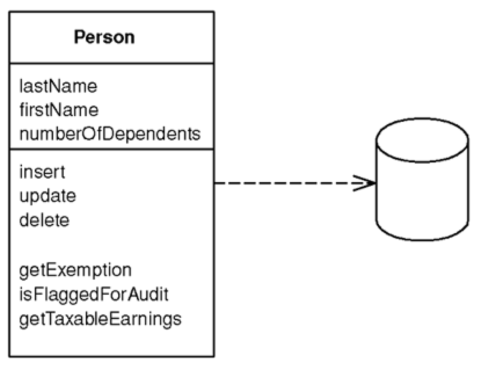
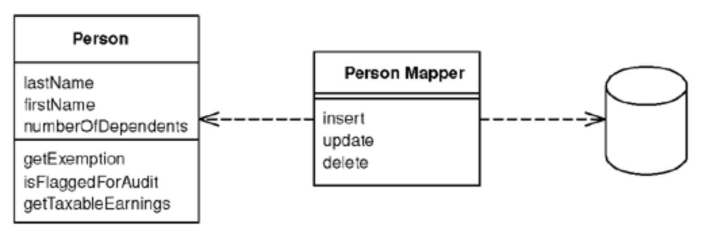
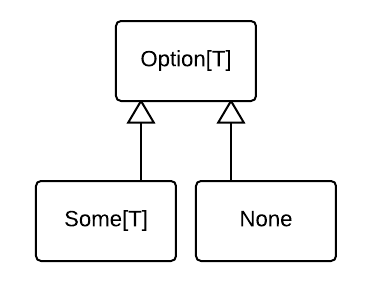
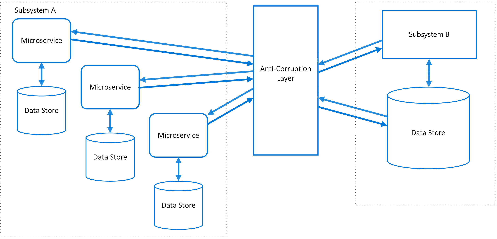

1. [为什么全局或者静态对象通常被认为是“坏味道”？请给出代码例子。](#1-为什么全局或者静态对象通常被认为是坏味道请给出代码例子)
2. [什么是控制反转（IoC）？它如何提升代码设计质量？](#2-什么是控制反转ioc它如何提升代码设计质量)
3. [什么是迪米特法则（Law of Demeter）？请写一个违反它的例子并重构。](#3-什么是迪米特法则law-of-demeter请写一个违反它的例子并重构)
4. [你如何看待 Active Record 模式？它有哪些限制和缺陷？](#4-你如何看待-active-record-模式它有哪些限制和缺陷)
5. [Data Mapper 和 Active Record 有什么区别？分别适合什么场景？](#5-data-mapper-和-active-record-有什么区别分别适合什么场景)
6. [为什么说 `null` 是 “billion-dollar mistake”？如何避免空引用问题？](#6-为什么说-null-是-billion-dollar-mistake如何避免空引用问题)
7. [为什么常说“组合优于继承”？你的观点是什么？](#7-为什么常说组合优于继承你的观点是什么)
8. [什么是反腐层（Anti-Corruption Layer, ACL）？](#8-什么是反腐层anti-corruption-layer-acl)
9. [如何实现线程安全的单例模式？](#9-如何实现线程安全的单例模式)
10. [如何处理依赖灾难（Dependency Hell）？](#10-如何处理依赖灾难dependency-hell)
11. [`goto` 语句是邪恶的吗？](#11-goto-语句是邪恶的吗)
12. [如何理解鲁棒性原则 / Postel 定律？它今天仍然适用吗？](#12-如何理解鲁棒性原则--postel-定律它今天仍然适用吗)
13. [什么是数据抽象（Data Abstraction）？请写一个违反它的例子并重构。](#13-什么是数据抽象data-abstraction请写一个违反它的例子并重构)
14. [请写一个违反 DRY 原则的例子，并说明如何修复。](#14-请写一个违反-dry-原则的例子并说明如何修复)
15. [什么是关注点分离（Separation of Concerns, SoC）？](#15-什么是关注点分离separation-of-concerns-soc)

---

## 1 为什么全局或者静态对象通常被认为是“坏味道”？请给出代码例子。

它们并不总是“邪恶”，但在业务代码里通常属于 **设计坏味道**。核心问题不是“能不能用”，而是它们会引入：

- **隐藏依赖**：函数签名看不出真实依赖什么
- **可测试性差**：测试之间容易互相污染
- **并发风险**：共享可变状态往往需要锁、原子操作或更复杂的同步机制
- **生命周期不清晰**：初始化、重置、回收都变得困难
- **可维护性下降**：任何地方都能修改，排查问题困难

### 典型反例

```go
package metrics

var requestCount int

func RecordRequest() {
    requestCount++
}

func CurrentCount() int {
    return requestCount
}
```

问题：

- 不是线程安全的
- 所有调用者都共享同一份状态
- 测试需要手动重置全局变量
- 未来如果想换成 Prometheus、StatsD 或 OpenTelemetry，就很难改

### 更好的做法：显式注入依赖

```go
package metrics

import "sync/atomic"

type Counter interface {
    Inc()
    Value() int64
}

type AtomicCounter struct {
    value int64
}

func (c *AtomicCounter) Inc() {
    atomic.AddInt64(&c.value, 1)
}

func (c *AtomicCounter) Value() int64 {
    return atomic.LoadInt64(&c.value)
}

type Service struct {
    counter Counter
}

func NewService(counter Counter) *Service {
    return &Service{counter: counter}
}

func (s *Service) HandleRequest() {
    s.counter.Inc()
}
```

### 例外情况

以下场景通常可以接受：

- 不可变常量
- 纯函数工具库
- 进程级只读配置快照
- 运行时明确要求的单实例资源（如日志器、指标注册器），但依然建议通过封装和注入来暴露

### 面试回答要点

可以总结为一句话：

> 全局 / 静态对象最大的问题不是语法，而是它们制造了隐藏耦合和共享可变状态；在现代工程里，应优先使用依赖注入、不可变对象和显式生命周期管理。

---

## 2 什么是控制反转（IoC）？它如何提升代码设计质量？

**控制反转（Inversion of Control, IoC）** 指的是：

> 程序不再自己掌控所有流程和依赖创建，而是把一部分控制权交给框架、容器或运行时。

常见表现包括：

- 框架回调你的代码，而不是你手动驱动框架
- 依赖由容器创建并注入，而不是类内部 `new`
- 事件、消息、HTTP 请求到来时，由运行时触发处理逻辑

### IoC 与 DI 的关系

很多人会混淆：

- **IoC** 是更大的设计思想
- **DI（Dependency Injection，依赖注入）** 是实现 IoC 的常见方式之一

### 反例：对象自己创建依赖

```java
public class OrderService {
    private final PaymentClient paymentClient = new PaymentClient();
    private final EmailClient emailClient = new EmailClient();

    public void placeOrder(Order order) {
        paymentClient.charge(order);
        emailClient.sendConfirmation(order);
    }
}
```

问题：

- 无法替换真实依赖
- 难以单元测试
- 依赖具体实现，扩展性差

### 更好的做法：通过构造函数注入

```java
public class OrderService {
    private final PaymentGateway paymentGateway;
    private final Notifier notifier;

    public OrderService(PaymentGateway paymentGateway, Notifier notifier) {
        this.paymentGateway = paymentGateway;
        this.notifier = notifier;
    }

    public void placeOrder(Order order) {
        paymentGateway.charge(order);
        notifier.sendConfirmation(order);
    }
}
```

### 它带来的价值

1. **降低耦合**：依赖抽象而不是实现
2. **提升可测试性**：更容易替换为 mock / fake
3. **增强可扩展性**：更容易接入不同实现
4. **统一生命周期管理**：连接池、客户端、缓存对象的创建与释放更清晰

### 现代工程中的例子

- Spring / ASP.NET Core 的依赖注入容器
- Web 框架中的中间件和事件回调
- Kubernetes + Operator 驱动的声明式控制循环
- 消息队列消费者由框架调度，而不是业务代码主动轮询

### 面试回答要点

> IoC 的本质是把“对象创建”和“流程控制”从业务代码中拿出来，交给容器或框架管理。这样能让代码更解耦、更易测试，也更适合大型系统演进。

---

## 3 什么是迪米特法则（Law of Demeter）？请写一个违反它的例子并重构。

迪米特法则也叫 **最少知识原则（Least Knowledge Principle）**。

核心思想：

> 一个对象应该尽量少了解其他对象的内部结构，只和“直接朋友”通信。

常见坏味道是“消息链”：

```java
order.getCustomer().getWallet().getBalance()
```

这通常意味着调用方知道太多内部细节。

### 违反示例

```csharp
public class Customer {
    public Wallet Wallet { get; init; }
}

public class Wallet {
    public decimal Balance { get; private set; }
    public void Debit(decimal amount) => Balance -= amount;
}

public class Cashier {
    public void Charge(Customer customer, decimal amount) {
        if (customer.Wallet.Balance >= amount) {
            customer.Wallet.Debit(amount);
        }
    }
}
```

问题：

- `Cashier` 知道 `Customer` 内部有 `Wallet`
- `Cashier` 直接操作 `Wallet`，越过了 `Customer` 的封装边界
- 将来支付规则变化，`Cashier` 很容易被迫修改

### 重构后

```csharp
public class Customer {
    private Wallet Wallet { get; init; }

    public bool TryPay(decimal amount) {
        if (Wallet.Balance < amount) {
            return false;
        }

        Wallet.Debit(amount);
        return true;
    }
}

public class Cashier {
    public bool Charge(Customer customer, decimal amount) {
        return customer.TryPay(amount);
    }
}
```

### 重构后的收益

- 行为被放回信息拥有者 `Customer`
- `Cashier` 只表达“收款”意图，不关心钱包实现
- 未来可扩展积分、优惠券、余额优先级等规则

### 需要避免机械化使用

迪米特法则不是说“链式调用一定错”。例如：

- ORM / 查询构造器
- fluent API
- stream / LINQ 风格调用

这些往往是刻意设计的可读接口，不应简单视为坏味道。

### 面试回答要点

> 迪米特法则强调减少对象之间不必要的了解，常见实践是 “Tell, Don’t Ask”——告诉对象做什么，而不是拿到它的内部数据后替它做判断。

---

## 4 你如何看待 Active Record 模式？它有哪些限制和缺陷？



**Active Record** 的特点是：

> 一个对象既表示领域数据，又自己负责持久化操作，例如 `save()`、`update()`、`delete()`。

### 优点

- 上手快，开发效率高
- 对简单 CRUD 场景非常友好
- 对后台管理系统、原型系统、小型单体应用很合适
- 与 Rails、Laravel 等生态配合成熟

### 缺点

1. **领域逻辑和持久化耦合**
   - 模型既要表达业务，又要关心数据库细节
2. **难以支撑复杂领域模型**
   - 聚合、领域事件、不变量、事务边界会变得混乱
3. **测试边界不清晰**
   - 很多业务测试会被迫连带数据库
4. **容易出现贫血模型或胖模型**
   - 要么逻辑散落在 service，要么 model 过于臃肿
5. **迁移成本高**
   - 数据库结构变化会直接波及领域对象

### 现代视角下的判断

Active Record 不是“落后”，而是 **有适用边界**：

- 如果系统以 CRUD 为主，业务规则简单，它是务实选择
- 如果系统是复杂领域、高一致性要求、长期演进型系统，通常不如 Data Mapper 更合适

### 适合的场景

- CMS、运营后台、报表系统
- 早期创业项目快速验证
- 业务规则薄、数据表结构相对稳定的服务

### 不太适合的场景

- 复杂电商订单域
- 支付、账务、库存等强业务约束场景
- 大型 DDD / 六边形架构项目

### 面试回答要点

> Active Record 的优势是简单直接，但代价是领域模型和持久化模型耦合。它适合简单业务，不适合复杂领域。现代工程里更重要的是按系统复杂度选模式，而不是绝对化地说某种模式“好”或“坏”。

---

## 5 Data Mapper 和 Active Record 有什么区别？分别适合什么场景？



**Data Mapper** 强调：

> 领域对象不直接负责数据库读写，持久化由独立的 Mapper / Repository / ORM 基础设施层处理。

### 核心区别

| 维度 | Active Record | Data Mapper |
|---|---|---|
| 持久化职责 | 在模型内部 | 在独立层中 |
| 领域对象 | 往往带数据库行为 | 更纯粹，更聚焦业务 |
| 开发效率 | 高 | 初期较低 |
| 复杂业务适配 | 一般 | 更强 |
| 测试性 | 较弱 | 较强 |
| 架构演进空间 | 有限 | 更好 |

### Data Mapper 的优势

- 领域模型更纯粹
- 容易表达聚合、值对象、领域服务
- 持久化实现可替换
- 更适合复杂业务和长期演进

### Data Mapper 的代价

- 代码更多
- 初始建模成本更高
- 容易因过度抽象导致“样板代码泛滥”

### 什么时候选哪个？

#### 选 Active Record

- 团队更追求开发速度
- 业务规则简单
- 多数操作都是单表 / 简单关联 CRUD
- 项目生命周期短或变化快

#### 选 Data Mapper

- 业务规则复杂
- 强调测试和架构边界
- 需要清晰区分领域层和基础设施层
- 预计系统会长期演进

### 现代补充

很多 ORM 实际上是混合模式：

- 领域上倾向 Data Mapper
- 使用 Repository + Unit of Work
- 某些场景又提供 Active Record 风格便捷操作

### 面试回答要点

> 两者没有绝对优劣。Active Record 优先效率，Data Mapper 优先边界和演进能力。系统越复杂、生命周期越长，越值得往 Data Mapper 靠拢。

---

## 6 为什么说 `null` 是 “billion-dollar mistake”？如何避免空引用问题？

`null` 被称为 “billion-dollar mistake”，是因为它把“没有值”这个概念引入了几乎所有引用类型，却没有强制开发者在类型层面正确处理，最终带来了：

- `NullPointerException` / `NullReferenceException`
- 大量防御式判空
- API 语义模糊：`null` 到底表示不存在、未知、失败，还是未加载？



### `null` 的问题不只在运行时

更大的问题是 **语义不清**：

- `findUser()` 返回 `null`：用户不存在？数据库超时？权限不足？
- `middleName = null`：没有中间名？未录入？脱敏？

### 更好的现代实践

#### 1. 使用非空类型系统

现代语言越来越强调：

- Kotlin 的可空 / 非空类型
- Rust 的 `Option<T>`
- TypeScript 的 `strictNullChecks`
- C# 的 nullable reference types
- Swift 的 `Optional`

#### 2. 使用明确的返回类型

```rust
fn find_user(id: UserId) -> Option<User> { ... }
```

比返回 `null` 更清晰，因为调用者必须处理“有 / 无”两种情况。

#### 3. 区分“缺失”和“错误”

- 缺失：`Option<T>` / `Maybe<T>`
- 错误：`Result<T, E>` / `Either` / `error`

#### 4. Null Object 模式

适用于“缺省行为对象”而不是“缺省数据值”。例如：

```java
interface Notifier {
    void send(String message);
}

final class NullNotifier implements Notifier {
    @Override
    public void send(String message) {
        // no-op
    }
}
```

注意：它适合消除条件分支，不适合掩盖真正的异常情况。

#### 5. 在边界层尽早校验

- HTTP 请求参数
- 消息队列消息体
- 配置文件
- 数据库反序列化结果

不要把“可能为空”的状态一路传到核心业务层。

### Go 里的现实做法

Go 没有 `Option<T>`，常见实践是：

- 用零值和 `ok` 模式区分存在性
- 用 `(value, error)` 区分结果与错误
- 明确文档：哪些返回值可能为 `nil`

### 面试回答要点

> `null` 的核心问题不是“会报错”，而是它让“缺失语义”变得模糊。现代解决方案是：在类型系统、API 设计和边界校验上明确区分“没有值”和“出错了”。

---

## 7 为什么常说“组合优于继承”？你的观点是什么？

这句话的意思不是“不要继承”，而是：

> 当两种方式都能实现目标时，通常应优先考虑组合，因为它耦合更低、变化更可控。

### 继承的问题

继承的代价在于它会把父类的：

- 状态
- 行为
- 约束
- 演化风险

一起带给子类。

一旦父类变化，子类可能被动受影响。这就是经典的 **fragile base class problem（脆弱基类问题）**。

### 典型误用

```java
class Stack extends ArrayList<Object> {
    public void push(Object value) { add(value); }
    public Object pop() { return remove(size() - 1); }
}
```

问题：

- 从语义上讲，`Stack` 并不是 `ArrayList`
- 子类继承了大量不该暴露的方法，如 `add(index, x)`、`get(index)`
- 它破坏了 `Stack` 的抽象边界

### 更好的做法：组合

```java
class Stack {
    private final List<Object> items = new ArrayList<>();

    public void push(Object value) { items.add(value); }
    public Object pop() { return items.remove(items.size() - 1); }
    public boolean isEmpty() { return items.isEmpty(); }
}
```

### 组合的优势

- 更灵活：运行时可替换依赖
- 更清晰：只暴露需要的能力
- 更安全：内部实现可变，外部接口不变
- 更适合接口驱动设计

### 继承什么时候仍然合理？

- 存在稳定、清晰的 **is-a** 关系
- 父类就是为了扩展而设计的
- 需要多态替换，且共享行为高度稳定
- 框架约定通过继承扩展（虽然现代框架越来越偏向组合）

### 现代工程补充

今天很多语言和框架更偏向：

- 接口 + 组合
- 委托
- 装饰器模式
- 中间件链
- trait / mixin / protocol 等较轻量复用机制

### 面试回答要点

> “组合优于继承”强调的是控制耦合和演进成本。继承适合稳定抽象层次，组合更适合业务系统中频繁变化的实现细节。

---

## 8 什么是反腐层（Anti-Corruption Layer, ACL）？



反腐层来自 DDD（领域驱动设计），它的作用是：

> 当一个系统需要与遗留系统、第三方系统或另一个模型不一致的上下文集成时，通过一层翻译与隔离，防止外部模型“污染”当前系统的领域模型。

### 典型场景

- 新系统逐步替换遗留单体
- 接第三方支付 / ERP / CRM / WMS
- 组织内两个系统模型不一致
- 微服务拆分后，旧服务接口语义很差

### ACL 通常做什么

- 协议适配：HTTP / SOAP / gRPC / MQ
- 数据转换：DTO、字段、枚举、时区、货币单位
- 语义翻译：把外部“订单状态 7”翻译成内部 `OrderStatus.Paid`
- 错误归一：把外部错误码映射为内部异常 / 错误模型
- 韧性增强：超时、重试、熔断、幂等、降级
- 可观测性：日志、指标、追踪、告警

### 它与 Adapter / Facade 的区别

- **Adapter**：通常只是接口形状转换
- **Facade**：通常是对复杂子系统做统一入口封装
- **ACL**：强调 **语义隔离** 和 **模型保护**，是更强的架构边界

### 现代实践建议

ACL 不只是“写个转换类”，还应该考虑：

- 超时和重试策略是否合理
- 外部接口是否幂等
- 是否需要消息重放 / 补偿
- 关键字段映射是否可监控
- 版本升级时是否能灰度切换

### 面试回答要点

> ACL 的核心价值不是“适配”，而是“隔离错误模型和坏语义”，让本系统的领域模型保持干净。这在遗留系统迁移和第三方集成里非常重要。

---

## 9 如何实现线程安全的单例模式？

先说结论：

> 单例不是优先推荐的模式。它常常只是“带全局状态的对象”换了个写法。

在现代工程里，更推荐：

- 通过依赖注入管理单实例对象
- 由应用启动阶段统一创建共享资源
- 在测试中显式替换依赖

但如果面试题要求实现线程安全单例，可以写标准实现。

### Go 中推荐的线程安全写法

```go
package config

import "sync"

type Manager struct {
    // ...
}

var (
    instance *Manager
    once     sync.Once
)

func Instance() *Manager {
    once.Do(func() {
        instance = &Manager{}
    })
    return instance
}
```

### 为什么推荐 `sync.Once`

- 线程安全
- 语义清晰
- 避免手写双重检查锁的复杂性和错误

### 面试加分点

可以顺带补充：

- Java 可用 `enum singleton`、静态内部类或类加载机制
- C# 可用 `Lazy<T>`
- Rust / Kotlin / Spring 往往通过语言或容器机制解决

### 单例的问题

- 隐藏依赖
- 测试困难
- 生命周期难控制
- 容易被滥用为“全局可变状态”

### 面试回答要点

> 我知道怎么实现线程安全单例，但在真实业务中会优先用依赖注入或启动时装配替代，因为单例常常会降低测试性和可维护性。

---

## 10 如何处理依赖灾难（Dependency Hell）？

依赖灾难的本质是：

> 系统对外部库的版本、兼容性、传递依赖和供应链风险失去控制。

### 常见表现

- 版本冲突
- 传递依赖过深
- 循环依赖
- 升级一个库引发大面积回归
- 同时引入多个做同一件事的库
- 安全漏洞通过间接依赖引入

### 现代解决方案

#### 1. 缩小依赖面

最有效的办法通常不是“更会管理依赖”，而是：

- 少引依赖
- 避免为一个小功能引入庞大框架
- 定期删除不用的包

#### 2. 使用锁文件和可复现构建

- `go.sum`
- `package-lock.json` / `pnpm-lock.yaml`
- `poetry.lock`
- `Cargo.lock`

这样可以保证 CI、开发机、生产环境尽量一致。

#### 3. 明确版本策略

- 遵循 SemVer，但不要盲目信任 SemVer
- 关键依赖采用固定版本或受控升级窗口
- 大版本升级要有回归验证

#### 4. 定期升级，而不是长期冻结

依赖如果长期不动，后面会形成“升级悬崖”。

最佳实践是：

- 小步快跑升级
- 自动化依赖 PR（Renovate / Dependabot）
- 按风险分层处理升级

#### 5. 做供应链安全治理

- 漏洞扫描（SCA）
- SBOM
- 制品签名 / 来源验证
- 私有代理仓库 / 镜像仓库

#### 6. 管理内部模块边界

很多“依赖灾难”其实来自项目内模块互相乱依赖。应控制：

- 分层依赖方向
- 禁止循环引用
- 限制跨模块访问

### 面试回答要点

> 处理依赖灾难不是只靠包管理器，而是要同时管理版本、构建可复现性、升级节奏、模块边界和供应链安全。

---

## 11 `goto` 语句是邪恶的吗？

不必绝对化。

### 经典观点

Dijkstra 批评 `goto` 的核心原因是：

- 它破坏结构化控制流
- 使程序难以推理
- 增加维护成本

这在业务代码里仍然成立。

### 为什么大多数时候不该用

- 降低可读性
- 容易制造隐式跳转路径
- 让资源清理和错误处理更难追踪
- 往往可以被 `if/else`、循环、函数拆分、异常机制替代

### 但不是绝对禁止

在少数场景里，`goto` 仍可能是合理工具：

- C 语言中的统一错误清理出口
- 编译器生成代码
- 状态机优化
- 极底层性能敏感代码

例如 C 中常见的资源回收模式：

```c
int process() {
    FILE *f1 = fopen("a.txt", "r");
    if (!f1) goto fail;

    FILE *f2 = fopen("b.txt", "r");
    if (!f2) goto cleanup_f1;

    // do work

    fclose(f2);
    fclose(f1);
    return 0;

cleanup_f1:
    fclose(f1);
fail:
    return -1;
}
```

### 现代工程里的态度

- 在高层业务代码中，通常避免使用
- 在低层系统代码中，可作为受控工具使用
- 重点不在“是否邪恶”，而在是否提升了可读性和正确性

### 面试回答要点

> `goto` 不是道德问题，而是工程问题。大多数业务代码不需要它；少数底层场景用它可以让错误处理更清晰，但必须克制使用。

---

## 12 如何理解鲁棒性原则 / Postel 定律？它今天仍然适用吗？

经典表述是：

> Be conservative in what you send, be liberal in what you accept.
>
> 发送时严格，接收时宽容。

它早期对互联网协议互操作性非常重要，因为很多系统实现并不完全一致。

### 它合理的地方

- 能提高兼容性
- 能降低系统间集成摩擦
- 对向后兼容、灰度升级、协议演进很有帮助

### 但现代系统里不能机械套用

今天更流行的观点是：

> 在安全边界和核心契约上，要尽量严格；“宽容接收”如果没有边界，会制造歧义、漏洞和长期兼容负担。

### 为什么要更谨慎

如果输入过度宽容，可能导致：

- 安全绕过
- 契约不清
- 调用方长期依赖错误行为
- 数据质量下降
- 兼容性债务不断累积

### 更现代的实践方式

#### 1. 输出保持严格

- 返回稳定、明确、文档化的 schema
- 不随意改变字段语义
- 版本升级要有迁移策略

#### 2. 输入在边界上有策略地宽容

可以容忍：

- 可选字段缺失
- 已知旧版本字段名
- 空白字符、大小写差异等非本质问题

但不应容忍：

- 非法状态
- 歧义字段
- 安全敏感参数的模糊输入

#### 3. 通过版本化和校验代替“无限宽容” 

- OpenAPI / Protobuf schema
- JSON Schema
- 契约测试
- 向后兼容策略

### 面试回答要点

> Postel 定律今天仍有价值，但应该被更精细地应用：对外输出要稳定，对输入要“有边界地兼容”，尤其在安全和核心业务场景中不能无限宽容。

---

## 13 什么是数据抽象（Data Abstraction）？请写一个违反它的例子并重构。

数据抽象的目标是：

> 隐藏内部实现细节，只暴露调用方真正需要的能力。

如果外部代码依赖了内部数据结构，那么实现一改，所有调用方都可能被迫修改。

### 违反示例

```csharp
public class ShoppingCart
{
    public List<Product> Items = new();
}

public class CheckoutService
{
    public decimal Checkout(ShoppingCart cart)
    {
        decimal total = 0;
        for (int i = 0; i < cart.Items.Count; i++)
        {
            total += cart.Items[i].Price * cart.Items[i].Quantity;
        }

        cart.Items.Clear();
        return total;
    }
}
```

问题：

- 内部结构 `List<Product>` 被直接暴露
- 调用方能随意清空、插入、重排
- 将来若改成 `Dictionary` 或事件溯源表示法，外部代码会全部受影响

### 重构后

```csharp
public class ShoppingCart
{
    private readonly List<Product> _items = new();

    public IReadOnlyCollection<Product> Items => _items.AsReadOnly();

    public void Add(Product product) => _items.Add(product);
    public void Clear() => _items.Clear();

    public decimal Total()
    {
        return _items.Sum(x => x.Price * x.Quantity);
    }
}

public class CheckoutService
{
    public decimal Checkout(ShoppingCart cart)
    {
        var total = cart.Total();
        cart.Clear();
        return total;
    }
}
```

### 收益

- 外部不再依赖具体容器实现
- 业务意图更清晰
- 内部可自由演进
- 更容易做校验、审计、并发保护

### 面试回答要点

> 数据抽象不是“把字段设成 private”这么简单，而是让调用方依赖稳定行为，而不是内部表示。这样系统才能在不破坏调用方的前提下演进实现。

---

## 14 请写一个违反 DRY 原则的例子，并说明如何修复。

DRY（Don't Repeat Yourself）的重点不是“代码不能重复”，而是：

> 同一份知识、规则、约束，应该只有一个权威来源。

### 违反示例

```csharp
public class UserService
{
    public void Register(string email)
    {
        if (string.IsNullOrWhiteSpace(email))
            throw new ArgumentException("email required");
        if (!email.Contains("@"))
            throw new ArgumentException("invalid email");
    }

    public void UpdateEmail(string email)
    {
        if (string.IsNullOrWhiteSpace(email))
            throw new ArgumentException("email required");
        if (!email.Contains("@"))
            throw new ArgumentException("invalid email");
    }

    public void InviteUser(string email)
    {
        if (string.IsNullOrWhiteSpace(email))
            throw new ArgumentException("email required");
        if (!email.Contains("@"))
            throw new ArgumentException("invalid email");
    }
}
```

如果邮箱规则变了，要改 3 处，极易漏改。

### 重构后

```csharp
public interface IEmailValidator
{
    void Validate(string email);
}

public class EmailValidator : IEmailValidator
{
    public void Validate(string email)
    {
        if (string.IsNullOrWhiteSpace(email))
            throw new ArgumentException("email required");
        if (!email.Contains("@"))
            throw new ArgumentException("invalid email");
    }
}

public class UserService
{
    private readonly IEmailValidator _emailValidator;

    public UserService(IEmailValidator emailValidator)
    {
        _emailValidator = emailValidator;
    }

    public void Register(string email) => _emailValidator.Validate(email);
    public void UpdateEmail(string email) => _emailValidator.Validate(email);
    public void InviteUser(string email) => _emailValidator.Validate(email);
}
```

### 但要避免过度抽象

DRY 经常被误用。不是所有重复都要立刻抽象。

例如：

- 两段代码只是“看起来像”，但变化原因不同
- 过早抽象反而制造错误复用

更准确的理解是：

- **知识重复** 要尽快消除
- **偶然相似** 可以暂时保留，等变化模式清晰后再抽象

### 面试回答要点

> DRY 要消除的是“知识的多处定义”，不是一切文本重复。好的抽象能降低维护成本，坏的抽象会把本来独立的变化耦合在一起。

---

## 15 什么是关注点分离（Separation of Concerns, SoC）？

关注点分离指的是：

> 把不同性质的问题拆开处理，让每一层、每一模块、每一类代码只关注自己最核心的职责。

这是大多数设计原则的共同底层逻辑，也是：

- SRP（单一职责）
- 分层架构
- MVC / MVP / MVVM
- 六边形架构
- Clean Architecture
- AOP / 中间件

背后的共同思想。

### 为什么重要

如果所有逻辑都堆在一起，会出现：

- 修改一处影响全局
- 测试困难
- 团队无法并行协作
- 代码难以推理和演进

### 常见层次上的 SoC

#### 1. 函数级

一个函数只做一件相对清晰的事。

#### 2. 类 / 模块级

例如：

- `OrderService` 负责业务编排
- `OrderRepository` 负责持久化
- `PaymentGateway` 负责支付集成

#### 3. 架构级

典型分层：

- 表示层：HTTP / RPC / CLI
- 应用层：用例编排
- 领域层：核心业务规则
- 基础设施层：数据库、缓存、消息、外部 API

#### 4. 横切关注点

日志、鉴权、缓存、重试、追踪、事务等，不应散落在所有业务代码里，而应通过：

- 中间件
- 装饰器
- 拦截器
- AOP

统一处理。

### 一个简单例子

#### 反例

```csharp
public void CreateOrder(OrderDto dto)
{
    Validate(dto);
    var total = Calculate(dto);
    SaveToDatabase(dto, total);
    SendEmail(dto);
    Log(dto);
}
```

这个函数同时承担了验证、定价、持久化、通知、日志等多个关注点。

#### 拆分后

```csharp
public class OrderAppService
{
    private readonly IOrderDomainService _domainService;
    private readonly IOrderRepository _repository;
    private readonly INotifier _notifier;

    public void Create(OrderDto dto)
    {
        var order = _domainService.Create(dto);
        _repository.Save(order);
        _notifier.OrderCreated(order);
    }
}
```

日志、追踪、鉴权可以再交给中间件或拦截器处理。

### 现代工程中的延伸

今天 SoC 不只体现在代码中，也体现在平台层：

- 应用团队负责业务逻辑
- 平台团队负责发布、观测、基础设施能力
- 安全能力左移到流水线和基础平台中

### 面试回答要点

> 关注点分离的目标是降低复杂度和耦合，让不同变化原因的代码位于不同位置。它不是某一个模式，而是很多优秀架构模式共同遵循的基本原则。
