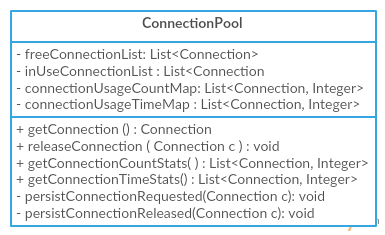
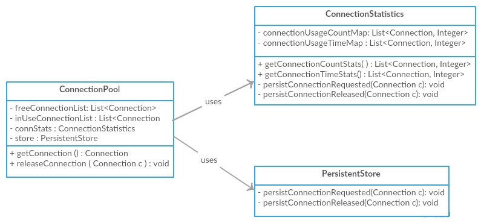
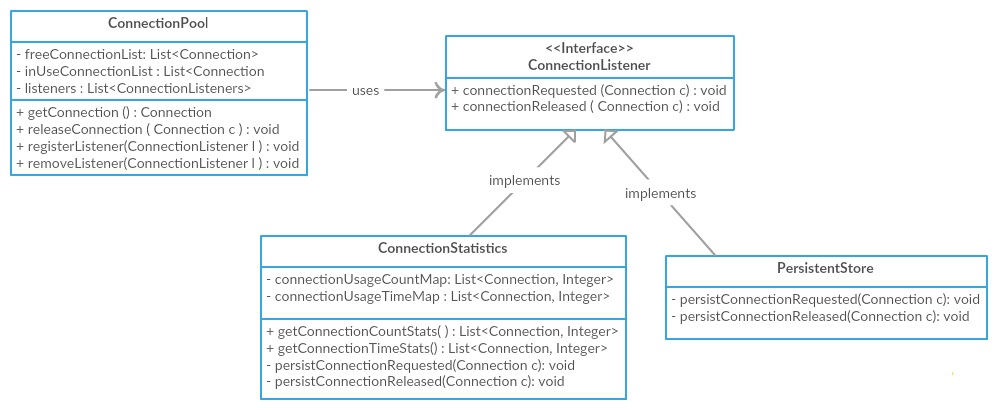

# 1 在面向对象编程中，一个很重要的目标是高内聚（High Cohesion)和松耦合（Loose Coupling). 那么它意味着什么？为什么这个很重要？如何实现它呢？

**内聚**用来度量一个软件的组成部分所专注的内容或者职责；**耦合**用来判定一个软件组成部分与其他部分的联系程度。软件的组成成分可以是类，包，组件，子系统或者完成的系统，然后在设计系统的时候，都会建议软件的各个组成拥有高内聚和松耦合。

低内聚将会导致巨大的类将会非常难以维护和理解，并且降低了可读性；同样的，紧耦合导致类之间紧紧联系在一起，每次改动都会涉及到其他的，导致难以改动和重用。

我们假设一个场景，设计一个可监控的类`ConnectionPool`，虽然它看上非常像一个简单的`ConnectionPool`，但是它的主要目的是演示如何实现高内聚和松耦合。它将有如下的功能：
1. 支持获取一个连接；
2. 释放一个连接；
3. 获取连接使用情况统计；
4. 获取连接时间统计；
5. 保存连接获取和释放信息，并统计汇报；

我们使用低内聚，设计出如下的`ConnectionPool`类，它生硬地将上述的所有功能和职责装入到一个类中，如下图所示，从中可以看出，
单个类包含连接管理，与数据库交互和维护连接状态等所有信息


使用高内聚，我们可以将这些职责分配给不同的类，来让他们更加可维护和可重用。


为了演示松耦合，我们继续使用紧耦合来设计`ConnnectinPool`，如果我们仔细看看上面的示意图，虽然它支持了高内聚，但是`ConnectionPool`仅仅地和`ConnectionStatistics`和`PersistentStore`两个类直接联系在一起。为了降低耦合，我们引入了`ConnectionListener`接口，让两个类分别实现这个接口，并且注册到`ConnecitonPool`类中。`ConnecitonPool`将会迭代这些监听器并且通知这些连接设置和释放事件，通过这样来完成解耦。


**注意点：**对于上述简单的场景，这个看上去好像有点过于设计，但是我们想象一下如果在真实的场景中，如果我们的应用程序需要和许多第三方的服务来完成事务，将我们的代码和第三方服务的进行直接耦合在一起也就意味着第三方服务的任何改变都会导致我们自己的代码发生改变，所以我们可以需要`Facade`设计模式来将我们的代码和不同的第三方服务隔离开来。

# 2 为什么在大部分语言中数组的下标从`0`开始？
大部分程序语言中，比如C/C++, Java等的数组都是从0开始，数组最后一个索引的为数组的长度减去1。对大部分程序开发人员而言，这个算是习以为常了。为什么数组的索引从0开始呢？这个与程序语言设计有关，比如在`C`语言中，数组的名字本质上就是指针，指向内存开始的位置，所以表达式`array[n]`表示为内存位置离数组开始位置，也就是偏移量。所以第一个元素也就是在数组的名字指向的位置，所以采用`array[0]`表示数组的第一个元素。
`Dijkstra`曾经解释过为什么数组从`0`开始，问题在于我们如何表示自然数，比如`1,2,3,...,10`，我们有四种可行的方案:
- a. `0<i<11`
- b. `1<=1<11`
- c. `0<i<=10`
- d. `1<=i<=10`

`Dijkstra`提出了表示表示应该可以表示下面两种情况：
1. 序列必须包含最小的自然数`0`
2. 序列应该是空的
第一个情况要求我们排除`a`和`c`，当然也可以使用，当然也可以使用`-1<i`来表示，不过这个太丑陋了；第二个情况可以排除`d`，剩下的就是`b`方案，而且两端相减就是序列的长度。
所以当你写如下的代码
```c
for (i=0; i < N; i++){
    sum += a[i]
}
```
这个代码就遵循了上述的语言设计规则。


# 5 内聚和耦合有什么区别？
- **内聚** 用来度量一个软件的组成部分所专注的内容或者职责
- **耦合** 用来判定一个软件组成部分与其他部分的联系程度。软件的组成成分可以是类，包，组件，子系统或者完成的系统，然后在设计系统的时候，都会建议软件的各个组成拥有高内聚和松耦合。
