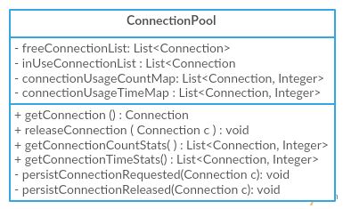
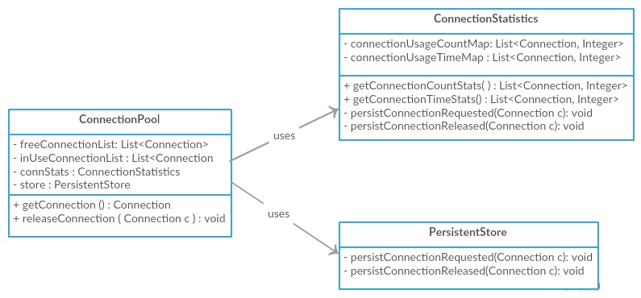
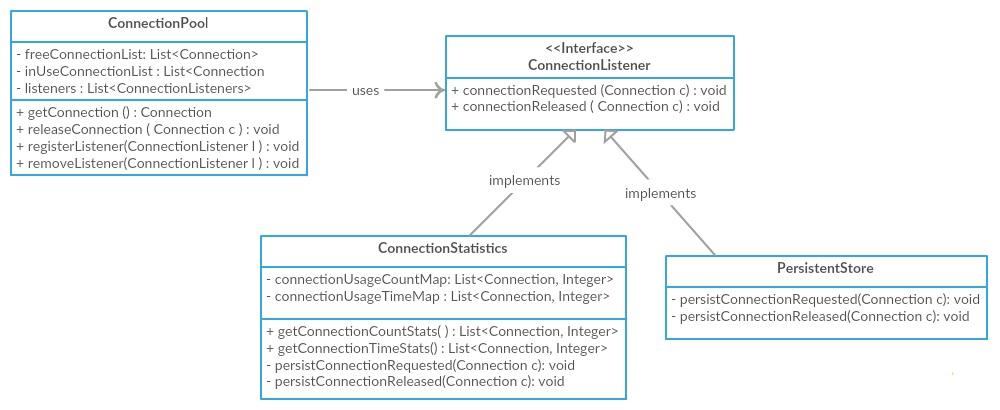

1. [什么是高内聚、低耦合？为什么它们重要？如何实现？](#1-什么是高内聚低耦合为什么它们重要如何实现)
2. [为什么大多数语言中的数组下标从 0 开始？](#2-为什么大多数语言中的数组下标从-0-开始)
3. [内聚和耦合有什么区别？](#3-内聚和耦合有什么区别)
4. [重构的作用是什么？](#4-重构的作用是什么)
5. [代码注释有用吗？应该尽量避免注释吗？](#5-代码注释有用吗应该尽量避免注释吗)
6. [为什么 TDD 要先写测试？](#6-为什么-tdd-要先写测试)
7. [把领域逻辑写在存储过程中，有什么优缺点？](#7-把领域逻辑写在存储过程中有什么优缺点)
8. [为什么面向对象编程（OOP）长期占据主流？](#8-为什么面向对象编程oop长期占据主流)
9. [测试和 TDD 如何影响代码设计？](#9-测试和-tdd-如何影响代码设计)
10. [设计和架构有什么区别？](#10-设计和架构有什么区别)
11. [多继承、多接口、委托分别有什么区别？](#11-多继承多接口委托分别有什么区别)
12. [如何判断一段代码是坏设计？](#12-如何判断一段代码是坏设计)

---

## 1 什么是高内聚、低耦合？为什么它们重要？如何实现？

这是软件设计里最经典也最实用的一组目标。

- **高内聚（High Cohesion）**：一个模块内部的职责应当高度相关，围绕同一个明确目标组织
- **低耦合（Loose Coupling）**：模块之间依赖尽量少、依赖尽量稳定、依赖方向尽量清晰

### 为什么重要

如果一个类什么都做，就会变成“上帝对象”；如果模块之间到处直接引用，就会导致修改一处牵一发而动全身。

高内聚、低耦合带来的收益包括：

- 更容易理解
- 更容易测试
- 更容易替换实现
- 更适合并行开发
- 更容易演进架构

### 一个直观例子

假设要设计一个连接池，并且还要负责：

1. 分配连接
2. 回收连接
3. 统计连接使用情况
4. 记录审计日志
5. 上报监控指标

如果把这些职责都塞进 `ConnectionPool`，就会低内聚、难维护。



更合理的做法是把不同关注点拆开：

- `ConnectionPool`：只负责连接生命周期
- `ConnectionStats`：负责统计
- `AuditLogger`：负责审计
- `MetricsReporter`：负责指标



如果这些能力再通过接口订阅连接事件，而不是直接写死依赖，耦合度会进一步下降。



### 如何实现

#### 提升内聚

- 一个类 / 模块只处理一类变化原因
- 长函数拆分为多个有意图的函数
- 将规则相近的代码放在一起
- 让命名反映单一职责

#### 降低耦合

- 依赖接口而不是具体实现
- 使用依赖注入
- 分层明确依赖方向
- 为外部系统增加适配层 / 反腐层
- 避免共享可变状态

### 面试回答要点

> 高内聚让模块“内部更专注”，低耦合让模块“外部更独立”。它们的目标都是降低复杂度和变更成本。

---

## 2 为什么大多数语言中的数组下标从 0 开始？

最常见的解释来自底层实现。

在 C 这类语言里，数组访问本质上接近于：

```c
array[i] == *(array + i)
```

也就是说，下标表示的是 **相对于起始地址的偏移量**。第一个元素距离起始地址的偏移自然是 `0`。

### 为什么这很自然

用半开区间表示数组范围时：

- 第一个元素是 `0`
- 长度为 `n` 的数组区间可写成 `[0, n)`
- 元素个数正好是 `end - start`

这在切片、子数组、循环边界里都非常方便：

```c
for (int i = 0; i < n; i++) {
    sum += array[i];
}
```

### 这不是唯一可能的设计

也有少数语言支持其他起始下标，但从工程角度看，0-based indexing 在：

- 指针运算
- 切片表达
- 边界计算
- 编译器实现

上都非常统一，因此成为主流。

### 面试回答要点

> 数组从 0 开始主要是因为下标本质上表示偏移量；配合半开区间 `[0, n)`，它能让长度、切片和循环边界表达更自然。

---

## 3 内聚和耦合有什么区别？

这两个概念容易一起说，但关注点不同：

- **内聚**：看模块“内部”是不是围绕单一职责组织
- **耦合**：看模块“外部”与其他模块的依赖是否过深

### 举例理解

- 一个类同时负责下单、支付、发邮件、写日志：**低内聚**
- 一个订单模块直接依赖库存、支付、风控、短信 SDK 的具体实现：**高耦合**

理想状态是：

- **模块内部高内聚**
- **模块之间低耦合**

### 面试回答要点

> 内聚回答“这个模块自己是否专注”，耦合回答“它和别人缠得有多深”。

---

## 4 重构的作用是什么？

重构（Refactoring）是指：

> 在不改变外部可观察行为的前提下，改善代码内部结构。

### 它的核心价值

- 降低复杂度
- 去除重复
- 提升可读性
- 改善测试性
- 为新需求腾出演进空间

### 它不是“重写”

重构通常是：

- 小步进行
- 持续进行
- 每一步都可验证

而不是推倒重来。

### 做重构的前提

- 有自动化测试兜底
- 每次变更范围可控
- 重构后代码更清晰，而不是更“聪明”

### 常见重构动作

- 提取函数 / 类 / 接口
- 消除重复
- 引入参数对象
- 移动职责
- 用多态替代条件分支
- 用组合替代继承

### 现代工程视角

今天重构不仅是代码层面的，也包括：

- 模块边界重构
- 数据库表拆分或归并
- API 契约收敛
- 服务拆分 / 合并
- 观测能力补齐后再重构高风险路径

### 面试回答要点

> 重构的目标不是“改写代码”，而是降低未来修改成本。它应该是持续、小步、可验证的工程活动。

---

## 5 代码注释有用吗？应该尽量避免注释吗？

结论很简单：

> 注释有用，但差的注释有害。

### 什么样的注释最有价值

注释最应该解释的是：

- **为什么这么做**
- **约束是什么**
- **风险和边界条件是什么**
- **哪些行为不能轻易修改**

例如：

```go
// 必须保留 2 分钟幂等窗口，原因是第三方支付回调可能重复投递。
```

这类注释很有价值，因为代码本身很难完整表达业务背景。

### 什么样的注释应该避免

#### 1. 翻译代码的注释

```java
// i 加 1
i++;
```

没有信息增量。

#### 2. 过时注释

过时注释比没注释更危险，因为它会误导维护者。

#### 3. 用注释掩盖坏代码

如果一段代码必须靠大量注释才能理解，优先考虑重命名、拆分或重构。

### 哪些地方应强制有文档化说明

- 公共 API
- SDK / library 暴露接口
- 并发代码
- 安全敏感逻辑
- tricky workaround
- schema / migration / 运维脚本

### 现代实践建议

除了代码注释，还应结合：

- README
- ADR（架构决策记录）
- API 文档 / OpenAPI
- 测试用例作为行为示例

### 面试回答要点

> 好的代码应尽量自解释，但注释仍然重要，特别是用来解释“为什么”和“边界条件”。应避免解释代码表面动作的低价值注释。

---

## 6 为什么 TDD 要先写测试？

TDD（Test-Driven Development）的经典循环是：

1. 先写一个失败的测试
2. 写最少代码让测试通过
3. 重构

### 为什么测试要先写

先写测试的真正价值，不只是“保证质量”，而是 **倒逼设计**。

它会迫使你先思考：

- 这个功能的输入输出是什么
- 接口是否易用
- 依赖是否过多
- 行为边界如何定义

### 它带来的设计收益

- 接口更简单
- 依赖更可替换
- 模块更容易隔离
- 行为定义更明确

### 但不要神化 TDD

TDD 不是所有场景都同样高效：

- UI / 探索式原型阶段不一定适合强行 TDD
- 高度依赖外部系统的集成逻辑，测试设计成本更高
- 算法和领域探索阶段，可能先 spike 再回补测试更现实

### 面试回答要点

> TDD 先写测试的价值，不只是验证，而是让开发者从“调用者视角”设计接口，从而得到更可测、更解耦的代码。

---

## 7 把领域逻辑写在存储过程中，有什么优缺点？

把逻辑放在存储过程（Stored Procedure）里，是一个典型的工程权衡问题。

### 优点

#### 1. 减少网络往返

如果一段逻辑需要多次读写数据库，放到存储过程里可以减少应用和数据库之间的 RTT。

#### 2. 数据就近处理

批量更新、复杂聚合、数据清洗等场景，数据库内部执行可能更高效。

#### 3. 一定程度上统一访问入口

对于一些强约束的数据操作，存储过程能封装一致行为。

### 缺点

#### 1. 业务逻辑和数据库绑定过深

数据库迁移成本会升高，跨数据库兼容更困难。

#### 2. 测试和版本管理更麻烦

很多团队的 CI/CD、代码审查、单测体系主要围绕应用代码，不围绕数据库脚本。

#### 3. 可观测性与调试体验较差

复杂存储过程通常比应用代码更难调试、回放和埋点。

#### 4. 团队技能要求特殊

不是每个后端团队都擅长写高质量 SQL / PL/SQL / T-SQL。

### 现代实践建议

更常见的做法是：

- **复杂业务规则放应用层**
- **高性能数据处理放数据库层**

也就是把数据库当作：

- 数据一致性保障者
- 查询与批量计算引擎
- 事务执行者

而不是整个业务系统的主要编程平台。

### 适合放在存储过程的场景

- 批处理任务
- 大批量写入 / 清洗
- 数据库内原子操作
- 高性能报表聚合

### 不适合的场景

- 复杂领域规则
- 经常变化的业务流程
- 需要跨多个外部系统编排的逻辑

### 面试回答要点

> 存储过程的优势在于性能和数据就近处理，劣势在于可维护性、可测试性和数据库耦合。现代系统通常把“数据密集型逻辑”留在数据库，把“业务变化频繁的逻辑”放在应用层。

---

## 8 为什么面向对象编程（OOP）长期占据主流？

OOP 长期流行，不是因为它完美，而是因为它在很多工程场景下足够实用。

### 它为什么长期有效

#### 1. 封装非常符合大型系统需求

把数据和行为组织在一起，有助于控制复杂度。

#### 2. 抽象和多态适合建模变化点

接口、多态、依赖倒置，非常适合处理支付、存储、消息、通知等可替换能力。

#### 3. 工程生态成熟

大量框架、IDE、建模方法、测试工具都围绕 OOP 发展起来。

#### 4. 与 GUI、企业应用、服务端开发长期契合

尤其是在 Java、C#、C++ 等主流企业语言里，OOP 是默认组织方式。

### OOP 的局限

- 容易过度设计
- 容易滥用继承
- 可变状态过多时，并发复杂度上升
- 并不天然适合数据流、函数式和声明式问题

### 现代视角

今天很少有人只用纯 OOP 思维开发系统。更常见的是混合式：

- 用 OOP 组织边界和依赖
- 用函数式风格写纯计算逻辑
- 用声明式配置描述基础设施
- 用事件流 / 消息流建模异步过程

### 面试回答要点

> OOP 长期主流的原因是它在封装、抽象、多态和工程组织上非常实用；但现代系统通常是多范式混合，而不是纯粹依赖 OOP。

---

## 9 测试和 TDD 如何影响代码设计？

测试不仅验证代码，也会反过来塑造代码结构。

### 对设计的正向影响

#### 1. 促使依赖可替换

难测试的代码，通常也难维护。为了测试，开发者会自然地引入：

- 接口
- 依赖注入
- 显式边界

#### 2. 促使模块职责更清晰

如果一个函数既访问数据库又发消息又调支付，测试会非常痛苦，这会倒逼职责拆分。

#### 3. 促使接口更简洁

复杂接口很难测，也很难用。

#### 4. 提供可执行文档

测试说明了系统“应该如何工作”。

### 可能的负面影响

如果方法不当，测试也可能把设计带偏：

- 过度为 mock 而抽象
- 过度关注实现细节而不是行为
- 写大量脆弱测试导致重构困难

### 好的测试设计原则

- 测行为，不测实现细节
- 测公共契约，不测私有函数
- 单元测试 + 集成测试 + 端到端测试搭配
- 对关键路径增加契约测试和回归测试

### 面试回答要点

> 测试会倒逼代码变得可替换、职责清晰、接口简洁；但如果过度 mock 或绑定实现细节，也可能让设计僵化。

---

## 10 设计和架构有什么区别？

两者相关，但关注层次不同。

### 设计（Design）

更关注：

- 模块如何组织
- 类和接口如何分工
- 代码如何表达职责
- 具体实现如何保持清晰、可测、可维护

它偏向 **局部和实现层面**。

### 架构（Architecture）

更关注：

- 系统由哪些核心部分组成
- 依赖方向是什么
- 是否分层 / 分服务 / 事件驱动
- 如何满足性能、可用性、安全、扩展性等非功能需求

它偏向 **全局和系统层面**。

### 一个常见理解

- 架构决定“系统的大轮廓和关键约束”
- 设计决定“局部怎么优雅落地”

### 但两者不是割裂的

坏的局部设计会侵蚀架构，架构也必须能落到具体设计上。

### 面试回答要点

> 架构是系统级结构和关键决策，设计是模块级和代码级落地。架构解决“大方向和约束”，设计解决“具体怎么写才能长期可维护”。

---

## 11 多继承、多接口、委托分别有什么区别？

这是三种复用和抽象机制，但它们能力和代价不同。

### 多继承

一个类继承多个父类，能直接复用多个父类的实现。

#### 优点

- 实现复用能力强

#### 问题

- 命名冲突
- 状态冲突
- 菱形继承问题
- 语义复杂，难推理

因此很多主流语言不鼓励或不支持类的多继承。

### 多接口实现

一个类实现多个接口，只承诺“具备这些能力”，通常不继承状态。

#### 优点

- 更清晰地表达能力组合
- 减少实现层冲突
- 更适合依赖抽象

这是 Java / C# 等企业开发中更常用的方式。

### 委托 / 组合

把另一个对象作为字段持有，把一部分工作转交给它完成。

```java
class ReportService {
    private final Exporter exporter;

    ReportService(Exporter exporter) {
        this.exporter = exporter;
    }

    void export(Report report) {
        exporter.export(report);
    }
}
```

#### 优点

- 低耦合
- 更灵活
- 可运行时替换
- 更符合“组合优于继承”

### 面试回答要点

> 多继承偏实现复用，但复杂度高；多接口偏能力抽象，更安全；委托 / 组合最灵活，也是现代工程中更常见的复用方式。

---

## 12 如何判断一段代码是坏设计？

判断坏设计，通常不是看“它优不优雅”，而是看它是否显著提高了理解、修改和扩展成本。

### 常见信号（Code Smells）

#### 1. 重复代码

同一规则在多处实现，未来必然漏改。

#### 2. 超长函数 / 超大类

一个单元承担过多职责。

#### 3. 高耦合

改一个地方要连带修改很多模块。

#### 4. Feature Envy

一个类频繁操作另一个类的内部数据，说明职责放错地方了。

#### 5. Shotgun Surgery

改一个需求要在十几个文件里同步修改。

#### 6. Primitive Obsession

大量使用原始类型而不是领域对象，例如到处传 `string userId`、`decimal amount`。

#### 7. Inappropriate Intimacy

模块之间知道太多对方内部细节。

#### 8. 过度工程

简单问题使用了过重抽象，增加理解成本。

#### 9. 坏命名

命名无法表达意图，维护者必须反复跳转阅读。

#### 10. 测试困难

如果一个模块几乎无法独立测试，通常意味着边界、职责或依赖设计有问题。

### 一个实用判断标准

可以问自己三个问题：

1. 这个模块的职责是否清晰？
2. 这个变化如果发生，影响范围是否可控？
3. 我能否在不破坏别处的前提下安全修改它？

如果答案经常是否定的，设计大概率有问题。

### 面试回答要点

> 坏设计最直接的表现不是“看起来丑”，而是它让变更变贵、测试变难、理解变慢。代码坏味道本质上都是复杂度失控的信号。
