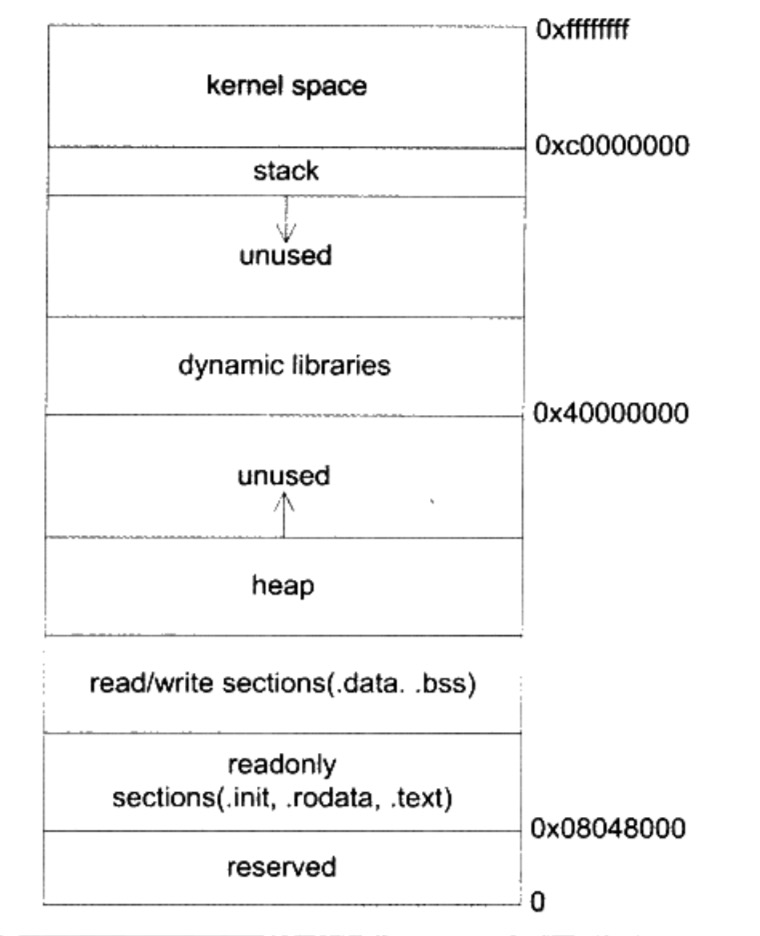

# 1 说一下你最喜欢语言的三个缺陷

C# 语言

1. 开源太晚

虽然说现在 `C#` 已经开源，但是面对互联网，云计算和大数据时代还是显得有点太晚了。在一些技术社区仍然以为 C# 知识 Windows Only 的开发语言。这个对于新的开发者而言是一个很错误的引导，而且吸引不了更多的开发者进入这个行业。而且在过去几年，C# 开发领域由很多令人困惑的概念，比如说 `.Net Core`, `.Net Standard`, `Mono`, `.Net 5` 以及传统的 `.Net Framework`。这些概念对于有经验的开发工程师都难以区分它们。

2. 复杂的比较操作

在 C# 中有很多比较操作，这些操作往往令开发者难以区分。

- 用户自定一个比较操作： `>`, `<`, `>=`,`==`,`!=`等等
- 重载 `Equals(object)` 这个方法
- `Object` 类中包含的 `Equals` 这个静态方法
- `IComparable` 接口
- `IEquality` 接口

3. 对接口限制太严格

对于接口，只能包含了方法和属性，不能包含字段，静态方法等等。

# 2 为什么现在对函数式编程语言越来越受到欢迎？

大部分应用程序在开发的过程中的缺陷主要是由软件开发者并没有完整的清楚代码在实际运行时候全部的状态。
尤其是在多线程运行环境中，这个问题就会被放大。通过函数式编程软件中所有的状态就会变得明确，同样使得
诸如多线程的条件竞争等问题得到解决。纯函数是函数式编程重要的内容，它只关注传递给他的参数，返回根据
传入的参数计算而得的值，没有逻辑上的副作用(`side effect`)。它不更新全局变量，不维持全局变量，
也不会进行IO操作，更不会修改传入的参数。纯函数的有一下几点优势

- 线程安全：纯函数只使用参数，所以它是完全线程安全的的；所以很容易地将这些函数改造成并行执行，尤其在多核CPU中发挥优势；
- 可重用性：将纯函数转移到新的环境非常简单，只需要处理类型定义和函数调用，不会发生类似滚雪球效应；
- 可测试性：纯函数是引用透明的，也就是说同样的参数调用无论如何都会返回正确的结果；
- 可理解性和可维护性：只关心参数的输入和结果的输出，大大降低了维护者的理解难度

3# 3 什么是闭包，闭包有什么作用？它和类有什么区别？

闭包（Closure）是词法闭包（Lexical Closure）的简称，闭包提供了一种方位内部变量的一种方式。
程序设计中，每一个变量都有一定的作用域，作用域之外的将不能访问该该变量

```go
var a = 1

func func1() {
    var b = 10
    fmt.Printf("%d", a)
}

// error
func func2(){
    fmt.Printf("%d", b)
}
```

变量`a`是全局变量，所以对`func1`和`func2`都可见，但是变量`b`是局部变量，对于`func2`是不可见的，所以无法访问`b`。这是由`go`语言的"链式作用域"结构（`chain scope`）决定的。子对象会一级一级地向上寻找所有父对象的变量，所以，父对象的所有变量，对子对象都是可见的，反之则不成立。
但是闭包提供了方位局部变量的方法：

```go
func func3() func() {
    var c = 10
    return func(){
        c++
        fmt.Printf("%d", c)
    }
}
handler := func3()
handler() // 11
handler() // 12 
```

在`go`语言中，函数是一等公民(`first class citizen`)，所以`func3`可以返回一个函数。该函数包含了局部变量`c`，所以在外面就可以访问`c`变量的方式。
使用闭包的可以减少变量的使用，使用局部变量就可以保存全部的状态。

# 4 什么是高阶函数？它是用来做什么的？用你最喜欢的语言写一个高阶函数;

如何一个函数接受另一个函数作为参数或者返回函数，那么这个函数就是高阶函数。
高阶函数能够表达出更强的抽象。

```go
func twice(f func(int) int, v int) int {
	return f(f(v))
}

func main() {
	f := func(v int) int {
		return v + 3
	}
	twice(f, 7) // returns 13
}
```

# 5 编写一个循环，然后将它转换成递归的形式，并且只能使用不可变结构（比如避免使用变量）

```go
func factorialInter(n int) int {
    val := 1
    for i:=1; i<n; i++ {
        val = val * i
    }
    return val
}

func factorialRec(n int, val int) int {
    if n = 1 {
        return val
    }else{
        return factorialRec(n-1, val*n)
    }
}
```

# 6 什么是栈和堆？什么叫栈溢出？

由于虚拟内存的设计，每一个应用程序 "仿佛" 使用了全部机器的内存，一般来讲程序内存划分情况如下图:



- 地址 `0xffffffff - 0xc0000000` 为内核地址；
- 地址 `0x08048000` 往上为程序的只读段，主要包含了代码段，只读数据段，再往上为数据段；
- 再往上为堆，所有程序中手动分配的内存将在这个位置开始往上分配；
- 地址 `0x40000000` 往上一部分为动态共享库；
- 地址 `0xc0000000` 往下为栈空间。

操作系统为为每一个函数调用提供了栈帧，主要保存函数的参数、返回地址和一些局部变量。如果程序设计不当，将会导致栈帧使用完毕，导致栈溢出，常见的主要有无限递归。

# 7 命名空间（namespace)是做什么的？能够发明一个可替代性的东西？

在编程领域中，命令空间主要解决变量，函数以及类它们之间的冲突。假设你的应用程序使用了两个库。

```C#
// library A 
public class FooBar 
{
    //...
}

// library B
public class FooBar
{
    //...
}
```
我们可以看到，`FooBar` 两个类出现了两个库，我们的应用程序编译器不能区分它们，所以我们引入了命名空间。

```C#
// libray A
namespace Tindo.SDK
{
    public class FooBar {}
}

// library B
namespace Aurisoft.Tool
{
    public class FooBar {}
}
```

现在我们就能很好的区分它们，不会发生对象解析错误。

如果我们能够解析冲突，就不需要命令空间。我们可以为每个库的对象能唯一值标记即可。

```C#
// libaray A -> libraryA.dll
public class FooBar {}

// library B -> libraryB.dll
public class FooBar {}


// programa
using FooBarA = import("libraryA.dll", "FooBar");
using FooBarB = import("libraryB.dll", "FooBar");

```

# 8 编写两个函数，一个是引用透明（`Referentially Transparent`)，另一个是引用不透明（`Referentially Opaque`）

首先什么是引用透明呢? 它用来描述定义一个表达式的事实，在一个程序中，如果一个表达式可以被一个具体的值取代而不影响结果那么我们就可以称为改引用透明，从某种程度来讲就是改表达式由特定的参数输入一定会输出相同的结果，这是函数式编程的概念。

假设我们由下面几个函数

```C#
int Add(int a, int b){
    return a + b;
}

int Mult(int a, int b){
    return a * b;
}

int x = Add(2, Mult(3, 4));
```

在上面的例子中， `Mult` 函数就是引用透明的，因为我们可以用 `12` 替换掉 `Mult(3, 4)` 而不会有任何影响；同样我们也可以用 `14` 替换 `Add(2, 12)`。

下面再介绍一下引用不透明的例子 

```C#
int Add(int a, int b){
    int result = a + b;
    Console.WriteLine($"Returning {result}");
    return result;
}
```

如果我们用特定的值替换 `Add` 方法，那么 `Returning` 方法就不会输出，产生了副作用 (Side Effect）。有些情况下，非但带来了副作用，而且导致的结果也不正确。

```C#
class Fibs {
    private int previous = 1;
    private int last = 1;

    public int Next() {
        last = previous + (previous = last);
        return prevous + last;
    }
}

public void PrintFibs(int limit){
    Fibs fibs = new Fibs();
    for(int i =0; i < limit; i++){
        Console.WriteLine(fibs.Next());
    }
}
```

在这里我们不能用任何值代替 `Next` 方法的调用，因为这个方法在每次调用的时候就是不一样的。

