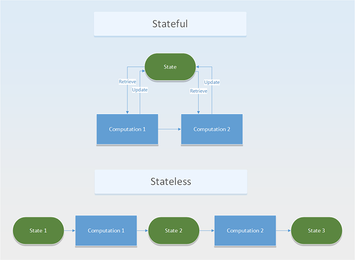

# 1 为什么`第一方`和`第三方`Cookie不同对待？

- 第一方 Cookie 是你直接访问的域名，它允许网站的拥有者可以搜集分析数据，记住语言设置或者提供很好的用户体验。举例来讲，在你访问社交网站的时候，你并不需要每次都需要重复登陆操作。
- 第三方 Cookie 并不是你正在访问的网站创建的，它通常是由第三方网站创建，用在跨站追踪上或者广告投放。举例来将，在正在浏览的网页上添加一个不可见的元素，浏览器用来向第三方网站发送请求。

```html
<a href="ad.doubleclick.net/some-other-parameters-specific-to-this-ad" target="_blank" rel="noopener"></a>
```

毫无疑问，第一方 Cookie 是互联网用户体验的重要的一部分；但是第三方 Cookie 通常涉及到用户的隐私数据的使用，现在的浏览器一般都可以配置竞争使用第三方 Cookie。


# 2 为什么我们通常在无状态服务做出巨大的付出，那么在无状态代码中有哪些好处以及有状态有什么坏处？

无状态的服务通常是不需要存储客户端生成的数据，这些数据通常是用在用户会话的 `session` 中；而有状态的服务缺恰恰相反。


为什么我们需要无状态的服务呢？
- 使用有状态的服务需要与存储层创建链接，这个增加工作量。
- 在有状态的服务中，需要在每次请求的时候维持事务操作。
- 需要处理用户数据存储等各种情况。

使用无状态服务可以获得如下的好处
1. 使用无状态的服务，可以很容易的扩展它们，只需要增加需要部署的服务。
2. 无状态的服务可以很方便的时候缓存。
3. 避免的存储层的设计。
4. 在每个请求中，无需绑定客户端和服务端，可以做到流水线处理。


现在很多云服务提供商提供了无状态服务 [Function as a Service](https://en.wikipedia.org/wiki/Function_as_a_service) (FaaS)，比如 AWS 的 Lambda, Azure 的 Function.