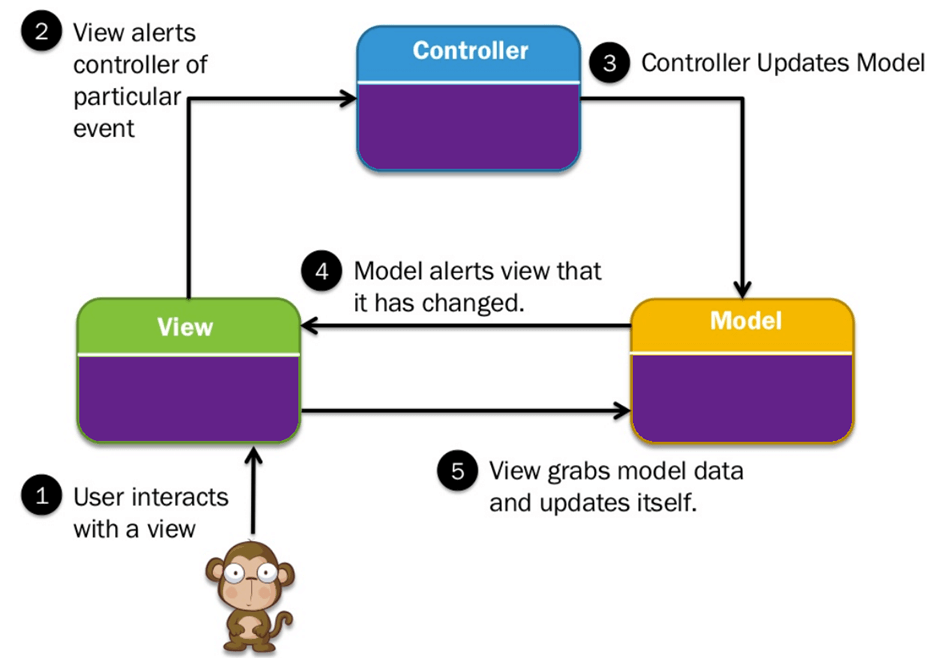
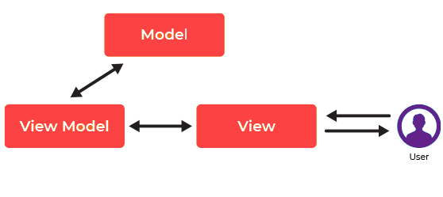

1. [为什么第一方和第三方Cookie不同对待？](#1-wei-shen-me-di-yi-fang-he-di-san-fang-cookie-bu-tong-dui-dai)
2. [为什么我们通常在无状态服务做出巨大的付出，那么在无状态代码中有哪些好处以及有状态有什么坏处？](#2-wei-shen-me-wo-men-tong-chang-zai-wu-zhuang-tai-fu-wu-zuo-chu-ju-da-de-fu-chu-na-me-zai-wu-zhuang-tai-dai-ma-zhong-you-na-xie-hao-chu-yi-ji-you-zhuang-tai-you-shen-me-huai-chu)
3. [从后端的角度来看，采取单页面应用程序(Single Page Application)有什么弊端和缺陷？](#3-cong-hou-duan-de-jiao-du-lai-kan-cai-qu-dan-ye-mian-ying-yong-cheng-xu-single-page-application-you-shen-me-bi-duan-he-que-xian)
4. [在Web开发中，MVC和MVVM两种模式非常常见，在前端和后端中都是常见的，那么它们各自是什么？为什么它们是值得使用的？](#4-zai-web-kai-fa-zhong-mvc-he-mvvm-liang-zhong-mo-shi-fei-chang-chang-jian-zai-qian-duan-he-hou-duan-zhong-du-shi-chang-jian-de-na-me-ta-men-ge-zi-shi-shen-me-wei-shen-me-ta-men-shi-zhi-de-shi-yong-de)
5. [如何管理你的Web符合的API版本？](#5-ru-he-guan-li-ni-de-web-fu-he-de-api-ban-ben)
6. [为什么我们通常在无状态服务做出巨大的付出，那么在无状态代码中有哪些好处以及有状态有什么坏处？](#6-wei-shen-me-wo-men-tong-chang-zai-wu-zhuang-tai-fu-wu-zuo-chu-ju-da-de-fu-chu-na-me-zai-wu-zhuang-tai-dai-ma-zhong-you-na-xie-hao-chu-yi-ji-you-zhuang-tai-you-shen-me-huai-chu)
7. [REST 和 SOAP两种方式，什么时候选择其中一个，而不用另外一个？](#7-rest-he-soap-liang-zhong-fang-shi-shen-me-shi-hou-xuan-ze-qi-zhong-yi-ge-er-bu-yong-ling-wai-yi-ge)

## 1 为什么`第一方`和`第三方`Cookie不同对待？

- 第一方 Cookie 是你直接访问的域名，它允许网站的拥有者可以搜集分析数据，记住语言设置或者提供很好的用户体验。举例来讲，在你访问社交网站的时候，你并不需要每次都需要重复登陆操作。
- 第三方 Cookie 并不是你正在访问的网站创建的，它通常是由第三方网站创建，用在跨站追踪上或者广告投放。举例来将，在正在浏览的网页上添加一个不可见的元素，浏览器用来向第三方网站发送请求。

```html
<a href="ad.doubleclick.net/some-other-parameters-specific-to-this-ad" target="_blank" rel="noopener"></a>
```

毫无疑问，第一方 Cookie 是互联网用户体验的重要的一部分；但是第三方 Cookie 通常涉及到用户的隐私数据的使用，现在的浏览器一般都可以配置竞争使用第三方 Cookie。


## 2 为什么我们通常在无状态服务做出巨大的付出，那么在无状态代码中有哪些好处以及有状态有什么坏处？

无状态的服务通常是不需要存储客户端生成的数据，这些数据通常是用在用户会话的 `session` 中；而有状态的服务缺恰恰相反。


为什么我们需要无状态的服务呢？
- 使用有状态的服务需要与存储层创建链接，这个增加工作量。
- 在有状态的服务中，需要在每次请求的时候维持事务操作。
- 需要处理用户数据存储等各种情况。

使用无状态服务可以获得如下的好处
1. 使用无状态的服务，可以很容易的扩展它们，只需要增加需要部署的服务。
2. 无状态的服务可以很方便的时候缓存。
3. 避免的存储层的设计。
4. 在每个请求中，无需绑定客户端和服务端，可以做到流水线处理。


现在很多云服务提供商提供了无状态服务 [Function as a Service](https://en.wikipedia.org/wiki/Function_as_a_service) (FaaS)，比如 AWS 的 Lambda, Azure 的 Function.


## 3 从后端的角度来看，采取单页面应用程序(`Single Page Application`)有什么弊端和缺陷？

首先，什么是单页面应用程序呢？从字面上讲，就是的单个页面持续和用户交互并且动态地重写当前页面而不是重新加载新的页面。

单页面应用程序地工作流程是这样的，在浏览器第一次打开的时候，服务端返回HTML页面，但是在后续的请求中，只会返回 JSON 数据结构。单页面和多页面应用程序的区别如下。


单页面应用程序只会重写当前页面的内容，这样就不用页面加载和额外的等待时间。
单页面应用程序有下面的好处
- 快速的响应时间：因为没有额外的页面加载，所以响应时间就很快。
- 无缝的用户体验：单页面应用程序使用体验和桌面和移动程序一样。只需要看到页面改变即可。
- 构建富特色的应用程序：通过单页面应用程序，可以构建内容编辑的Web应用和实时分析，如果用传统的方式就需要不同的加载页面。
- 使用更小的带宽：由于单页面应用程序，不需要额外的数据传输，减少了数据在网络中的传输。

单页面应用的缺陷：
- SEO处理不够友好：大部分搜索引擎的度量标准是这个站点有多少页面，有于单页面应用只有一个页面，所以不能很好的做到优化。
- 使用了大量的浏览器资源：在单页面应用程序中，大部分任务都是由浏览器完成，所以浏览器会使用很多资源。

## 4 在Web开发中，MVC和MVVM两种模式非常常见，在前端和后端中都是常见的，那么它们各自是什么？为什么它们是值得使用的？

**MVC 模式**



- Model: 包含了数据和它们之间的逻辑
- View: 向用户展示数据或者处理用户交互
- Controller: 介于 Model 和 View 之间的接口的组件

MVC 模式有下面的特色：
- 这是一个非常容易测试和拓展的框架
- 现有的 ASP.NET, Django, JSP 都支持这种模式
- 你可以非常容易控制 HTML 页面和 URL 
- 支持 Test Driven Development (TDD) 
- 对 SEO 也非常友好
- 支持映射复合和可搜索的 URL 

MVC 模式的优点主要有
- 支持各式各样的客户端
- 开发不同的组件的过程可以并行执行
- 支持 Web 应用程序
- 提供了清晰的 Separation of Concerns (SoC)
- MVC 可以将多逻辑操作组合成一个 Controller 

MVC 模式缺点如下
- 业务逻辑和 UI 混合在一起
- 很难复用和实现测试
- 随着数据增加，复杂度和无效性逐步增加
- 需要同时掌握不同的技术

**MVVM 模式**



- Model: 存储了数据和它们之间的逻辑，
- View: 代表了 UI 组件，比如 HTML, CSS, JQuery 等等。
- View-Model: 它代表了展示函数，命令和方法，来支持 View 的状态。

MVVM 提供了在 View 和 View-Model 之间的双向绑定功能，而且提供了一种修改自动通知的功能从 View-Model 到 View 之间。同样的 View-Model 使用了观察者模式来将 View 上改变到 view-model 中。

MVVM 有下面的特色
- MVVM 一开始是为桌面应用程序设计的，通过数据绑定的方式实现，`XAML` 和 `INotifiyPropertyChanged` 接口
- 如果你想在 View-Model 上做修改，那么 View-Model 使用了观察者模式
- MVVM 模式通常用在 WPF，Sliverlight，nRoute 中

MVVM 模式的优点有
- 业务逻辑和 UI 解耦
- 非常容易维护和测试
- 非常容易重用组件
- 低耦合架构
- 可以为 View-model 和 Model 单独编写单元测试，而不需要引用 View

MVVM 的缺陷有
- 在 Controller 中要维护大量的代码
- 有些人认为在简单的 UI 中使用 MVVM 是 “大炮打蚊子”

## 5 如何管理你的Web符合的API版本？

管理Web API的版本是确保API用户（开发者）能够平滑过渡到新版本同时保持旧版本系统稳定运行的关键策略。以下是一些有效管理Web API版本的常用方法：

1. URI版本控制
将版本信息直接嵌入到API的URI中，这是一种常见且直观的方法。例如：

`https://api.example.com/v1/resource`
`https://api.example.com/v2/resource`

这种方法的优点是直观易懂，缺点是可能会导致URI设计过于僵硬。

2. 参数版本控制

通过查询参数来指定API的版本。这种方法不需要改变URI结构，例如：

`https://api.example.com/resource?version=1`
`https://api.example.com/resource?version=2`

这种方法使URI保持了一致性，但是将版本控制的责任转移到了客户端，需要客户端明确请求特定版本的API。

3. 头部版本控制

在HTTP请求的头部中指定版本信息，而不是在URI中。这可以通过自定义头信息实现，例如：

```makefile
GET /resource HTTP/1.1
Host: api.example.com
Accept-Version: v1
```

头部版本控制的优点是保持了URI的稳定性和干净性，缺点是不如URI版本控制直观，且要求客户端构建更复杂的请求。

4. 内容协商

利用HTTP头部中的Accept字段来请求特定版本的数据，例如：

```makefile
GET /resource HTTP/1.1
Host: api.example.com
Accept: application/vnd.example.v1+json
```

这种方法允许服务器基于HTTP头部返回不同版本的响应。优点是非常灵活，并能很好地支持不同的数据格式和版本。缺点是增加了客户端的请求复杂性。

版本管理的最佳实践

- 避免频繁的大变动：尽量通过向后兼容的小更新来避免版本爆炸。
- 清晰的文档：为API的每个版本提供详细的文档，包括变更日志。
- 弃用策略：提前通知用户旧版本的弃用计划，给予足够的过渡期。
- 使用语义化版本号：遵循语义化版本控制规范来命名你的API版本，使版本变化更加明确和预测。
选择哪种版本控制策略取决于你的具体需求、API的复杂度以及你的用户群体。无论哪种方法，关键在于保持一致性、清晰的沟通以及对用户友好的过渡策略。

## 6 为什么我们通常在无状态服务做出巨大的付出，那么在无状态代码中有哪些好处以及有状态有什么坏处？

在软件架构中，无状态和有状态服务是两种基本的设计方法，各有其优缺点。选择哪一种设计取决于应用的需求、性能目标和可维护性考虑。下面是一些在无状态服务中付出巨大努力的原因，以及无状态和有状态代码的优缺点。

- 无状态服务的优点

1. 可伸缩性：无状态服务更容易水平扩展，因为任何请求都可以由任何实例处理，不需要特定的会话信息。这意味着你可以简单地增加更多的服务实例来处理更多的负载。
2. 可靠性和容错性：由于每个请求都是自包含的，一个服务实例的失败不会直接影响到其他实例。这使得无状态架构更加可靠和容错。
3. 简化的负载均衡：无状态架构简化了负载均衡的实现，因为请求不需要基于用户的会话信息来路由到特定的服务器。
4. 提高性能：无状态服务通常能够更快地响应请求，因为它们不需要查询或管理会话状态。

- 无状态服务的缺点

1. 状态管理外部化：虽然服务本身是无状态的，但通常需要某种形式的外部状态管理，如数据库、缓存或会话存储，这可能会引入额外的复杂性和延迟。
2. 可能的数据一致性问题：在分布式系统中，确保外部状态存储的数据一致性可能会变得复杂和挑战性。

- 有状态服务的优点

1. 上下文感知：有状态服务能够记住之前的交互，这对于需要复杂交互和维护用户会话的应用来说是必需的。
2. 减少外部依赖：由于状态是由服务自身维护的，可能减少对外部状态存储的依赖，从而在某些情况下降低系统复杂性。

- 有状态服务的缺点

1. 扩展性问题：有状态服务更难以水平扩展，因为需要考虑如何在多个服务实例之间共享和同步状态。
2. 容错性和恢复性问题：服务失败可能会导致状态丢失或不一致，从而影响应用的可靠性。实现高可用性的有状态服务通常更复杂。
3. 负载均衡复杂性：需要更复杂的负载均衡策略来确保用户的请求被路由到正确的服务器实例，以维护用户会话的连续性。

综上所述，无状态服务之所以受到青睐，主要是因为它们提供了更好的可伸缩性、可靠性和容错性。然而，无状态和有状态设计各有应用场景，选择哪种设计取决于具体的业务需求和技术挑战。在某些情况下，可能需要结合使用无状态和有状态组件，以利用各自的优点来构建高效、可靠和易于维护的应用程序。

## 7 REST 和 SOAP两种方式，什么时候选择其中一个，而不用另外一个？

在选择REST和SOAP这两种Web服务通信协议时，最佳选择依赖于应用程序的特定需求、目标和约束条件。这两种协议都有其优点和适用场景。下面是在选择REST和SOAP之间进行决策时可以考虑的一些关键因素：

- 选择SOAP的情况

1. 安全性需求高：如果应用程序需要严格的安全性保证，SOAP可能是更好的选择。SOAP支持WS-Security，这是一个提供消息安全性的标准，包括加密、签名和身份验证。
2. 事务管理：SOAP支持WS-AtomicTransaction，为分布式事务提供原子性、一致性、隔离性和持久性（ACID属性）保证。
3. 状态管理：SOAP支持WS-ReliableMessaging，确保消息的可靠传递，即使在不可靠的网络环境中也能保证消息的顺序和不重复。
4. 已有的企业集成：在与已经基于SOAP的系统集成时，继续使用SOAP可以简化开发和维护工作。

选择REST的情况

1. 简单性和可用性：如果你的优先级是开发简单、易于使用和理解的API，REST是一个很好的选择。REST利用了HTTP协议的标准方法（如GET、POST、PUT、DELETE）来进行资源操作，这使得它对开发者更加友好。
2. 灵活性和可伸缩性：REST基于无状态的通信，这使得REST服务能够很好地水平扩展，并且易于缓存，从而提高性能和可伸缩性。
3. 互联网和移动应用：对于互联网应用程序和移动应用程序，REST通常是更合适的选择。它的轻量级特性适合网络带宽有限的环境，并且能够更容易地与Web技术集成。
4. 公共API：如果你打算设计一个公共API供广泛使用，REST由于其简单性和广泛的支持，通常是更受欢迎的选择。

总结
选择SOAP：当你需要高级的安全性、事务管理或与遵循特定企业标准的系统集成时。
选择REST：对于需要高度可伸缩性、简单性、灵活性的互联网和移动应用，或者设计面向公众的API时。
在做出决策时，还应该考虑现有的架构、团队的技术栈熟悉度、以及项目的长期维护性。了解你的项目需求并权衡各种因素，将帮助你作出合适的选择。