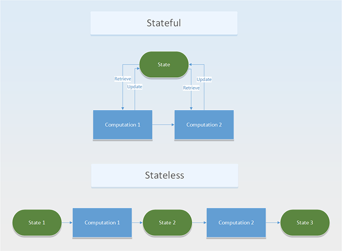
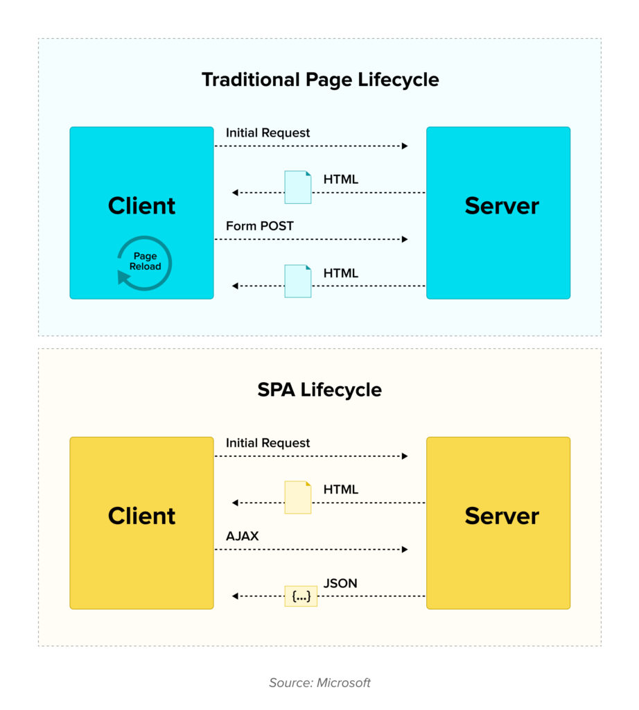
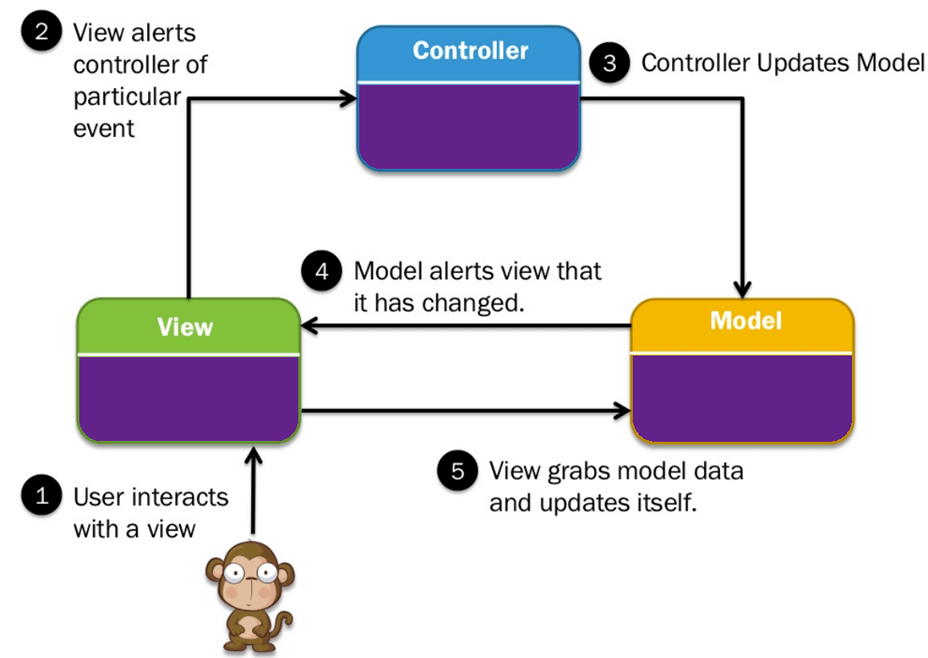
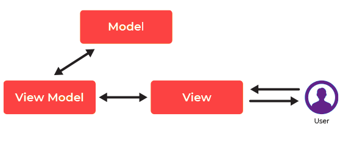

1. [为什么第一方 Cookie 和第三方 Cookie 会被区别对待？](#1-为什么第一方-cookie-和第三方-cookie-会被区别对待)
2. [为什么后端系统通常努力追求无状态？无状态和有状态分别有什么优缺点？](#2-为什么后端系统通常努力追求无状态无状态和有状态分别有什么优缺点)
3. [从后端角度看，单页面应用（SPA）有什么代价和挑战？](#3-从后端角度看单页面应用spa有什么代价和挑战)
4. [MVC 和 MVVM 分别是什么？它们各自适合什么场景？](#4-mvc-和-mvvm-分别是什么它们各自适合什么场景)
5. [如何管理 Web API 的版本？](#5-如何管理-web-api-的版本)
6. [REST 和 SOAP 应该如何选择？](#6-rest-和-soap-应该如何选择)

---

## 1 为什么第一方 Cookie 和第三方 Cookie 会被区别对待？

核心原因是：

> 它们服务的对象、可见范围和隐私影响完全不同。

### 什么是第一方 Cookie

第一方 Cookie 是由用户当前访问的网站所属域名设置的 Cookie。

常见用途：

- 登录态维持
- 语言偏好
- 购物车
- 安全校验
- 站点内分析

例如你访问 `example.com`，由 `example.com` 设置的 Cookie 就是第一方 Cookie。

### 什么是第三方 Cookie

第三方 Cookie 是由当前页面中嵌入的其他域设置的 Cookie。

例如页面里加载了：

- 广告脚本
- 统计脚本
- 社交分享按钮
- 第三方 iframe

这些第三方域可能借机设置 Cookie，用于跨站识别用户。

### 为什么浏览器会更严格地对待第三方 Cookie

因为第三方 Cookie 更容易被用于：

- 跨站追踪
- 广告画像
- 用户行为聚合
- 隐私侵犯

也就是说，第一方 Cookie 大多服务于“你当前访问的网站的正常功能”，而第三方 Cookie 往往服务于“别的系统对你进行识别和追踪”。

### 现代浏览器趋势

近几年主流浏览器都在逐步收紧第三方 Cookie：

- 默认限制第三方 Cookie
- 引入更严格的 `SameSite` 策略
- 推动分区存储（partitioned storage）
- 逐步淘汰跨站跟踪能力

### 后端开发需要关注什么

#### 1. 正确认识 Cookie 已经不是“随便设就行”

现代浏览器对 Cookie 的限制越来越多，尤其是跨站场景。

#### 2. 正确设置安全属性

常见安全属性包括：

- `HttpOnly`
- `Secure`
- `SameSite=Lax/Strict/None`

#### 3. 跨域登录和嵌入式场景要提前验证浏览器兼容性

比如：

- SSO
- iframe 嵌入系统
- 跨域 API + Cookie 会话认证

### 面试回答要点

> 第一方 Cookie 主要服务于当前站点功能，第三方 Cookie 更容易用于跨站追踪，因此浏览器会对第三方 Cookie 采取更严格的隐私限制。现代后端开发必须同时考虑功能性和隐私合规。

---

## 2 为什么后端系统通常努力追求无状态？无状态和有状态分别有什么优缺点？



无状态（stateless）不是说“系统完全没有状态”，而是说：

> 单个服务实例不在本地内存中长期持有某个客户端会话所必需的状态。

状态通常会放在外部系统中，例如：

- 数据库
- Redis
- 对象存储
- 消息队列
- 身份令牌（如 JWT）

### 为什么大家愿意为无状态付出代价

因为无状态服务对现代基础设施非常友好：

#### 1. 更容易水平扩展

任意请求都可以由任意实例处理，扩容更简单。

#### 2. 更利于弹性和故障恢复

某个实例挂掉，流量可以快速切到其他实例。

#### 3. 更适合容器和云原生环境

在 Kubernetes、Serverless、Auto Scaling 等环境下，无状态服务更容易调度和替换。

#### 4. 简化负载均衡

不需要强依赖 sticky session。

#### 5. 更容易做灰度、滚动发布和回滚

实例之间不绑定用户上下文，变更发布风险更低。

### 无状态的代价

无状态不是免费午餐，它会带来：

- 外部状态存储复杂度上升
- 更多网络跳数
- 缓存一致性问题
- 身份认证和上下文传播设计更复杂
- 幂等、重试、并发冲突需要更仔细处理

### 有状态服务的优点

- 某些交互式会话场景更直接
- 可以减少部分外部存储访问
- 对某些长连接、实时会话、游戏房间、流式上下文处理更自然

### 有状态服务的缺点

- 扩容困难
- 故障恢复复杂
- 会话迁移成本高
- 对调度器、负载均衡器和部署系统要求更高
- 更容易产生节点绑定和热点问题

### 一个常见误区

很多人把“无状态服务”和“无状态系统”混为一谈。

实际上，一个系统可以由：

- 无状态应用层
- 有状态数据库
- 有状态缓存
- 有状态消息系统

共同组成。

真正的重点是：

> 尽量让业务计算层无状态，把状态管理收敛到更适合管理状态的组件上。

### 面试回答要点

> 无状态之所以重要，不是因为它更“纯”，而是因为它更适合弹性伸缩、容灾和云原生部署；代价是状态被外部化后，一致性、缓存和上下文传播会更复杂。

---

## 3 从后端角度看，单页面应用（SPA）有什么代价和挑战？



SPA（Single Page Application）的主要特点是：

> 首次加载页面框架后，后续大量交互通过前端路由和 API 调用完成，而不是每次都由服务端重新渲染完整页面。

### SPA 的好处

先承认它的优点：

- 交互流畅
- 更适合复杂前端状态管理
- 前后端边界更清晰
- 更适合富交互后台和协作型产品

### 从后端角度的主要挑战

#### 1. API 设计压力更大

在 SPA 架构中，前端大量依赖 API，后端必须更认真地处理：

- 资源模型设计
- 错误码规范
- 分页、过滤、排序
- 幂等性
- 版本治理
- 权限模型

#### 2. 前后端契约治理成本上升

服务端模板时代，很多变更都在一个代码库内完成；而 SPA 常常意味着：

- 前后端独立发布
- 契约漂移风险上升
- 需要 OpenAPI / schema / mock / contract test 支撑

#### 3. SEO 与首屏性能问题

虽然现代 SSR / SSG / hydration 已缓解不少问题，但纯 CSR SPA 仍然可能在：

- SEO
- 首屏时间
- 弱网体验

上吃亏。

#### 4. 安全边界变复杂

SPA 常见安全议题包括：

- Token 存储位置
- XSS 导致凭证泄露
- CORS 配置
- CSRF 策略变化
- 前后端权限校验职责划分

#### 5. 观测和排障链路更长

一个用户问题可能横跨：

- 浏览器状态
- CDN
- BFF / API Gateway
- 后端 API
- 第三方服务

问题定位通常比传统服务端渲染更复杂。

### 现代补充：SPA 不等于唯一答案

今天更常见的是混合方案：

- SPA + BFF
- SSR + hydration
- SSG + API
- islands architecture
- Next.js / Nuxt / Remix 这类折中方案

### 面试回答要点

> SPA 的问题不是“前端太重”这么简单，而是它把更多复杂度转移到了 API 设计、契约治理、安全和排障体系上。对于富交互系统它很有价值，但后端要承担更成熟的平台职责。

---

## 4 MVC 和 MVVM 分别是什么？它们各自适合什么场景？

### MVC 是什么



MVC 指：

- **Model**：领域数据和业务逻辑
- **View**：界面展示
- **Controller**：接收输入、协调 Model 和 View

在 Web 开发里，经典服务端 MVC 常见于：

- ASP.NET MVC
- Spring MVC
- Django
- Rails

### MVC 的价值

- 将展示和业务逻辑做基础分离
- URL / 路由 / 请求处理模型清晰
- 适合服务端渲染页面
- 对 SEO 友好
- 有利于传统 Web 应用快速开发

### MVC 的局限

- 在复杂前端交互下，前端状态管理能力有限
- Controller 可能膨胀
- 对富客户端场景不够自然

### MVVM 是什么



MVVM 指：

- **Model**：数据和业务规则
- **View**：界面
- **ViewModel**：把界面状态和交互行为映射成更适合 View 使用的数据模型

MVVM 最早常见于桌面开发（如 WPF），后来也影响了很多现代前端框架思路。

### MVVM 的价值

- 更适合复杂界面状态
- 更适合双向绑定或响应式更新
- 视图逻辑可测试性更好
- UI 与数据变换更解耦

### MVVM 的局限

- 简单场景可能过度设计
- 数据绑定链路复杂时调试难度上升
- 不同框架实现差异很大

### 后端面试里怎么答更好

不要把 MVC 和 MVVM 当成“二选一宗教战争”。

更准确的说法是：

- 服务端页面驱动系统常见 MVC
- 富客户端和桌面应用更常见 MVVM 思路
- 现代全栈系统常常是多层模式共存

例如：

- 后端采用 MVC / 分层架构暴露 API
- 前端采用 MVVM 或响应式状态管理

### 面试回答要点

> MVC 更偏请求驱动和服务端页面协调，MVVM 更偏界面状态管理和响应式绑定。它们不是互斥关系，而是适用于不同交互复杂度和技术栈的组织方式。

---

## 5 如何管理 Web API 的版本？

API 版本管理的目标不是“给 URL 加个 v2”这么简单，而是：

> 在持续演进 API 的同时，尽量降低客户端中断风险和兼容性成本。

### 常见版本管理方式

#### 1. URI 版本

```text
/api/v1/orders
/api/v2/orders
```

优点：

- 直观
- 易于文档化
- 对外部开发者友好

缺点：

- 资源 URI 与版本强耦合
- 容易导致版本分叉长期共存

#### 2. Header 版本

```http
Accept-Version: v2
```

优点：

- URI 更稳定
- 更适合把版本当作协商能力

缺点：

- 不如 URI 直观
- 调试和网关治理稍复杂

#### 3. 媒体类型 / 内容协商版本

```http
Accept: application/vnd.example.v2+json
```

优点：

- 更符合协议语义
- 灵活

缺点：

- 对客户端和文档不够友好
- 团队执行一致性要求高

### 比“怎么加版本号”更重要的事

#### 1. 尽量优先向后兼容演进

不是每次改动都该升主版本。

优先考虑：

- 增加可选字段
- 新增端点
- 放宽兼容解析
- 通过 feature flag 灰度能力

#### 2. 明确定义什么叫 breaking change

例如：

- 删除字段
- 改字段语义
- 收紧校验规则
- 修改错误码契约
- 修改排序 / 默认分页语义

这些都可能是破坏性变更。

#### 3. 做好废弃（deprecation）治理

- 给出 sunset 时间
- 文档标明弃用字段 / 版本
- 提前监控仍在使用旧版本的客户端
- 提供迁移指南

#### 4. 契约要可验证

- OpenAPI / protobuf / JSON schema
- consumer-driven contract testing
- 兼容性测试

### 现代实践建议

对外公共 API 往往更适合：

- 简单清晰的 URI 版本
- 长兼容周期
- 强文档和弃用治理

对内服务间 API 则可以更多依赖：

- schema 管理
- protobuf 演进规则
- 契约测试
- 网关灰度发布

### 面试回答要点

> API 版本管理的重点不是版本号放哪里，而是如何控制破坏性变更、提供迁移路径、监控旧版本使用情况，并尽量通过向后兼容演进来减少版本爆炸。

---

## 6 REST 和 SOAP 应该如何选择？

先说结论：

> 在现代互联网 API 场景中，REST 更常见；但 SOAP 在某些企业集成和强规范场景里仍然有现实价值。

### SOAP 的特点

SOAP 是一种更严格、更规范化的协议体系，通常与 XML、WSDL 以及 WS-* 规范一起出现。

它更适合：

- 强契约企业集成
- 历史系统对接
- 某些需要 WS-Security、WS-ReliableMessaging 等标准能力的场景

### REST 的特点

REST 更像一种架构风格，通常基于 HTTP 资源语义构建。

它更适合：

- Web API
- 移动端 API
- 公共开放平台
- 微服务 HTTP 接口
- 前后端分离系统

### 什么时候选 SOAP

- 你要对接的就是既有 SOAP 生态
- 组织内部已有成熟 WSDL / WS-* 治理体系
- 你明确需要这些既有企业协议标准

### 什么时候选 REST

- 面向浏览器、移动端或第三方开发者
- 希望 API 更简单易用
- 更关注开发效率和生态兼容性
- 基于 JSON / HTTP 的工具链更成熟

### 现代补充

今天真实世界里，选择通常不是 SOAP vs REST 二选一，而是：

- 对外开放 API：REST 或 GraphQL
- 服务间高性能通信：gRPC
- 历史企业系统：SOAP
- 事件驱动集成：Webhook / MQ / Event Bus

所以更现代的回答应该体现：

> SOAP 和 REST 都只是通信方式的一部分，实际还要结合契约、性能、生态、历史系统包袱和团队能力一起判断。

### 面试回答要点

> 如果是现代 Web 和开放 API，通常优先 REST；如果是已有企业系统集成、强依赖 WS-* 标准或遗留协议兼容，SOAP 仍然合理。选型应基于场景，而不是流行度。
