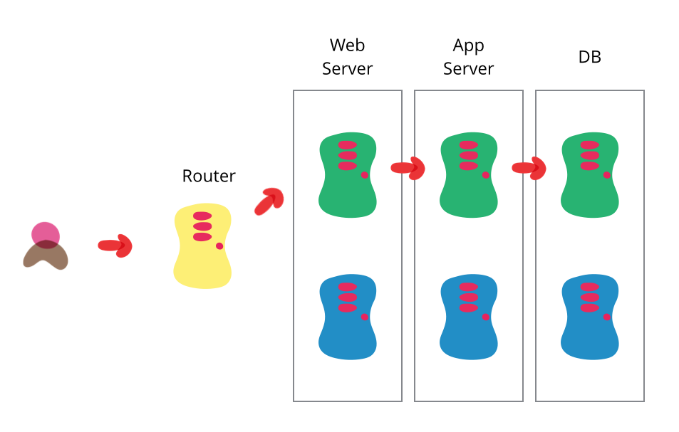

1. [ACID通常是 Atomicity, Consistency，Isolation 和 Durabiltiy。这四个属性通常有数据库引擎的事务来保证，你能谈谈这个话题吗？](#1-acid-tong-chang-shi-atomicity-consistencyisolation-he-durabiltiy-zhe-si-ge-shu-xing-tong-chang-you-shu-ju-ku-yin-qing-de-shi-wu-lai-bao-zheng-ni-neng-tan-tan-zhe-ge-hua-ti-ma)
2. [什么叫做Blue-Green Deployment](#2-shen-me-jiao-zuo-bluegreen-deployment)
3. [什么是 N + 1 问题](#3-shen-me-shi-n-1-wen-ti)
4. [如果你将你的应用程序迁移数据库，比如从MySQL迁移到PostgreSQL，你会怎么做？如果你来管理这个项目，那些问题需要考虑？](#4-ru-guo-ni-jiang-ni-de-ying-yong-cheng-xu-qian-yi-shu-ju-ku-bi-ru-cong-mysql-qian-yi-dao-postgresql-ni-hui-zen-me-zuo-ru-guo-ni-lai-guan-li-zhe-ge-xiang-mu-na-xie-wen-ti-xu-yao-kao-lv)
5. [为什么数据库需要特别对待null，比如在SQL语言中: SELECT * FROM table WHERE field=null并不能匹配为空的记录？](#5-wei-shen-me-shu-ju-ku-xu-yao-te-bie-dui-dai-null-bi-ru-zai-sql-yu-yan-zhong-select-from-table-where-fieldnull-bing-bu-neng-pi-pei-wei-kong-de-ji-lu)
6. [你是如何做到数据库模式的迁移，你是如何版本更改中，如何自动更改数据库模式修改的影响？](#6-ni-shi-ru-he-zuo-dao-shu-ju-ku-mo-shi-de-qian-yi-ni-shi-ru-he-ban-ben-geng-gai-zhong-ru-he-zi-dong-geng-gai-shu-ju-ku-mo-shi-xiu-gai-de-ying-xiang)
7. [如何在你的应用中查出代价最大的查询？](#7-ru-he-zai-ni-de-ying-yong-zhong-cha-chu-dai-jia-zui-da-de-cha-xun)
8. [在你的观点中，数据库范式化是否永远必须的？什么时候数据库可以不需要范式化？](#8-zai-ni-de-guan-dian-zhong-shu-ju-ku-fan-shi-hua-shi-fou-yong-yuan-bi-xu-de-shen-me-shi-hou-shu-ju-ku-ke-yi-bu-xu-yao-fan-shi-hua)

## 1 ACID通常是 `Atomicity`, `Consistency`，`Isolation` 和 `Durabiltiy`。这四个属性通常有数据库引擎的事务来保证，你能谈谈这个话题吗？

数据库通过事务来保证数据的完全性，通常用 `ACID` 来表示。

- **Atomicity**

不同于多线程变种原子操作，数据库中的 `Atomicity` 描述了下述的情况，如果客户端打算执行若干次写操作，但是由于某种原因，其中的有部分操作失败了。如果这些操作被组合成一个事务（transaction），那么数据库丢弃掉这些操作，数据库并不会生成 `脏` 数据。这样很方便进行重试操作。

- **Consistency** 

对于数据库中，你可以声明一些一定正确的语句。比如说对于财务的数据，所有账户的财务数据是平衡的。当然这个通常也取决于应用程序，如果刻意写入不合法的数据，数据库也不能阻止其发生。但是有些数据库会对写入的数据会做一些校验，比如日期字段合法性。

- **Isolation**

通常一个数据库被会多个客户端同时访问，如果都是读取或者修改不同的部分没有什么问题，但是如果同时修改的相同的部分，就会导致类似条件竞争的情况发生。数据库的 `Isolation` 意味着并发执行的事务是各自独立的，通常也叫做序列化。但是在实际中很少会使用序列化来完成 `Isolation`，因为有性能方面的损失。

- **Durability**

`Durability` 是一种数据库中一种承诺，一旦事务成功完成，那么它写入的数据就不会忘记。


## 2 什么叫做`Blue-Green Deployment`

`Blue-Green Deployment` 是一种减少服务宕机时间和避免 regression 的方法，它提供了两套一摸一样的生产环境，分别称之为 `Blue` 和 `Green`。



在任何时刻，只有一个环境是工作的，它承载的所有生产环境中的流量，而另一个环境则处于闲置状态。比如上图中，绿色的部分为工作环境，而蓝色部分处于闲置状态。

当你为软件开发出新的版本，在闲置的环境中部署，并且执行完全部的测试，比如在蓝色的环境中完成这些工作。然后在路由中切换所有的流量到新部署的环境中，那么现在绿色部分的环境就变为闲置。

这样做减少了宕机的时间，而且降低了风险，因为一旦新的软件版本出现问题，可以立马将路由切回到原来的环境，完成回滚。

这个设计通常要保证 `Green` 和 `Blue` 两套环境一摸一样，而且使用同一份数据。这样对于数据库的设计提出了挑战，尤其是在新的软件版本中需要修改数据库的 schema，因为一旦 rollback 就会导致不同版本之间的兼容性，解决办法就是将数据库升级和软件升级区分开来。

## 3 什么是 `N + 1` 问题 

N+1 问题通常是在使用 ORM 的时候发生，尤其是在使用懒加载的时候。当一个应用程序从数据库中获取了数据，然后迭代这个这个结果。这就意味着我么一遍遍的访问数据库。最终这个应用程序会在处理结果的每一行都有一个查询操作（N）和最原始的依次查询 （+1）。这就是 N+1 问题。
我们以 C# 中广泛使用的 Entity Framework 为例

```C#
using (var context = new StackOverFlowContext())
{
    var posts = context.Posts
                .Where(t => t.PostTags.Any(pt => pt.Tag == "sqlbulkcopy"))
                .Select(p => p);
    foreach(var post in posts)
    {
        foreach(var linkPost in post.LinkedPosts)
        {
            // Do something important.
        }
    }
}
```

上面的代码生成的 SQL 代码如下

```sql
Select
    [Extent1].[Id] as [Id],
    [Extent1].[TagVarchar] AS [TagsVarchar]
    FROM [dbo].[Posts] AS [Extent1]
    Where Exists (Select 
        1 as [C1]
        From [dbo].[PostTag] as [Extent2]
        Where ([Extent1].[Id] = [Extent2].[PostId]) And (N'sqlbulkcopy' = [EXtent2].[Tag]))
```

在这个例子中，我们从 Posts 表和 PostTags 表中获取 Tags 等于 `sqlbulkcopy`， 问题出在下面这么一行代码

```C#
foreach (var linkPost in post.LinkedPosts)
```

原因是原先的查询并由从 `LinkedPost` 实体中获取数据，仅仅从 `Posts` 和  `PostTags`。 Entity Framework 知道它没有从 `LinkedPosts` 实体中获取数据，所以会自动在每一行中自动从数据库中查询。这个糟糕透了，因为我们知道多次查询肯定比依次查询慢。

那么该如何解决这个问题呢？很简单只需要使用 `Include` 方法即可，也叫做激进加载。使用 `Include` 可以将所有的 `LinkedPosts` 实体加载进来。

```C# 
var posts = context.Posts
            .Where(t => t.PostTags.Any(pt => pt.Tag == "sqlbulkcopy"))
            .Include(p => p.LinkedPosts)
            .Select(p => p);
```

在这里，当 LinkedPosts 实体被访问的时候，Posts 实体已经加载了全部的数据，这样就不在需要额外的数据库访问。
那么我们生成的 SQL 语句有

```sql
SELECT 
    [Project2].[Id] AS [Id], 
    /* All columns from the Post table are in the SELECT. Extra columns removed for brevity */
    [Project2].[LinkTypeId] AS [LinkTypeId]
    FROM ( SELECT 
        [Extent1].[Id] AS [Id], 
        /* All columns from the Post table are in the SELECT. Extra columns removed for brevity */
        [Extent1].[TagsVarchar] AS [TagsVarchar], 
        [Extent2].[Id] AS [Id1], 
        [Extent2].[CreationDate] AS [CreationDate1], 
        [Extent2].[PostId] AS [PostId], 
        [Extent2].[RelatedPostId] AS [RelatedPostId], 
        [Extent2].[LinkTypeId] AS [LinkTypeId], 
        CASE WHEN ([Extent2].[Id] IS NULL) THEN CAST(NULL AS int) ELSE 1 END AS [C1]
        FROM  [dbo].[Posts] AS [Extent1]
        LEFT OUTER JOIN [dbo].[PostLinks] AS [Extent2] ON [Extent1].[Id] = [Extent2].[PostId]
        WHERE  EXISTS (SELECT 
            1 AS [C1]
            FROM [dbo].[PostTags] AS [Extent3]
            WHERE ([Extent1].[Id] = [Extent3].[PostId]) AND (N'sqlbulkcopy' = [Extent3].[Tag])
        )
    )  AS [Project2]
    ORDER BY [Project2].[Id] ASC, [Project2].[C1] ASC
```

## 4 如果你将你的应用程序迁移数据库，比如从MySQL迁移到PostgreSQL，你会怎么做？如果你来管理这个项目，那些问题需要考虑？

数据库迁移是一个复杂的过程，需要仔细规划和执行。从MySQL迁移到PostgreSQL具体涉及的步骤和考虑因素可能会根据应用的具体需求、数据的规模和复杂性以及系统的架构而有所不同。以下是管理此类迁移项目时应考虑的一些关键问题和步骤：

1. 准备工作
需求分析：明确迁移的目的和预期收益。考虑为什么需要从MySQL迁移到PostgreSQL，以及这将如何影响你的应用程序。
风险评估：评估迁移过程中可能遇到的风险，包括数据丢失、性能问题和应用兼容性问题。
资源评估：确定需要多少人力、时间和财务资源。
2. 详细规划
迁移策略：制定详细的迁移计划，包括迁移将如何执行、需要哪些工具和技术、以及如何分阶段进行。
测试计划：制定测试策略以验证迁移后的数据完整性和应用性能。
备份策略：确保有有效的数据备份和恢复计划，以防迁移失败。
3. 执行迁移
数据类型差异处理：考虑MySQL和PostgreSQL之间的数据类型差异，制定相应的映射策略。
SQL语法和功能差异：调查两种数据库系统之间的SQL语法和功能差异，修改应用程序代码以适应新的数据库系统。
数据迁移：使用工具（如pgloader、ETL工具）或自定义脚本迁移数据。
迁移触发器、存储过程和视图：因为这些可能包含特定于数据库的SQL语法，所以需要特别注意转换和测试。
4. 测试
完整性测试：验证迁移数据的完整性，确保所有数据都被准确迁移。
性能测试：比较迁移前后的应用性能，确保迁移不会引入性能下降。
应用兼容性测试：确保应用程序可以正常运行在新的数据库上，所有功能都按预期工作。
5. 部署和监控
迁移验证：在生产环境中彻底测试迁移过程，验证迁移的成功。
监控：在迁移后密切监控系统性能和用户反馈，以快速发现并解决问题。
文档更新：更新相关文档，包括架构文档、操作手册和应用程序文档。
6. 培训和支持
团队培训：确保团队成员了解新的数据库系统，包括开发者、DBA和运维人员。
用户支持：为应用的最终用户提供必要的支持，以确保他们能够无缝地使用新系统。
在管理数据库迁移项目时，细致的规划、充分的测试和周到的执行至关重要。成功的迁移不仅需要技术上的精确，还需要有效的沟通和团队合作。

## 5 为什么数据库需要特别对待null，比如在SQL语言中: SELECT * FROM table WHERE field=null并不能匹配为空的记录？

现在有下面两个 `SQL` 语句

```sql 
select * from table where field = null;
select * from table where filed <> null;
```
这两句都返回空的数据集，这是为什么呢？ 这是主要原因 `SQL` 不同于其他的编程语言，在其他编程语言中

> NULL 永远不等于其他任何事情

那么这导致了理解 `NULL != <something>` 这个语句返回 `true`。但是在数据库中，`NULL` 既不等于任何事物，也*不*不等于任何事物，这也是在数据库中我们需要特别对待 `Null`。当我们在等于或者不等于的比较的时候，我们应该还有大于或者小于同样的概念，但是对于 `NULL` 而言这是不成立的，我们只能说这个值是不是 `NULL`。

所以数据库 `NULL` 字段的正确地处理方式是这样的 

```sql
select * from where field is null;
select * from where field is not null;
```

## 6 你是如何做到数据库模式的迁移，你是如何版本更改中，如何自动更改数据库模式修改的影响？

数据库模式的迁移和版本更改是现代应用开发流程中的一个重要方面，特别是在持续集成/持续部署（CI/CD）的背景下。正确管理数据库模式变更能确保数据的一致性和完整性，同时减少对生产环境的潜在影响。下面是一些关键步骤和最佳实践，用于管理数据库模式的迁移和自动化处理变更：

- 版本控制数据库模式
使用迁移脚本：为数据库模式的每次变更创建迁移脚本，并将这些脚本纳入版本控制。这样可以确保变更的追踪、复现和回滚。
迁移脚本命名约定：采用一致的命名约定，通常包括版本号或时间戳，确保迁移的顺序执行。

- 使用数据库迁移工具
选择适合的迁移工具：根据你的技术栈和需求选择合适的数据库迁移工具。流行的选项包括Flyway, Liquibase, Alembic（针对Python/SQLAlchemy）等。
自动化迁移流程：将数据库迁移步骤整合到CI/CD流程中，确保每次代码部署时自动执行数据库迁移。这要求迁移脚本是幂等的，即多次执行不会改变结果。

- 测试数据库迁移
在开发和测试环境中执行迁移：在将变更部署到生产环境之前，先在开发和测试环境中执行迁移脚本，确保迁移按预期工作。
使用数据快照测试：在执行迁移前，从生产数据库创建快照，并在隔离的环境中测试迁移，以评估对数据和性能的影响。

- 备份与回滚计划
备份数据库：在执行任何迁移之前备份当前生产数据库。这是防止数据丢失和快速恢复的关键。
准备回滚脚本：为每个迁移脚本准备对应的回滚脚本，以便在迁移失败或出现意外时快速回滚至上一个稳定状态。

- 监控与验证
监控数据库性能：迁移后，监控数据库性能和应用日志，以便及时发现和解决由于模式变更可能引起的问题。
数据一致性和完整性验证：确保迁移后的数据与预期一致，执行数据完整性和一致性的检查。

- 文档和通讯
文档化变更：将所有数据库模式变更及其理由、影响和执行步骤进行文档化，便于团队成员理解和后续审计。
通知团队成员：关于数据库模式变更的决策和计划应该及时通知给团队的所有相关成员。
通过遵循这些步骤和最佳实践，你可以有效地管理数据库模式的迁移，减少对应用程序的影响，并保证数据的完整性和可靠性。这不仅提高了开发和部署的效率，也保障了业务的连续性和数据的安全。

## 7 如何在你的应用中查出代价最大的查询？

查找并优化应用中代价最大的数据库查询是提高整体应用性能的关键步骤。以下是一些有效的方法和工具，用于识别和分析性能瓶颈所在的查询：

1. 启用查询日志
大多数数据库管理系统（如MySQL、PostgreSQL等）提供了查询日志功能，允许你记录执行的所有查询及其执行时间。

MySQL：可以通过设置slow_query_log和long_query_time参数来记录执行时间超过特定阈值的查询。
PostgreSQL：通过调整log_min_duration_statement设置，可以记录执行时间超过指定毫秒数的所有语句。

2. 使用性能分析工具
数据库自带的工具：大多数数据库系统提供了性能分析工具，比如MySQL的EXPLAIN和PostgreSQL的EXPLAIN ANALYZE命令，可以用来分析查询计划并找出查询性能瓶颈。
第三方监控工具：如New Relic, Datadog等，这些工具可以提供实时监控和深入分析数据库性能，帮助你识别最耗时的查询。

3. 代码层面的优化
ORM分析器：如果你的应用使用对象关系映射（ORM）框架，很多ORM都提供了分析工具或插件来监控和记录查询性能，例如，Django的django-debug-toolbar或Rails的active_record_query_trace。
自定义日志记录：在应用层面添加自定义日志记录，对关键功能的数据库交互进行性能记录和分析。

4. 性能基准测试
在进行任何优化之前，建立一个性能基准是很重要的。这可以通过对数据库执行一系列标准化测试查询来完成，以此作为性能比较的基础。

5. 分析和重构查询
查询拆分：将复杂的查询拆分成多个简单的查询，有时候可以减少数据库的负载。
索引优化：确保最耗时的查询能够有效利用索引。没有正确索引的查询往往是性能瓶颈。
查询重写：优化查询逻辑，比如减少子查询和JOIN操作的使用，或者使用数据库提供的特定函数来提高效率。
6. 持续监控
性能优化是一个持续的过程。即使在进行了优化之后，随着应用的发展和数据量的增长，新的性能瓶颈可能会出现。因此，持续监控应用和数据库的性能至关重要。

通过上述方法和工具，你可以识别应用中代价最大的查询，并采取相应的优化措施。重要的是，优化工作应当谨慎进行，每次变更后都要进行充分的测试，以确保优化措施不会对应用功能产生负面影响。

## 8 在你的观点中，数据库范式化是否永远必须的？什么时候数据库可以不需要范式化？

数据库范式化是设计数据库时为了减少数据冗余、避免不必要的数据依赖，以及提高数据完整性而遵循的一系列准则。范式化可以帮助设计出结构良好、易于维护和扩展的数据库。然而，并不是在所有情况下范式化都是必须的，有时根据特定需求进行适度的反范式化（denormalization）也是合理的。

- 范式化的必要性

1. 数据一致性和完整性：范式化通过消除数据冗余来减少数据不一致的可能性。
2. 避免更新异常：范式化的数据库减少了插入、更新和删除操作引起的异常。
3. 提高查询效率：在某些情况下，范式化可以简化查询逻辑，使得数据更加容易查询。

反范式化的考虑
尽管范式化有上述优点，但在特定情况下进行适当的反范式化也有其好处：

1. 查询性能优化：对于读操作远远多于写操作的数据库，反范式化通过减少JOIN操作可以提高查询性能。
2. 简化应用逻辑：在某些情况下，反范式化可以简化应用程序的数据访问逻辑，尤其是当数据的一致性可以通过应用层来保证时。
3. 实时处理需求：在需要快速响应的系统中（如实时分析系统），反范式化有助于减少复杂的数据处理操作，提高系统响应速度。

何时可以不需要范式化

1. 数据仓库和分析应用：数据仓库经常采用反范式化的设计，以优化大规模数据集上的复杂查询性能，便于进行数据挖掘和分析。
2. 高性能需求的读取操作：对于读取密集型应用，特别是那些需要高速读取大量数据的应用（如社交网络的信息流），适度反范式化可以提高效率。
3. 缓存和临时数据：缓存系统或处理临时数据的场景中，数据模型可能不需要严格遵守范式化原则，因为这些数据的存储是为了快速访问和临时使用。

结论
在数据库设计中，是否遵循范式化原则应该基于具体的应用场景和性能需求来决定。范式化和反范式化不是绝对的对立面，而是需要在数据一致性、完整性和系统性能之间找到恰当的平衡点。在大多数情况下，推荐首先考虑范式化的设计，以确保数据的完整性和可维护性，然后根据性能测试和实际需求适当地进行反范式化优化。

