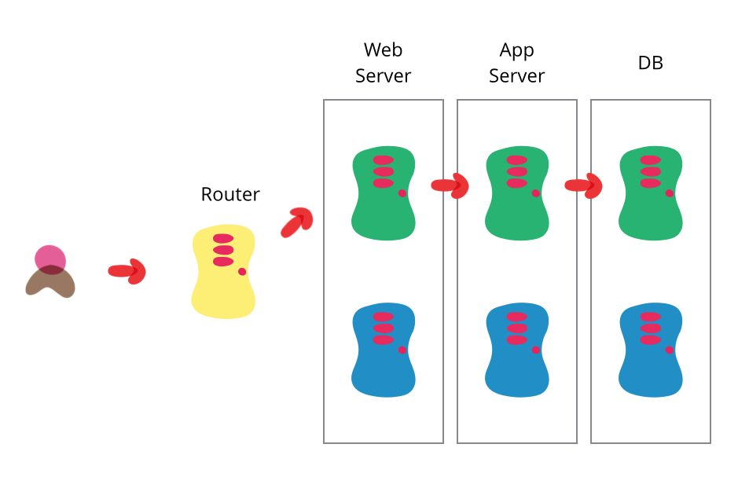

1. [如何理解数据库事务的 ACID？](#1-如何理解数据库事务的-acid)
2. [什么是 Blue-Green Deployment？它和数据库变更有什么关系？](#2-什么是-blue-green-deployment它和数据库变更有什么关系)
3. [什么是 N+1 查询问题？如何发现和解决？](#3-什么是-n1-查询问题如何发现和解决)
4. [如果要把应用从 MySQL 迁移到 PostgreSQL，你会如何推进？](#4-如果要把应用从-mysql-迁移到-postgresql你会如何推进)
5. [为什么 SQL 要特殊对待 `NULL`？为什么 `field = NULL` 不成立？](#5-为什么-sql-要特殊对待-null为什么-field--null-不成立)
6. [如何管理数据库 schema 迁移和版本变更？](#6-如何管理数据库-schema-迁移和版本变更)
7. [如何找出应用中代价最高的查询？](#7-如何找出应用中代价最高的查询)
8. [数据库规范化是否永远必要？什么时候应该反规范化？](#8-数据库规范化是否永远必要什么时候应该反规范化)

---

## 1 如何理解数据库事务的 ACID？

ACID 是事务的四个经典属性：

- **Atomicity（原子性）**
- **Consistency（一致性）**
- **Isolation（隔离性）**
- **Durability（持久性）**

它们的目标是：

> 让数据库在并发、故障和部分失败条件下，仍然能够以可预期的方式维护数据正确性。

### 1. Atomicity（原子性）

一个事务中的操作要么全部成功，要么全部失败回滚。

例如银行转账：

- A 账户扣款
- B 账户加款

这两个动作必须作为一个整体成功，否则就会出现“钱丢了”或“凭空多了”的问题。

### 2. Consistency（一致性）

事务执行前后，数据应满足系统定义的约束和不变量。

例如：

- 主键唯一
- 外键约束成立
- 余额不能为负（如果业务要求如此）
- 账务总额守恒

注意：

> 一致性不只是数据库引擎的责任，也依赖应用层正确建模和使用事务。

### 3. Isolation（隔离性）

多个事务并发执行时，一个事务不应看到另一个事务的中间状态。

如果隔离不足，会出现：

- 脏读（dirty read）
- 不可重复读（non-repeatable read）
- 幻读（phantom read）
- 丢失更新（lost update）

数据库通常通过不同隔离级别在 **正确性** 和 **性能 / 并发度** 之间做权衡。

### 4. Durability（持久性）

一旦事务提交成功，结果就应在系统故障后依然存在。

实现手段通常包括：

- WAL / redo log
- fsync
- 副本复制
- 崩溃恢复机制

### 现代工程视角

面试里不要把 ACID 讲成“数据库天然全都完美保证”。更好的说法是：

- ACID 保证依赖数据库实现细节
- 不同隔离级别的实际语义不同
- 分布式系统里很难无限放大 ACID 的边界
- 业务一致性常常还需要幂等、重试、补偿和事件机制配合

### 面试回答要点

> ACID 描述了事务在失败和并发下的核心保证，但真实系统中必须结合隔离级别、数据库实现和业务建模一起理解，不能把它当成“用了事务就万事大吉”。

---

## 2 什么是 Blue-Green Deployment？它和数据库变更有什么关系？



Blue-Green Deployment（蓝绿发布）是一种降低发布风险的部署策略。

核心思路是：

> 维护两套尽量一致的生产环境，当前流量只打到其中一套；新版本先部署到另一套，验证通过后再切流。

### 它的好处

- 切换快
- 回滚快
- 减少停机时间
- 便于上线前做真实环境验证

### 最大难点：数据库

应用可以蓝绿两套并存，但数据库通常只有一套共享数据。

这就导致一个现实问题：

> 新旧版本应用可能要同时读写同一份数据库。

因此数据库 schema 变更往往成为蓝绿发布里最危险的部分。

### 为什么数据库变更难

如果新版本上线时：

- 删除旧列
- 修改字段语义
- 更改约束
- 改写存储过程

那么一旦需要回滚，旧版本可能无法继续工作。

### 更安全的现代策略：Expand and Contract

常见做法是分阶段演进数据库：

#### 阶段 1：Expand

先做向后兼容的 schema 变更，例如：

- 新增列
- 新增表
- 新增索引
- 双写支持

#### 阶段 2：应用切换

新旧应用在过渡期兼容这套 schema。

#### 阶段 3：Contract

确认旧版本不再使用后，再删除旧列 / 旧索引 / 旧逻辑。

### 现代发布里还会配合

- feature flag
- canary 发布
- shadow traffic
- online DDL
- 数据回填任务

### 面试回答要点

> 蓝绿发布本身不难，真正难的是数据库兼容。安全做法通常是把数据库变更设计成向后兼容的多阶段演进，而不是和应用版本强绑定地一次性修改。

---

## 3 什么是 N+1 查询问题？如何发现和解决？

N+1 是一种典型的查询性能问题，常见于 ORM 或懒加载场景。

它的模式通常是：

1. 先执行 1 次查询拿到 N 条主记录
2. 再对每条记录各发 1 次关联查询

于是总共执行了 `1 + N` 次数据库访问。

### 典型场景

例如先查所有订单，再在循环里逐条查订单项：

```csharp
var orders = context.Orders.ToList();
foreach (var order in orders)
{
    foreach (var item in order.Items)
    {
        // ...
    }
}
```

如果 `Items` 是懒加载，这段代码就可能触发 N+1。

### 为什么它危险

- 查询次数暴增
- RTT 开销大
- 数据量一上来就退化明显
- 在测试环境可能感觉不明显，生产上才暴露

### 如何发现

#### 1. 看 ORM SQL 日志

把实际发出的 SQL 打出来，最容易看出循环查询。

#### 2. APM / tracing

通过 Datadog、New Relic、SkyWalking、OpenTelemetry 等看请求内 SQL 次数。

#### 3. 数据库慢查询日志

有时不是单条 SQL 慢，而是“单请求 SQL 数量异常多”。

#### 4. 压测和 profiling

随着数据量增长，响应时间曲线会明显恶化。

### 如何解决

#### 1. eager loading / preload / include

提前把关联数据一次性加载：

```csharp
var orders = context.Orders
    .Include(o => o.Items)
    .ToList();
```

#### 2. 批量查询

先查主表，再用 `IN (...)` 一次查所有关联数据，应用侧组装。

#### 3. 改写查询

必要时直接写更合适的 JOIN / 聚合 SQL，而不是完全依赖 ORM 默认行为。

#### 4. 只取需要的字段

不要为了避免 N+1 就盲目把整张关联表全部拉出来。

### 现代补充

N+1 不只存在于数据库，也存在于：

- GraphQL resolver
- 微服务串行 RPC
- 对象存储元数据访问

本质上都是“循环中逐个远程调用”。

### 面试回答要点

> N+1 的本质不是 ORM 的锅，而是“批处理问题被写成了多次远程访问”。解决思路通常是 eager loading、批量查询、合理 JOIN，核心目标是减少往返次数。

---

## 4 如果要把应用从 MySQL 迁移到 PostgreSQL，你会如何推进？

数据库迁移不是“导出再导入”这么简单，它通常是一个系统性工程。

### 第一步：先明确迁移动机

要先回答：为什么迁？

例如：

- 需要更强的 SQL 能力
- 需要 JSONB / window functions / partial index / extension 生态
- 需要统一技术栈
- 成本、许可、云服务能力考虑

如果动机不清，项目很容易变成高风险低收益。

### 第二步：评估差异和风险

重点检查：

- 数据类型差异
- SQL 方言差异
- 自增机制差异（AUTO_INCREMENT vs sequence / identity）
- 事务与隔离级别语义
- 索引类型与执行计划差异
- JSON、全文检索、时区、字符集行为
- 存储过程 / 触发器 / 函数差异

### 第三步：梳理依赖面

不仅是数据库本身，还要看：

- ORM 映射
- 报表脚本
- ETL 任务
- CDC / binlog 订阅
- 备份恢复链路
- 运维监控体系
- 数据权限和审计机制

### 第四步：制定迁移策略

常见策略有：

#### 1. 一次性停机迁移

适合：

- 数据量不大
- 可接受停机窗口
- 业务简单

#### 2. 双写 / 双读迁移

适合：

- 核心系统
- 停机窗口极小
- 需要灰度验证

代价是复杂度大幅上升，需要解决一致性和回放问题。

#### 3. CDC 增量同步切换

先全量迁移，再通过 binlog / CDC 把增量变更同步到新库，最后切流。

### 第五步：测试验证

必须覆盖：

- 数据完整性校验
- 行数 / checksum / 抽样对比
- 功能回归
- 查询性能对比
- 锁行为和事务冲突测试
- 备份恢复演练

### 第六步：演练切换和回滚

迁移前要明确：

- 切换窗口
- 流量冻结策略
- 回滚触发条件
- 回滚后的数据处理方式

### 现代实践建议

- 优先做 PoC 和影子读流量验证
- 对热点 SQL 单独做 explain analyze
- 先迁边缘业务，再迁核心交易链路
- 为迁移建立专项 dashboard 和告警

### 面试回答要点

> 从 MySQL 迁到 PostgreSQL，本质是一个涉及数据模型、SQL 方言、性能特性、运维体系和回滚方案的工程项目。关键不是“怎么导数据”，而是如何在可验证和可回退的前提下完成切换。

---

## 5 为什么 SQL 要特殊对待 `NULL`？为什么 `field = NULL` 不成立？

因为在 SQL 里，`NULL` 表示的不是一个普通值，而是：

> “未知（unknown）”或“缺失（missing）”的状态。

所以它不遵循普通二值逻辑，而是采用 **三值逻辑（true / false / unknown）**。

### 为什么 `field = NULL` 不成立

看这句：

```sql
SELECT * FROM t WHERE field = NULL;
```

这里不是返回 `true` 或 `false`，而是返回 `unknown`。

而 `WHERE` 子句只保留结果为 `true` 的行，因此不会匹配到任何记录。

同理：

```sql
SELECT * FROM t WHERE field <> NULL;
```

结果也仍然是 `unknown`，同样不会命中。

### 正确写法

```sql
SELECT * FROM t WHERE field IS NULL;
SELECT * FROM t WHERE field IS NOT NULL;
```

### 为什么这是个坑

因为很多开发者下意识把 `NULL` 当成编程语言里的普通空值，但 SQL 的语义更接近“值不存在 / 不知道”。

### 这会影响哪些事情

- 比较运算
- 排序
- 聚合函数
- 唯一索引行为
- 连接条件
- `NOT IN` / `IN` 语义

例如 `NOT IN` 一旦集合里出现 `NULL`，结果常常和直觉不一致。

### 设计建议

- 对关键字段尽量 `NOT NULL`
- 在业务上区分“空字符串”“0”“未知”“未设置”
- 在 API、ORM、数据分析场景明确建模 null 语义

### 面试回答要点

> `NULL` 在 SQL 里不是普通值，而是“未知状态”，因此比较运算走的是三值逻辑。正确判断空值要用 `IS NULL / IS NOT NULL`，而不是 `=`。

---

## 6 如何管理数据库 schema 迁移和版本变更？

数据库 schema 变更应该像应用代码一样，被纳入工程化治理。

核心目标是：

> 让结构变更可追踪、可测试、可回滚、可自动化执行。

### 基本原则

#### 1. 把 migration 脚本纳入版本控制

每次 schema 变更都应对应明确的 migration 文件。

常见工具：

- Flyway
- Liquibase
- Alembic
- Rails migrations
- Django migrations
- goose / golang-migrate

#### 2. 保证迁移可重复和顺序明确

需要有：

- 唯一版本号 / 时间戳
- 明确执行顺序
- 环境一致性保障

#### 3. 将迁移纳入 CI/CD

部署新版本时，数据库迁移不应靠人工临时敲命令。

但要注意：

- 自动化不等于无脑自动执行高风险 DDL
- 生产环境重大变更仍需要审批和演练

### 重要实践

#### 向后兼容优先

遵循 expand / contract：

- 先新增，不立即删除
- 先双读 / 双写，再收缩
- 应用和 schema 分阶段发布

#### 为大表变更设计 online 方案

例如：

- 加索引使用 online / concurrently 机制
- 避免长事务锁表
- 分批回填数据
- 峰值期禁止高风险 DDL

#### 迁移前后做验证

- schema diff
- 数据完整性校验
- 核心查询 explain
- 应用 smoke test

#### 准备回滚策略

不是所有 migration 都能真正“回滚”。

例如：

- 删除列后数据可能无法恢复
- 回填脚本执行后难以完全逆转

因此更安全的策略往往是：

- 前向修复（roll-forward）
- 兼容期双轨运行
- 生产前充分演练

### 面试回答要点

> schema 迁移要工程化管理：版本控制、自动化执行、兼容性设计、灰度验证和回滚预案缺一不可。关键不是“怎么改表”，而是如何在不停机或低风险条件下安全演进数据结构。

---

## 7 如何找出应用中代价最高的查询？

这类题的重点不是背几个命令，而是体现你有 **端到端定位性能瓶颈** 的能力。

### 第一步：先定义“代价最高”

可能有几种含义：

- 单次最慢
- 总耗时最高
- 调用次数最多
- 最消耗 CPU / I/O
- 最影响用户请求延迟

不同目标，排查方法不同。

### 常见定位方法

#### 1. 数据库慢查询日志

例如：

- MySQL `slow_query_log`
- PostgreSQL `log_min_duration_statement`

这是发现慢 SQL 的基础手段。

#### 2. 执行计划分析

使用：

- `EXPLAIN`
- `EXPLAIN ANALYZE`

重点看：

- 是否走索引
- 是否全表扫描
- join 顺序是否合理
- 估算行数是否失真
- sort / hash / temp file 开销

#### 3. APM / tracing

现代系统更推荐通过链路追踪看：

- 哪些 API 最慢
- 其中哪条 SQL 最耗时
- 是否存在单请求大量 SQL
- 是否数据库时间只是表象，真正瓶颈在锁等待

#### 4. 数据库内部统计视图

例如 PostgreSQL 的：

- `pg_stat_statements`
- `pg_stat_activity`
- `pg_locks`

能更系统地看到热点语句和等待情况。

#### 5. ORM / 应用层日志

很多问题不是 SQL 本身慢，而是：

- N+1
- 查询次数过多
- 不必要字段过大
- 重复查询

### 发现后怎么做

不是所有慢查询都该直接“加索引”。

应先判断问题类型：

- SQL 写法问题
- 索引设计问题
- 数据分布变化
- 统计信息过期
- 锁冲突 / 事务过长
- 表结构不适合当前查询模式
- 应用请求模式有问题

### 面试回答要点

> 找最贵查询要结合数据库日志、执行计划、链路追踪和应用上下文一起看。真正重要的不是定位到“慢 SQL”，而是判断慢的根因到底在查询写法、索引、锁、数据分布还是调用模式。

---

## 8 数据库规范化是否永远必要？什么时候应该反规范化？

规范化（normalization）的目标是：

- 减少冗余
- 降低更新异常
- 提高一致性
- 让数据模型更清晰

所以在绝大多数事务型系统里，**先规范化设计** 是合理默认选择。

### 为什么不能一开始就随意反规范化

因为过早反规范化通常会带来：

- 数据重复
- 一致性维护复杂
- 更新成本升高
- 回写链路变复杂
- 难以解释哪个字段才是真实来源

### 什么时候可以反规范化

当你已经明确遇到以下问题时，可以考虑：

#### 1. 读远多于写，且 JOIN 成本过高

例如热点页面、时间线、推荐流、搜索结果页。

#### 2. 分析型 / 报表型场景

OLAP、数据仓库、宽表设计本来就更偏反规范化。

#### 3. 为缓存和查询效率做投影模型

例如 CQRS 中专门为查询构建 read model。

#### 4. 业务允许最终一致性

如果可以接受短时间数据滞后，就能换取更高读取性能。

### 反规范化前要问自己

- 一致性由谁维护？
- 回填和修复机制是什么？
- 延迟刷新是否可接受？
- 是真实业务需求，还是 SQL 没优化好？
- 能否先用索引、物化视图、缓存解决？

### 现代视角

今天“是否规范化”往往不是单选题，而是多层模型并存：

- OLTP 主库：相对规范化
- 缓存层：反规范化
- 搜索索引：面向查询结构
- 数仓：宽表 / 星型模型
- CQRS 读模型：按查询场景定制

### 面试回答要点

> 规范化是默认起点，不是宗教信条；反规范化是有成本的性能优化手段。正确做法通常是先保证数据模型清晰和一致，再基于访问模式有节制地做反规范化。
