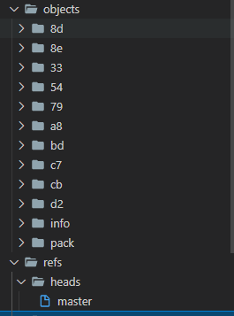
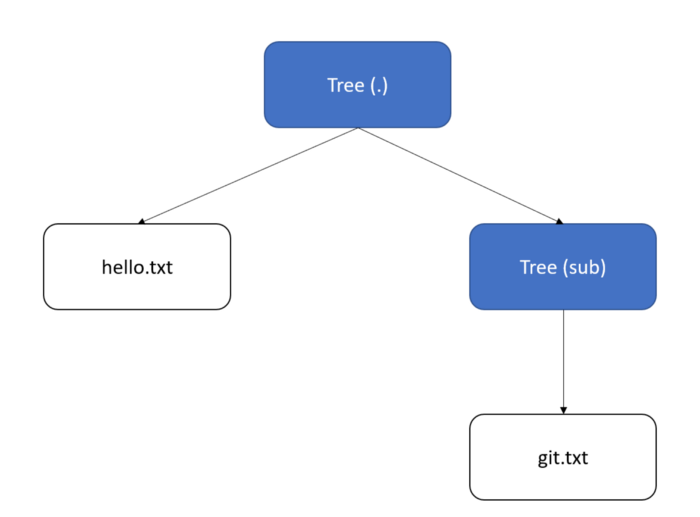
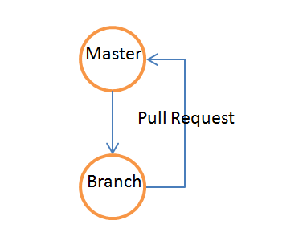

1. [为什么在Mercuial或者git中，创建分支比SVN分支容易](#1-wei-shen-me-zai-mercuial-huo-zhe-git-zhong-chuang-jian-fen-zhi-bi-svn-fen-zhi-rong-yi)
2. [分布式版本控制系统和集中式版本管理系统有什么各自的缺点和优点？](#2-fen-bu-shi-ban-ben-kong-zhi-xi-tong-he-ji-zhong-shi-ban-ben-guan-li-xi-tong-you-shen-me-ge-zi-de-que-dian-he-you-dian)
3. [你能描述github flow和gitflow各自的工作流？](#3-ni-neng-miao-shu-github-flow-he-gitflow-ge-zi-de-gong-zuo-liu)
4. [什么是rebase?](#4-shen-me-shi-rebase)
5. [为什么在Mercuial或者git中，创建分支比SVN分支容易?](#5-wei-shen-me-zai-mercuial-huo-zhe-git-zhong-chuang-jian-fen-zhi-bi-svn-fen-zhi-rong-yi)
6. [分布式版本控制系统和集中式版本管理系统有什么各自的缺点和优点？](#6-fen-bu-shi-ban-ben-kong-zhi-xi-tong-he-ji-zhong-shi-ban-ben-guan-li-xi-tong-you-shen-me-ge-zi-de-que-dian-he-you-dian)
7. [在Mercurial或者git中合并比SVN中容易；](#7-zai-mercurial-huo-zhe-git-zhong-he-bing-bi-svn-zhong-rong-yi)

## 1 为什么在`Mercuial`或者`git`中，创建分支比`SVN`分支容易

`SVN` 并没有一个叫做分支的概念，当你在 SVN 中使用所谓的分支的时候，只不过是创建了一个新的文件夹，然后将所有的文件拷贝进去。如果你仅仅是创建新的分支，然后做一些修改并且合并到之前的分支，最后删掉这个分支，这个没有任何大的问题。但是如果你想

- 保持这个分支
- 如果想从别的分支合并过来，而且该分支也做了一些修改

那么你可能会遇到一些问题，处理起来非常耗时。那么 `git` 是如何处理分支的问题的呢？

本质上来讲，`git` 是一个定制的文件数据库，它用 `.git` 文件夹的保存当前的目录下所有的文件的信息，并且使用树状结构来管理它们。

首先我们可以看看 `.git` 目录是怎样的，截图如下。



在这里我们只关注 `objects` 和 `refs/heads` 两个文件夹，`object` 文件夹中主要存放了三种类型数据
1. 文件 (blob)
2. 文件夹 (tree)
3. 提交 (commit)

- 对于文件，读取文件内容并且使用 `Sha256` 提取摘要作为文件名，`git` 将前两个字符作为文件夹名字；
- 对于文件夹，它是一系列这样三元组 `(<name> <sha256> <type>)` 的集合。`name` 可以是文件的名字，也可以是子文件名字；`sha256` 比较容易理解，这些信息都保存在 `ojects` 目录下；`type` 主要分为两类: `blob` 和 `tree` 两种。
- 对于提交，主要是由下面的信息组成

```
tree <tree sha256>
parent <previous commit sha256>

<commit message>
```

提交信息也通过 `sha256` 提取摘要并且将这些信息写入到相应的文件中。通过提交信息中 `parent` 信息，我们可以将 `git` 仓库中的文件按照一定结构组织起来。

假设我们的仓库中文件组织是这样的 

```
.
+-- hello.txt
|  +tree
|   -- git.txt
```

体现在 `git` 文件数据库中是这样的：




那么 `git` 是如何知道每个分支处在何处呢？答案就在 `refs\heads` 文件夹中，每个文件就是一个分支，从上面的截图中，这个仓库只有一个 `master` 分支，这个文件的内容就是某一个提交的 `sha256` 的值。所以在 `git` 中创建一个分支非常容易，只需要在 `refs\heads` 目录下创一个文件，文件名就是分支的名称，内容是当前提交的 `sha256` 值。`git` 是如何知道但当前的提交的呢？ 答案在 `.git\HEAD` 这文件, 比如当前这个文件内容是 `ref: refs/heads/master`，它表明目前是处在 `master` 分支上。


## 2  分布式版本控制系统和集中式版本管理系统有什么各自的缺点和优点？
*todo*

## 3  你能描述`github flow`和`gitflow`各自的工作流？
*todo*

**github flow**
github flow 以部署为中心的开发模式，功能简单可靠，持续、安全和高效的部署，以`Pull Request`为中心



- `master`分支保持可部署的状态；
- 从`master`分支切换出功能分支，并进行开发工作；
- 在`github`仓库创建同名的远端分支，并`push`到远端分支上；
- 在合并时候时候，提交`Pull Request`，以`Pull Request`为交流工具；
- 其他开发者对`Pull Request`进行`Review`

**git flow**


`master`分支和`develop`分支贯穿于整个开发过程
- master： 软件可以正常运行的状态，不允许直接在该分支上直接开发，其他分支的开发工作合并到`master`分支上，在发布的时候附加上`tag`号
- develop: 是开发过程中的中心分支，所有开发工作以该分支作为起点；
- feature: 是开发人员直接工作的分支，在`feature`分支完成开发工作后，向`develop`分支提交`Pull Request`请求。
- release: 处理发布前相关处理，变更版本号，或者提交到beta环境进行测试，该分支不允许有较大的改动；
- hot-fix: 对于已经`release`分支，如果发现出现`bug`修复，则将在以该`tag`号为基础，创建`hot-fix`分支，并且修改完后，分别向`deveop`和`master`分支请求合并，并更新`tag`号。

## 4 什么是`rebase`?
在很多人看来`merge`和`rebase`的功能是类似的，都是从别的分支冲获取提交记录。这种理解是错误的，`git` 很重要的一点就是给大众看到这个repo代码在整个生命周期内的活动，这个记录都是有语义化。 在我们打算`merge`一个分支的时候，需要思考一下这个问题：*这个分支的作用是什么？*
1. 如果这个分支的是本地的，而且仅仅是为了防止待合并的分支在开发过程中不稳定，那么这个分支就不应该出现的在整个仓库的历史记录中，则使用`fast forward`方式`merge`该分支。但是在开发过程中，如果主分支已经做了相关的提交，也就是当前主分支的头已经不是带合并分支基，那么就要在待合并的分支上进行**变基** `rebase`，然后使用`fast forward`方式进行合并。
2. 同样如果该分支是具有特定意义的，比如`feature`或者`bugfix`分支，那么这个分支一定要保留在历史记录中，使用 `no fast forward`进行合并分支。

`rebase`主要用于有当前的工作的分支的`基`太老了，需要更新以获得最新的提交。还有`rebase`也经常用在修正分支的`commit`提交记录，使之变得更加有清晰明了。

注意：千万不要在一个*共享*的分支上做`rebase`操作，只能`reabse`私有化的分支。

## 5 为什么在Mercuial或者git中，创建分支比SVN分支容易?
*todo*


## 6 分布式版本控制系统和集中式版本管理系统有什么各自的缺点和优点？
*todo*

## 7 在Mercurial或者git中合并比SVN中容易；
*todo*