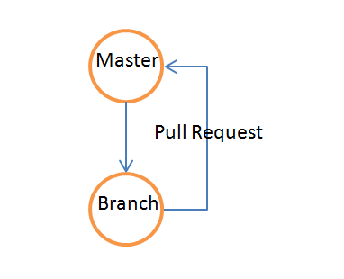

1. [为什么在 Git 或 Mercurial 中创建分支通常比 SVN 更容易？](#1-为什么在-git-或-mercurial-中创建分支通常比-svn-更容易)
2. [分布式版本控制系统和集中式版本控制系统各自有什么优缺点？](#2-分布式版本控制系统和集中式版本控制系统各自有什么优缺点)
3. [你能描述 GitHub Flow 和 GitFlow 吗？今天应该如何选择？](#3-你能描述-github-flow-和-gitflow-吗今天应该如何选择)
4. [什么是 rebase？什么时候该用，什么时候不该用？](#4-什么是-rebase什么时候该用什么时候不该用)
5. [为什么 Git / Mercurial 中的合并通常比 SVN 更容易？](#5-为什么-git--mercurial-中的合并通常比-svn-更容易)

---

## 1 为什么在 Git 或 Mercurial 中创建分支通常比 SVN 更容易？

核心原因是：

> Git / Mercurial 从模型上就是围绕“提交图”和“分支引用”设计的，而 SVN 的分支更接近目录层面的复制约定。

### SVN 中的分支是什么

在 SVN 里，分支通常是通过创建一个新的目录（例如 `branches/feature-x`）来实现的。

这并不是说 SVN 完全不能做分支，而是：

- 分支语义没有 Git 那么“原生”
- 长期维护多个分支的体验较差
- 合并历史和分支关系更难推理

### Git 中的分支是什么

在 Git 里，分支本质上只是：

> 一个指向某个 commit 的可移动引用（ref）。

创建分支并不需要复制整棵目录树，通常只是新增一个指针，因此非常轻量。

### 这会带来什么工程差异

#### 在 Git / Mercurial 中

- 创建分支成本低
- 删除分支成本低
- 本地就能随时切分支和提交
- 更鼓励短生命周期分支
- 更适合代码审查驱动流程

#### 在 SVN 中

- 虽然也能建分支，但心智模型偏重
- 分支管理和合并策略更容易变复杂
- 开发者更容易倾向少分支、长分支

### 现代面试里怎么答更好

不要只说“Git 分支是指针，所以快”。更好的回答是：

> Git / Mercurial 让分支成为版本历史的一等概念，这改变的不只是性能，而是团队的协作方式、发布方式和代码审查方式。

### 面试回答要点

> Git / Mercurial 的分支之所以更容易，不只是因为实现更轻量，而是因为它们从底层数据模型到协作流程都把分支当成常态操作；SVN 虽然也能分支，但分支体验和合并体验通常更重。

---

## 2 分布式版本控制系统和集中式版本控制系统各自有什么优缺点？

### 集中式版本控制（CVCS）

代表：

- SVN
- Perforce（部分场景常被单独讨论）

特点是：

- 权威仓库集中在服务器端
- 客户端通常依赖中心服务器完成很多操作

#### 优点

- 权限控制和审计集中
- 流程相对直观
- 对非开发岗位（如某些设计、内容团队）有时更容易理解
- 对超大二进制仓库，某些集中式工具体验更好

#### 缺点

- 对中心服务依赖更强
- 离线能力弱
- 分支和合并体验通常不如 DVCS 灵活
- 本地历史操作能力有限

### 分布式版本控制（DVCS）

代表：

- Git
- Mercurial

特点是：

- 每个克隆几乎都包含完整历史
- 本地即可完成提交、分支、回滚、查看历史等操作

#### 优点

- 离线工作能力强
- 分支、合并、rebase 更灵活
- 本地提交成本低
- 更适合 PR / code review / trunk-based 开发
- 容灾能力更强，每个 clone 某种程度上都是备份

#### 缺点

- 学习曲线更陡，尤其是 Git
- 历史改写能力强，也更容易误操作
- 权限模型通常围绕仓库而不是细粒度文件
- 大仓库和大二进制文件需要额外治理（如 Git LFS、monorepo 工具链）

### 现代现实情况

今天大部分软件团队默认使用 Git，但并不代表集中式系统彻底过时。

在以下场景，集中式工具仍可能合理：

- 游戏资源和大二进制资产管理
- 特定企业已有流程和工具深度绑定
- 对细粒度权限和集中治理要求极高

### 面试回答要点

> DVCS 的核心优势是本地历史、轻量分支和灵活协作；CVCS 的优势是集中治理和某些场景下更简单的权限控制。今天大多数代码开发场景偏向 Git，但工具选择仍要看组织和资产类型。

---

## 3 你能描述 GitHub Flow 和 GitFlow 吗？今天应该如何选择？

### GitHub Flow 是什么

GitHub Flow 是一种相对轻量的分支协作模型，通常包括：

1. `main`（或 `master`）始终保持可部署
2. 从主分支切出短生命周期分支
3. 在分支上开发和提交
4. 发起 Pull Request
5. 通过 review、CI、测试后合并回主分支
6. 尽快部署



### GitHub Flow 的特点

- 简单
- 分支生命周期短
- 适合持续集成 / 持续部署
- 强依赖自动化测试和代码审查

### GitFlow 是什么

GitFlow 是一种更重的发布分支模型，典型分支包括：

- `master` / `main`
- `develop`
- `feature/*`
- `release/*`
- `hotfix/*`


它的设计目标是把：

- 日常开发
- 发布准备
- 紧急修复

通过不同分支清晰分离。

### GitFlow 的优点

- 适合版本化发布节奏较明确的软件
- 适合需要长期维护多个发布分支的团队
- 对“发布前稳定化阶段”有显式支持

### GitFlow 的缺点

- 流程更重
- 分支更多，合并点更多
- 容易拖慢交付节奏
- 在持续交付环境下往往显得笨重

### 今天该如何选

现代团队更常见的选择往往是：

- **GitHub Flow** 或其变体
- **Trunk-Based Development**
- 在主干上配合 feature flag、CI、canary、快速回滚

GitFlow 仍适合：

- 有明确发布列车
- 版本维护复杂
- 发布审批流程较重
- 多环境稳定化阶段很长

的组织。

### 面试回答要点

> GitHub Flow 更轻，适合持续集成和快速交付； GitFlow 更重，适合发布节奏明确、分支治理复杂的团队。今天很多团队会更偏向主干开发或 GitHub Flow，再配合 feature flag 和自动化发布能力。

---

## 4 什么是 rebase？什么时候该用，什么时候不该用？

`rebase` 的本质是：

> 把一组提交“重新放到”另一个基底提交之上，从而改写提交历史。

### 它和 merge 的区别

- `merge`：保留分叉历史，生成一个新的合并提交
- `rebase`：重写分支提交，让历史看起来像基于最新主线线性展开

### 什么时候适合用 rebase

#### 1. 更新自己的私有开发分支

例如主分支前进了，你希望自己的 feature branch 基于最新 `main`：

```bash
git checkout feature-x
git fetch origin
git rebase origin/main
```

#### 2. 在合并前清理提交历史

例如：

- squash 无意义提交
- 调整提交顺序
- 拆分或合并提交

这会让 PR 历史更干净。

#### 3. 保持线性历史（在团队允许的前提下）

某些团队偏好干净的主线历史，会在合并前做 rebase。

### 什么时候不该用 rebase

#### 不要轻易 rebase 已共享的公共分支

因为 rebase 会改写 commit ID。如果别人已经基于旧历史开展工作，你再 rebase 会让他们的历史分叉，增加协作混乱。

这就是常说的原则：

> **不要随意 rebase 他人已经依赖的公共历史。**

### rebase 的风险

- 改写历史导致协作混乱
- force push 可能覆盖他人提交
- 处理复杂冲突时容易误操作

### 面试回答要点

> rebase 适合整理私有分支历史、让分支跟上最新主线；但它会改写历史，所以不应随意对共享分支使用。是否用 rebase，本质上是历史可读性和协作安全性之间的权衡。

---

## 5 为什么 Git / Mercurial 中的合并通常比 SVN 更容易？

核心原因是：

> Git / Mercurial 把提交关系、共同祖先和变更历史都作为一等信息保存下来，因此更容易做可靠的三方合并和重复合并判断。

### SVN 合并为什么更容易痛苦

SVN 的历史模型更偏向“文件 / 目录在某个版本号下的状态”，而不是完整的提交图。

这样会带来几个问题：

- 分支历史关系不够直观
- 长期分支反复合并更容易出错
- 合并追踪和冲突理解成本更高

### Git / Mercurial 的优势

#### 1. 原生记录提交图

系统知道：

- 共同祖先是谁
- 各自分支做了哪些提交
- 哪些改动已经被合并过

#### 2. 合并是常规操作

在 Git / Mercurial 中，分支和合并是日常流程的一部分，不是额外负担。

#### 3. 更适合频繁、小步合并

而频繁合并本身就会减少大冲突。

### 但不要说得太绝对

Git 合并“通常更容易”，不代表合并本身就简单。

真正决定合并痛苦程度的还有：

- 分支活跃时间是否过长
- 是否频繁同步主线
- 是否存在大规模重构
- 团队是否遵循小步提交和及时集成

### 面试回答要点

> Git / Mercurial 之所以通常比 SVN 更易合并，是因为它们围绕提交图和变更历史设计，能更好理解分支关系；但真正减少合并痛苦的，除了工具模型，更重要的是短分支、频繁集成和小步变更。
