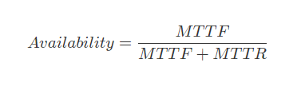
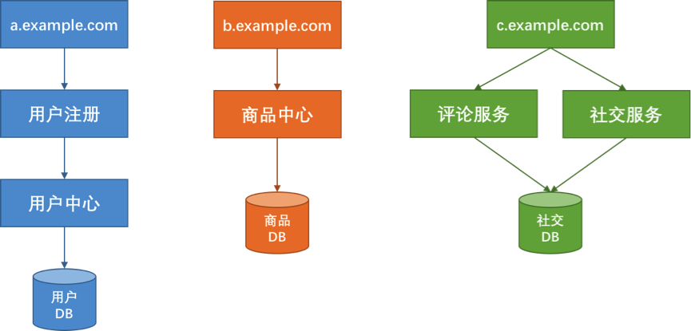
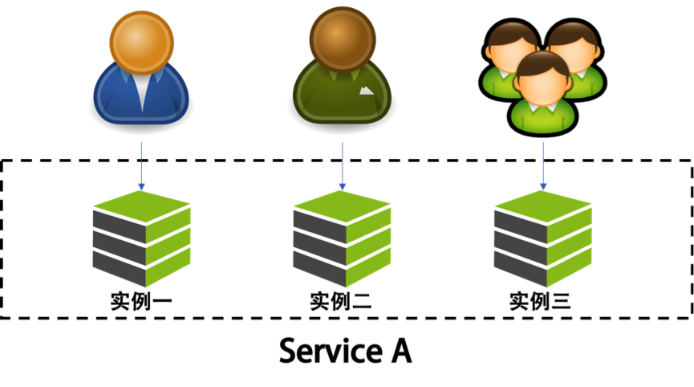
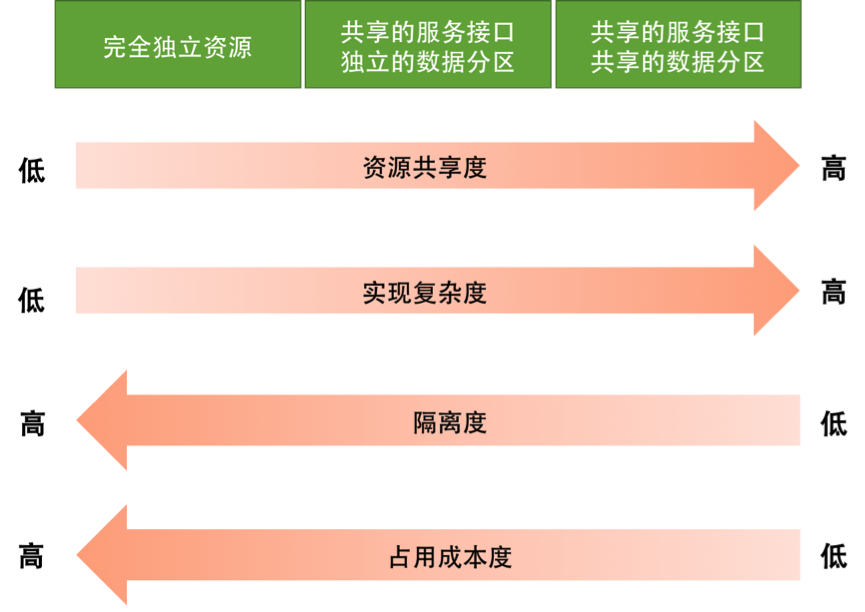
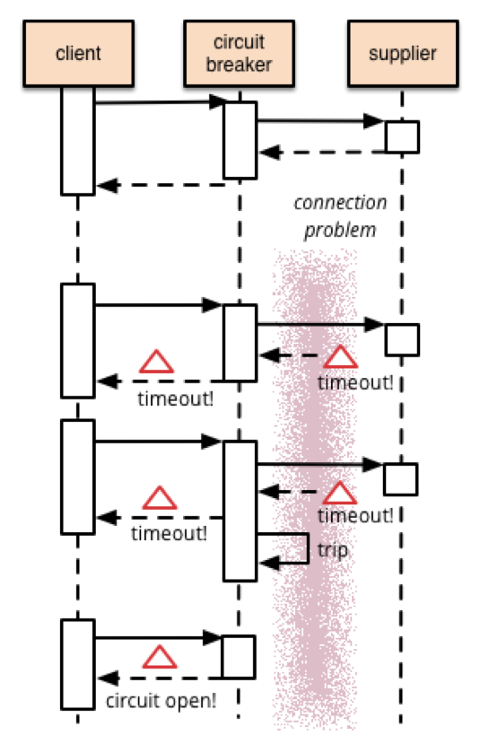
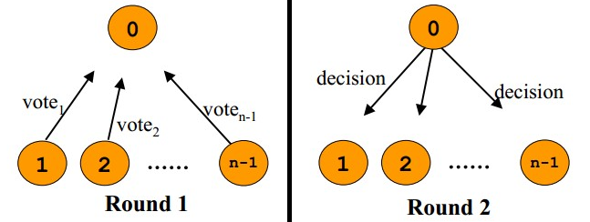
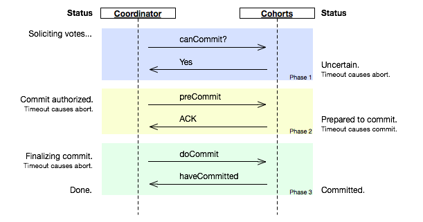

1. [RPC调用有什么缺陷？](#1-rpc-tiao-yong-you-shen-me-que-xian)
2. [什么时候用Request/Response模式或者Publish/Subscribe模式？](#2-shen-me-shi-hou-yong-requestresponse-mo-shi-huo-zhe-publishsubscribe-mo-shi)
3. [如何测试分布式系统？](#3-ru-he-ce-shi-fen-bu-shi-xi-tong)
4. [在哪种方式下在两个系统之间通信使用异步方式？](#4-zai-na-zhong-fang-shi-xia-zai-liang-ge-xi-tong-zhi-jian-tong-xin-shi-yong-yi-bu-fang-shi)
5. [如果你在构建一个分布式系统以便可扩展性和鲁棒性，那么在网络环境安全和地理分布上的考虑和其他系统有什么区别？](#5-ru-guo-ni-zai-gou-jian-yi-ge-fen-bu-shi-xi-tong-yi-bian-ke-kuo-zhan-xing-he-lu-bang-xing-na-me-zai-wang-luo-huan-jing-an-quan-he-di-li-fen-bu-shang-de-kao-lv-he-qi-ta-xi-tong-you-shen-me-qu-bie)
6. [如何管理一个web应用程序的错误容忍性？](#6-ru-he-guan-li-yi-ge-web-ying-yong-cheng-xu-de-cuo-wu-rong-ren-xing)
7. [在分布式系统中如何处理故障？](#7-zai-fen-bu-shi-xi-tong-zhong-ru-he-chu-li-gu-zhang)
8. [如何在分布式网络中保证一致性？](#8-ru-he-zai-fen-bu-shi-wang-luo-zhong-bao-zheng-yi-zhi-xing)
9. [分布式系统中有哪些谬论？](#9-fen-bu-shi-xi-tong-zhong-you-na-xie-miu-lun)
10. [假设你的系统不支持事务，那么你该如何从头实现一个？](#10-jia-she-ni-de-xi-tong-bu-zhi-chi-shi-wu-na-me-ni-gai-ru-he-cong-tou-shi-xian-yi-ge)

## 1 RPC调用有什么缺陷？

RPC (Remote Procedure Call) 是一种技术，它允许一个函数可以在 Remote 的环境中执行。RPC 拓展了本地调用的概念，不过这个借助了 HTTP 协议。

在最开始的时候，使用 XML 定义数据传输的 payload, 但是 XML 数据格式比较难以表示数据类型。所以紧接着 JSON 格式取代了 XML 格式。在 2015 年 Google 提出了 gPRC 这种格式，并且非常适合在微服务使用。

PRC 是如何工作的呢？
客户端触发远程调用，将参数和额外的信息序列化成一个消息，然后将消息发送给服务端。一旦接收到消息，服务端反序列化消息，执行请求操作，然后将结果返回给客户端。服务端和客户端遵循参数的序列化和反序列化的协议。

RPC 调用有下面的好处

- 简单明了的交互：RPC 使用 GET 操作来获取消息，使用 POST 处理其他的操作。服务端和客户端的交互就是调用某一个 endpoint 并且返回一个结果。
- 非常容易添加函数：如果需要为 API 添加新的功能，只需要增加新的 endpoint, 并且将新的函数隐藏在这个endpoint 之后，接下来客户端就能调用这个方法
- 高性能：网络上的轻量级的 payload 就能获得高性能，并且可以将服务端拆分开来执行并行计算。而且对于大数据量，RPC 也可以在网络层进行优化。

RPC 也有下面的缺陷

- 和底层系统紧耦合：API 层次的抽象可以促进系统重用，而 RPC 与下面的支持系统紧紧地联系在一起而且不存在一个抽象层在函数和系统之间。这个带来了安全的问题，因为这个很容易泄露实现的细节。
- 很难发现新的方法：在 RPC 系统中，没有办法找到 API 或者如何发送 API.
- 方法爆炸：创建新的方法非常容易，但是创建新的方法将会创建无数互相覆盖的函数，并且增加了维护的难度。

## 2 什么时候用`Request/Response`模式或者`Publish/Subscribe`模式？

在分布式系统中，服务之间都需要进行通信。在网络通信中有两种主要的模式，分别是 `Request/Response` 和 `Publish/Subscribe` 两种形式，接下来我们探讨在哪种场景下使用其中的一种而不是另一种。

首先我们先看一下这两种模式究竟是什么。

**Request/Response**

在网络中最常见的通信的方式是 `Request/Response`，在这个模式中，客户端请求数据或者服务，而服务端响应这个请求并且提供所需的数据或者服务。举个例子，当你在你的智能手机上观看 YouTube 视频的时候，你的网络浏览器 app 就是客户端，通过网络它向 YouTube 服务器请求数据，然后返回视频页面到你的手机 app 上。你可以想象 `Request/Response` 模式就像客户端发送一个空的卡车到服务端，然后服务端将这个卡车填满并且返回。

**Publish/Subscribe**

在 `publish/subscribe` 模式中，处于最中心的服务叫做 `broker`，它接受各种分布式的数据。在 `Pub-Sub` 模式中，客户端既可以向 broker 发送数据也可以那边获取数据。客户端只有在数据发生改变的时候才会发布数据。订阅的客户端就会自动接受到数据，同样也是只有数据发生改变的时候才会得到通知。`broker` 不存储任何数据，它仅仅是简单地将它们从发布者传递到接受者中。同样以卡车类比，客户端发布一卡车的数据到 `broker` 中，然后这个 `broker` 将这个数据路由给所有的订阅者。

`MQTT` 是著名的使用 `pub-sub` 这种模式的协议。`MQTT` 非常轻量级，几乎在设备中不占用任何体积。

那么在什么情况下使用这两种模式呢？

在 `Request/Response` 模式中，每个 client 都会与服务端建立一个直接连接，因此这种链接是非常可靠的。但是由于客户端不知道数据已经发生改变，所有它需要每隔一段时间就需要去请求最新的数据。如果你的网络非常可靠而且只有几台服务器，这种模式非常可靠。因为几台服务器就能处理请求，而且也能支持数据量超大的请求。

那么什么时候使用 `pub-sub` 模式呢？如果有很多服务器和很多客户端，那么 `Request/Response` 模式中的数据流量就非常大。每个客户端都选用链接各自的服务器，每个链接都需要经历打开，查询，响应和关闭这些步骤，如此反复进行。

与此相反的是，`pub-sub` 架构就简化了通信，直接链接和不停的查询将不复存在。网络链接被设备到 `broker` 链接取代。client 和 `Broker` 之间的链接将会被保持，但是这是轻量级的。只有两样数据会在连接中传递：

- 数据改变
- 客户端的心跳以便让 `broker` 知道客户端仍然存在

所以 `pub-sub` 模式非常实用与很多服务端和很多客户端的场景。由于大大减少了直接链接，网络中流量大大减低了，而且只有数据改变的时候才会发送数据，而不是特定的间隔。`pub-sub` 也非常适用于那些客户端和服务端非常困难的建立链接这种情况。

## 3 如何测试分布式系统？
*todo*
## 4 在哪种方式下在两个系统之间通信使用异步方式？
异步通信可以有助于提高系统的稳定性和容错能力，从而增加整个系统的吞吐量。在分布式架构中，我们的系统被拆分成很多子系统，如果想要将系统整理的利用好，需要统一地规划和统筹整体,这样可以达到整体的最优。
同步操作相当于被动工作，而异步方式则是一种主动工作。尤其是在多个系统的处理能力和速度上不匹配的时候，就需要异步操作。一个最显著的例子，在计算机程序写文件的收，操作系统并不是真正的同步操作写硬盘，而是把硬盘的写请求在内存中 hold 上一小会（几十毫秒），然后再对这些读写请求做 merge 和 sort。这样设计的原因就是因为计算机不同的组件的执行速度是不一样的，内存的操作速度非常快，而物理硬盘的执行速度非常慢，相差了好几个数量级。如果将读写操作设计成同步操作，那么每次读写，CPU 都会暂停下来，等待操作完成。这样是用户提样是无法接受的。

在异步通信的方式中，需要设计一个前台系统，负责将调用方的请求记录下来。然后需要一个任务处理系统来处理这些请求，有两种模型
- Push 模型
- Pull 模型

Push 模型需要将任务派发给相应的人处理，但是需要知道下游的工作节点的情况，但是好处可以做一些任务的调度。而 Pull 模型则只需要更具自己的工作情况，将任务处理完毕即可。

但是对于强一致性业务的系统，使用异步方式就不合理，比如银行的账单业务，这些就会选择牺牲性能从而达到一致性要求。

## 5 如果你在构建一个分布式系统以便可扩展性和鲁棒性，那么在网络环境安全和地理分布上的考虑和其他系统有什么区别？
*todo*
## 6 如何管理一个web应用程序的错误容忍性？

## 7 在分布式系统中如何处理故障？

错误容忍性也叫做容错设计，主要有以下能力
- 容错能力
- 可伸缩性
- 一致性
- 应对大流量的能力

容错的主要目的是为了提供可用性，那么如何顶一个系统的可用性呢？ 通常使用的公式是

其中
- MTTF 是指 `Mean Time To Failure`，平均故障前时间，表明系统平均能够运行的时间才会出现一次故障，时间越长越好。
- MTTR 是指 `Mean Time To Recovery`, 平均修复时间，表明故障出现到故障修复的时间，这段时间越短越好。

在管理应用程序的错误容忍性的时候，需要承认下面两个事实
* 故障是正常的，而且是常见的；
* 故障是不可以预测突发的，而且非常难处理；

从设计上，我们有多种方式来应对应用程序的故障。

**一：隔断设计**

隔断源自于 `Bulkhead`, 它是源自于造船工艺上，它通过隔板将船舱分割为多个部分，如果一个部分进水，只会将其限制在一个有限的空间中。

在分布式软件架构中，我们可以将系统进行隔离，一般有两种方式进行隔离，一是按照服务划分，另一种是按照用户做分离。

*按照服务种类分离*

在上图中，我们将系统划分用户，商品和社区三个板块，这三个板块使用不同的域名，服务器和数据库。从接入层，应用层和数据层完全隔离。这样当某一个板块发生故障也不会影响到其他服务。 每个服务都有自己的数据库，并且通过API接口对外暴露服务，但是这样做也有其相关的缺陷。
- 当我们需要多个板块的数据的时候，就需要调用多个服务，这会降低性能
- 如果业务逻辑流程是各个板块流转，那么一个板块出现故障，仍然会导致整体服务故障。在业务设计上要做到 Step-By-Step 的方式，而且每一步可以保存。
- 多个板块需要面对事务的问题，因此需要 **二次提交** 这样的方案。

*按照用户的请求分离*

在这里，我们将用户分为不同的组，并且将后端的服务根据这些不同的服务分成不同的实例，对于同一个服务对于不同的用户进行冗余和隔离。当服务实例故障发生的时候，只会影响部分用户。这类似多租户模式，对于 VIP 客户，可以单独设置独立的服务实例，或者服务集群将其与其他用户分开。对于普通用户，可以共享一个服务实例。

对于多租户架构有下面三种设计方式
1. 完全独立的设计，服务和数据都不共享
2. 独立数据分区，但是服务是共享的
3. 服务和数据都是共享的

从上面可以看出，我们一般选择折中的方式，也就是数据是独立的，服务是共享的。

对于隔离设计要注意下面考量

1. 定义好业务隔离的大小和粒度
2. 无论是系统板块或者多租户的隔离设计，需要考虑服务度，成本，性能，资源的使用问题
3. 隔离模式需要和其他设计模式同时使用
4. 需要一个完善的所有服务的监控系统。

**二：补偿事务**

在分布式系统中，一个业务通常由多个服务组合而成，如果一个步骤失败了，就需要回滚到之前的服务调用，要么不断重试所有的步骤保证都完成。在传统的关系型数据库中，有 ACID 属性。但是在分布式系统，出现了一个变种 BASE。
- Basic Availability: 基本可用，系统可以短暂出现不可用状态。
- Soft-state：软状态，它是处于“有状态”和“无状态”之间的一种中间状态
- Eventual Consistency: 最终一致性，系统在短暂时间段内是不一致的，但是最终是一致的。

假设在网络电商平台，大家都可以下单购买，但是并不是真正的分配库存（比如将库存锁住），而是将订单交给异步批量订单处理，在后台处理的时候发现没有订单的时候，通知用户没有购买成功。

有了 BASE 设计知道原则，我们当某种条件不满足的时候，或者发生变化的时候，需要从业务上做出相应的事务补偿。首先需要将服务设计成幂等状态，如果一个事务失败了或者超市，需要不停的重试或者恢复到之前的状态。好的事务补偿机制需要做到下面两点
- 需要清晰的表达出需要到达什么状态，如果条件不满足，需要回退到哪个状态。
- 将业务执行的过程中，是否可以串行或者并行执行这些事情。

**三：重试机制**

重试设计是非常普通的设计模式，在分布式系统的中，一个进程内部的函数调用变成了远程调用，网络各种各样的设备都是不稳定的，任何一个环节出问题都可能导致服务调用失败。

重试机制本质上是我们认为故障是短暂的，不是永久的，我们需要重试。因此比如超时，服务端繁忙，资源不足的时候可以选择重试；但是对于业务的错误（没有权限，非法错误），技术上错误（HTTP 503）错误并不需要使用重试机制。

在重试设计中，都会采用 `Exponential Backoff` 的策略，也叫做指数级回退，每次重试的休息时间都会乘倍增加。在重试设计中要注意下面几点：
- 确定什么情况下需要重试
- 重试的时间和次数
- 如果重试超过一定次数或者时间，重试没有意义了，那么对于新来的请求该就没有比较继续执行。
- 重试考虑被调用方的幂等性
- 重试可以作为一个框架，不嵌入到业务代码中

**四：熔断机制**

熔断机制灵感来电闸上的保险丝，当电网中出现问题的是时候，电路会自动断开，从而保护电器。在分布式系统中，我们也应该有这样的设计，比如在重试设计中，错误太多，得不到修复的时候，开启熔断保护机制。熔断除了避免不断尝试失败的操作，还需要在程序修复之后，能够检测到故障的修复。熔断器（circuit breaker) 是常见的导致错误的代理，这种代理能够记录发生错误的次数，然后选择继续操作，还是立即返回错误。

熔断器可以使用状态机表示，内部模拟有下面几种状态

- 闭合（close) 状态：内部有一个调用失败的计数器，如果调用失败，则失败的次数加 1， 如果超出给定时间内的失败阈值，则切换到断开 （Open） 状态。然后设置一个超时时钟，如果超过该时间，切换到半断开（Half-Open) 状态，它允许系统来修正导致调用失败的错误。

- 断开（open) 状态：应用程序会立刻返回错误响应，而不调用后端服务，如果有缓存，则返回缓存内容。

- 半开（half-open) 状态：允许一定数量的请求调用服务，如果调用成功，则认为之前的错误已经修复，如果失败，则认为错误还没有修复。

熔断器设计，需要考虑下面的因素。

- 错误类型：需要注意请求失败有很多原因，要为不同的错误采用不同的策略
- 日志监控：请求失败和成功的需要记录
- 测试服务是否可用：在断开的情况下，熔断器可以定期 ping 远程服务的监控状态
- 手动设置：可以加入手动 override 熔断器状态
- 并发问题：熔断器的请求量可能非常大，熔断器设计上不应段阻塞并发请求
- 资源分区：有时候服务的不可用是部分分区的问题，所以避免单一分区故障导致整个服务不可用

**四：限流设计**

限流的目的是对并发访问进行限速，相关的策略一般是，一旦达到限制速率，则触发限流的行为

- 拒绝服务：把多出来的请求拒绝掉，这样可以将不正常或者高并发的访问挡在门外
- 服务降级：将后端的服务降级处理，让足够的资源来处理更多的请求，可以将不重要的服务停掉；二是不在返回全量数据
- 特权请求：将有限的资源分配给 VIP 客户。
- 延时处理：通过队列缓存请求，如果队列已经满载，则拒绝下面其他的请求
- 弹性伸缩：对重要的服务可以做扩容操作

限流实现有很多中实现方式

1. 计数方式：维护一个计数器 （counter）， 当请求接受到，计数器加1，当请求处理完毕，计数器减1
2. 队列算法：通过维护一个队列，如果队列还有 slot，则将请求放入队列，否则决绝掉请求。
3. [漏斗算法](https://en.wikipedia.org/wiki/Leaky_bucket)： 漏斗也是通过一个队列来实现，当请求过多，请求开始积压，但是请求处理有个限流器，可以让处理器均匀的速度处理。
4. 基于响应时间请求：记录下当前的请求的响应时间，以 P90 或者 P99 这种统计数据，如果处理时间超出了我们的阈值，则启动限流。

**五：降级处理**

所谓降级（Degradation）就是解决资源不足和访问量过大带来的问题。为了在有限的资源下，避免大量的请求，需要降级处理。

- 降低一致性：将一致性从之前的强一致性变成弱一致性，就可以有效的释放资源，比如数据库锁。
- 使用异步简化流程：异步操作避免了同步操作带来的一直性问题
- 降低数据一致性：使用缓存或者使用部分数据。
- 停止次要功能：对于非服务的非必要功能，可以停止该服务，比如电商平台可以停止商品评论功能。

对于降级处理需要考虑下面几点

1. 定义好降级的条件，如果吞吐量，响应时间或者失败次数过多
2. 梳理业务的功能， 哪些是 must-have 功能，那些是 nice-to-have 的功能，那些是核心服务
3. 对于牺牲掉一致性的，需要通过日志方式记录下来，以便后续处理。
4. 降级功能可以是系统的配置的开关。
5. 降级处理需要前后端同时处理，应为这样可以协同工作，通过请求返回的协议头的标明。

## 8 如何在分布式网络中保证一致性？
在分布是系统中，为了保证数据的高可用，通常会将数据保留多个副本（Replica), 这些副本会放在不同的物理的机器上。如果由于网络，服务器或者软件出现故障，会导致部分副本写入成功，部分副本写入失败，就会导致副本之间的数据不一致。两阶段提交协议一般是协调所有分布式原子事务的参与者，并决定提高或者回滚的分布式算法。

（1）协议参与者
在两阶段提交协议中，系统一般包含两类机器（或节点）：一类为协调者（coordinator），通常一个系统中只有一个；另一类为事务参与者（participants，cohorts或workers），一般包含多个，在数据存储系统中可以理解为数据副本的个数。协议中假设每个节点都会记录写前日志（write-ahead log）并持久性存储，即使节点发生故障日志也不会丢失。协议中同时假设节点不会发生永久性故障而且任意两个节点都可以互相通信。

（2）两个阶段的执行

1.请求阶段（commit-request phase，或称表决阶段，voting phase）
在请求阶段，协调者将通知事务参与者准备提交或取消事务，然后进入表决过程。
在表决过程中，参与者将告知协调者自己的决策：同意（事务参与者本地作业执行成功）或取消（本地作业执行故障）。

2.提交阶段（commit phase）
在该阶段，协调者将基于第一个阶段的投票结果进行决策：提交或取消。
当且仅当所有的参与者同意提交事务协调者才通知所有的参与者提交事务，否则协调者将通知所有的参与者取消事务。
参与者在接收到协调者发来的消息后将执行响应的操作。

（3）两阶段提交的缺点

1.同步阻塞问题。执行过程中，所有参与节点都是事务阻塞型的。
当参与者占有公共资源时，其他第三方节点访问公共资源不得不处于阻塞状态。

2.单点故障。由于协调者的重要性，一旦协调者发生故障。
参与者会一直阻塞下去。尤其在第二阶段，协调者发生故障，那么所有的参与者还都处于锁定事务资源的状态中，而无法继续完成事务操作。（如果是协调者挂掉，可以重新选举一个协调者，但是无法解决因为协调者宕机导致的参与者处于阻塞状态的问题）

3.数据不一致。在二阶段提交的阶段二中，当协调者向参与者发送commit请求之后，发生了局部网络异常或者在发送commit请求过程中协调者发生了故障，这回导致只有一部分参与者接受到了commit请求。
而在这部分参与者接到commit请求之后就会执行commit操作。但是其他部分未接到commit请求的机器则无法执行事务提交。于是整个分布式系统便出现了数据部一致性的现象。

（4）两阶段提交无法解决的问题

当协调者出错，同时参与者也出错时，两阶段无法保证事务执行的完整性。
考虑协调者再发出commit消息之后宕机，而唯一接收到这条消息的参与者同时也宕机了。
那么即使协调者通过选举协议产生了新的协调者，这条事务的状态也是不确定的，没人知道事务是否被已经提交。

三阶段提交协议在协调者和参与者中都引入超时机制，并且把两阶段提交协议的第一个阶段拆分成了两步：询问，然后再锁资源，最后真正提交。

（1）三个阶段的执行
1.CanCommit阶段
3PC的CanCommit阶段其实和2PC的准备阶段很像。
协调者向参与者发送commit请求，参与者如果可以提交就返回Yes响应，否则返回No响应。

2.PreCommit阶段
Coordinator根据Cohort的反应情况来决定是否可以继续事务的PreCommit操作。
根据响应情况，有以下两种可能。
A.假如Coordinator从所有的Cohort获得的反馈都是Yes响应，那么就会进行事务的预执行：
发送预提交请求。Coordinator向Cohort发送PreCommit请求，并进入Prepared阶段。
事务预提交。Cohort接收到PreCommit请求后，会执行事务操作，并将undo和redo信息记录到事务日志中。
响应反馈。如果Cohort成功的执行了事务操作，则返回ACK响应，同时开始等待最终指令。

B.假如有任何一个Cohort向Coordinator发送了No响应，或者等待超时之后，Coordinator都没有接到Cohort的响应，那么就中断事务：
发送中断请求。Coordinator向所有Cohort发送abort请求。
中断事务。Cohort收到来自Coordinator的abort请求之后（或超时之后，仍未收到Cohort的请求），执行事务的中断。

3.DoCommit阶段

该阶段进行真正的事务提交，也可以分为以下两种情况:

执行提交

A.发送提交请求。Coordinator接收到Cohort发送的ACK响应，那么他将从预提交状态进入到提交状态。并向所有Cohort发送doCommit请求。
B.事务提交。Cohort接收到doCommit请求之后，执行正式的事务提交。并在完成事务提交之后释放所有事务资源。
C.响应反馈。事务提交完之后，向Coordinator发送ACK响应。
D.完成事务。Coordinator接收到所有Cohort的ACK响应之后，完成事务。

中断事务

Coordinator没有接收到Cohort发送的ACK响应（可能是接受者发送的不是ACK响应，也可能响应超时），那么就会执行中断事务。

（2）三阶段提交协议和两阶段提交协议的不同

对于协调者(Coordinator)和参与者(Cohort)都设置了超时机制（在2PC中，只有协调者拥有超时机制，即如果在一定时间内没有收到cohort的消息则默认失败）。
在2PC的准备阶段和提交阶段之间，插入预提交阶段，使3PC拥有CanCommit、PreCommit、DoCommit三个阶段。
PreCommit是一个缓冲，保证了在最后提交阶段之前各参与节点的状态是一致的。

（2）三阶段提交协议的缺点

如果进入PreCommit后，Coordinator发出的是abort请求，假设只有一个Cohort收到并进行了abort操作，
而其他对于系统状态未知的Cohort会根据3PC选择继续Commit，此时系统状态发生不一致性。

除此之外，还有 Paxos, Raft 等分布式一致性算法。

## 9 分布式系统中有哪些谬论？
*todo*

## 10 假设你的系统不支持事务，那么你该如何从头实现一个？
*todo*
