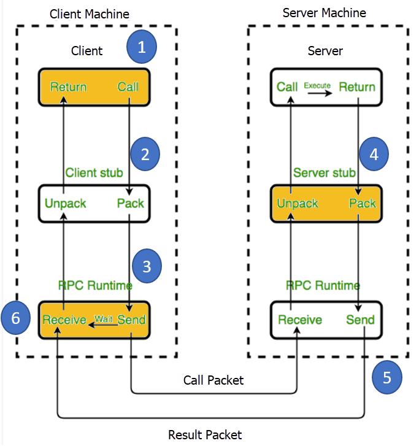
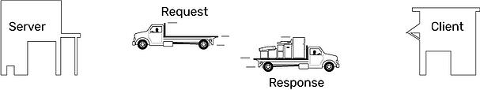
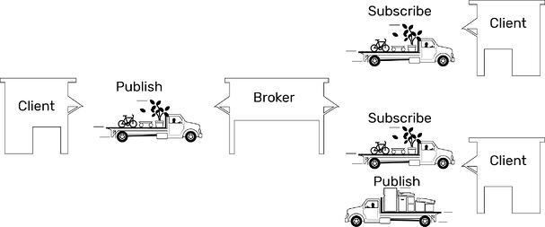
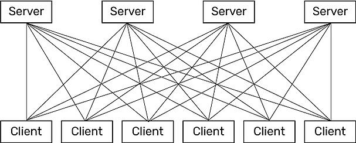
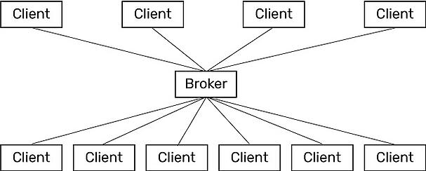

## 1 RPC调用有什么缺陷？

RPC (Remote Procedure Call) 是一种技术，它允许一个函数可以在 Remote 的环境中执行。RPC 拓展了本地调用的概念，不过这个借助了 HTTP 协议。

在最开始的时候，使用 XML 定义数据传输的 payload, 但是 XML 数据格式比较难以表示数据类型。所以紧接着 JSON 格式取代了 XML 格式。在 2015 年 Google 提出了 gPRC 这种格式，并且非常适合在微服务使用。

PRC 是如何工作的呢？
客户端触发远程调用，将参数和额外的信息序列化成一个消息，然后将消息发送给服务端。一旦接收到消息，服务端反序列化消息，执行请求操作，然后将结果返回给客户端。服务端和客户端遵循参数的序列化和反序列化的协议。

RPC 调用有下面的好处

- 简单明了的交互：RPC 使用 GET 操作来获取消息，使用 POST 处理其他的操作。服务端和客户端的交互就是调用某一个 endpoint 并且返回一个结果。
- 非常容易添加函数：如果需要为 API 添加新的功能，只需要增加新的 endpoint, 并且将新的函数隐藏在这个endpoint 之后，接下来客户端就能调用这个方法
- 高性能：网络上的轻量级的 payload 就能获得高性能，并且可以将服务端拆分开来执行并行计算。而且对于大数据量，RPC 也可以在网络层进行优化。

RPC 也有下面的缺陷

- 和底层系统紧耦合：API 层次的抽象可以促进系统重用，而 RPC 与下面的支持系统紧紧地联系在一起而且不存在一个抽象层在函数和系统之间。这个带来了安全的问题，因为这个很容易泄露实现的细节。
- 很难发现新的方法：在 RPC 系统中，没有办法找到 API 或者如何发送 API.
- 方法爆炸：创建新的方法非常容易，但是创建新的方法将会创建无数互相覆盖的函数，并且增加了维护的难度。

## 2 什么时候用`Request/Response`模式或者`Publish/Subscribe`模式？

在分布式系统中，服务之间都需要进行通信。在网络通信中有两种主要的模式，分别是 `Request/Response` 和 `Publish/Subscribe` 两种形式，接下来我们探讨在哪种场景下使用其中的一种而不是另一种。

首先我们先看一下这两种模式究竟是什么。

**Request/Response**

在网络中最常见的通信的方式是 `Request/Response`，在这个模式中，客户端请求数据或者服务，而服务端响应这个请求并且提供所需的数据或者服务。举个例子，当你在你的智能手机上观看 YouTube 视频的时候，你的网络浏览器 app 就是客户端，通过网络它向 YouTube 服务器请求数据，然后返回视频页面到你的手机 app 上。你可以想象 `Request/Response` 模式就像客户端发送一个空的卡车到服务端，然后服务端将这个卡车填满并且返回。

**Publish/Subscribe**

在 `publish/subscribe` 模式中，处于最中心的服务叫做 `broker`，它接受各种分布式的数据。在 `Pub-Sub` 模式中，客户端既可以向 broker 发送数据也可以那边获取数据。客户端只有在数据发生改变的时候才会发布数据。订阅的客户端就会自动接受到数据，同样也是只有数据发生改变的时候才会得到通知。`broker` 不存储任何数据，它仅仅是简单地将它们从发布者传递到接受者中。同样以卡车类比，客户端发布一卡车的数据到 `broker` 中，然后这个 `broker` 将这个数据路由给所有的订阅者。

`MQTT` 是著名的使用 `pub-sub` 这种模式的协议。`MQTT` 非常轻量级，几乎在设备中不占用任何体积。

那么在什么情况下使用这两种模式呢？

在 `Request/Response` 模式中，每个 client 都会与服务端建立一个直接连接，因此这种链接是非常可靠的。但是由于客户端不知道数据已经发生改变，所有它需要每隔一段时间就需要去请求最新的数据。如果你的网络非常可靠而且只有几台服务器，这种模式非常可靠。因为几台服务器就能处理请求，而且也能支持数据量超大的请求。

那么什么时候使用 `pub-sub` 模式呢？如果有很多服务器和很多客户端，那么 `Request/Response` 模式中的数据流量就非常大。每个客户端都选用链接各自的服务器，每个链接都需要经历打开，查询，响应和关闭这些步骤，如此反复进行。

与此相反的是，`pub-sub` 架构就简化了通信，直接链接和不停的查询将不复存在。网络链接被设备到 `broker` 链接取代。client 和 `Broker` 之间的链接将会被保持，但是这是轻量级的。只有两样数据会在连接中传递：

- 数据改变
- 客户端的心跳以便让 `broker` 知道客户端仍然存在

所以 `pub-sub` 模式非常实用与很多服务端和很多客户端的场景。由于大大减少了直接链接，网络中流量大大减低了，而且只有数据改变的时候才会发送数据，而不是特定的间隔。`pub-sub` 也非常适用于那些客户端和服务端非常困难的建立链接这种情况。