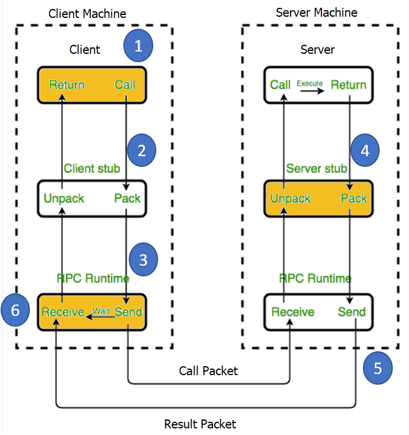
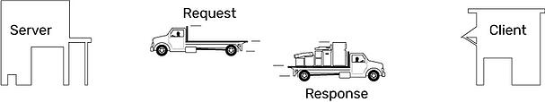
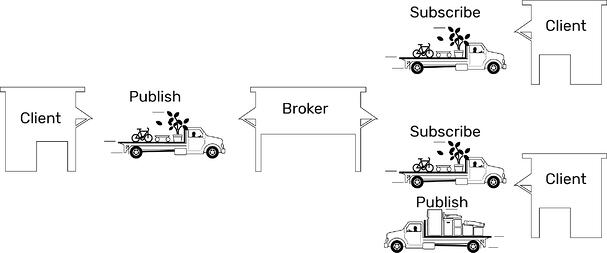
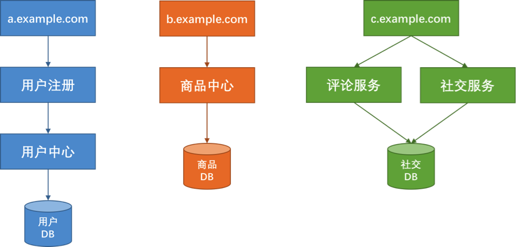
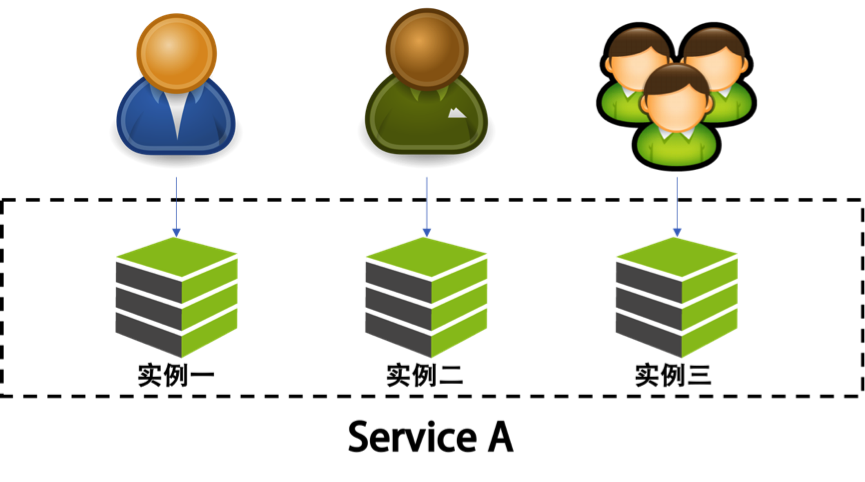
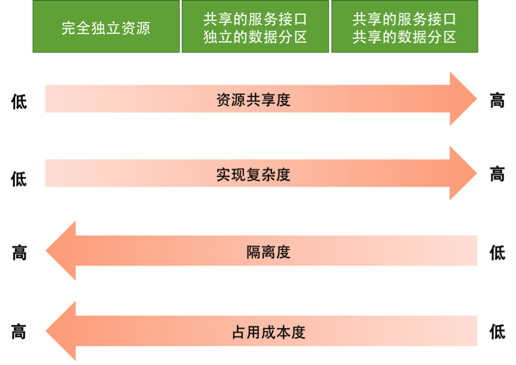
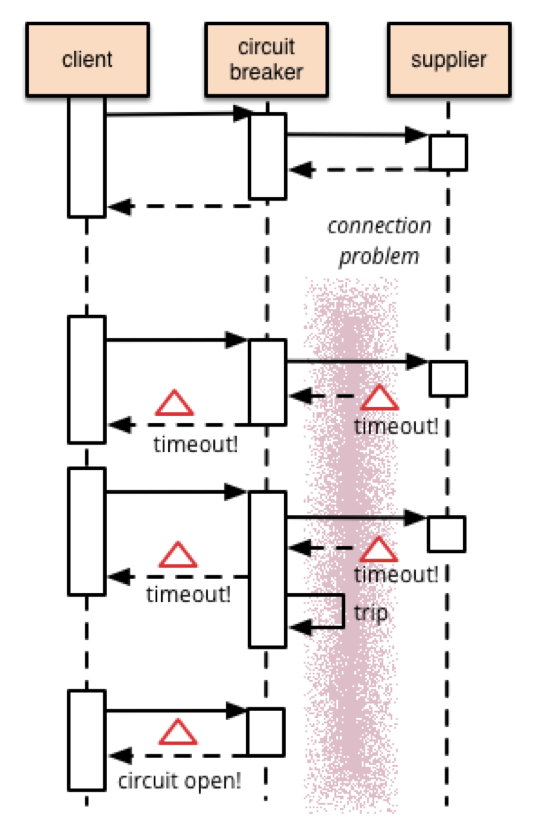
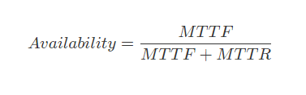
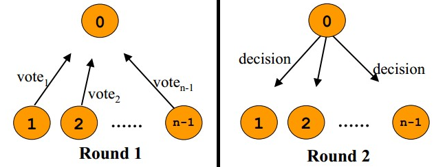
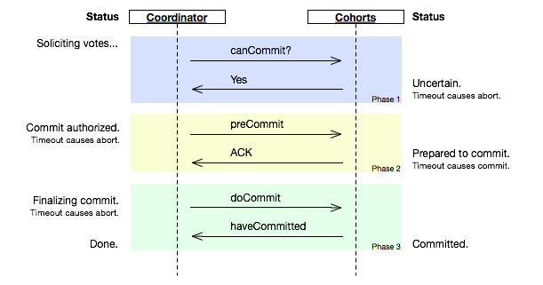

1. [RPC 调用有什么缺点和风险？](#1-rpc-调用有什么缺点和风险)
2. [什么时候使用 Request/Response，什么时候使用 Publish/Subscribe？](#2-什么时候使用-requestresponse什么时候使用-publishsubscribe)
3. [如何测试分布式系统？](#3-如何测试分布式系统)
4. [什么时候两个系统之间应该使用异步通信？](#4-什么时候两个系统之间应该使用异步通信)
5. [构建分布式系统时，在网络、安全和地理分布上要额外考虑什么？](#5-构建分布式系统时在网络安全和地理分布上要额外考虑什么)
6. [如何提升 Web 应用的容错性和错误韧性？](#6-如何提升-web-应用的容错性和错误韧性)
7. [在分布式系统中如何处理故障？](#7-在分布式系统中如何处理故障)
8. [如何在分布式系统中保证一致性？](#8-如何在分布式系统中保证一致性)
9. [分布式系统中有哪些经典谬论（Fallacies of Distributed Computing）？](#9-分布式系统中有哪些经典谬论fallacies-of-distributed-computing)
10. [如果系统不原生支持事务，你会如何从头实现事务能力？](#10-如果系统不原生支持事务你会如何从头实现事务能力)

---

## 1 RPC 调用有什么缺点和风险？

RPC（Remote Procedure Call）让远程调用看起来像本地函数调用，这很方便，但也正因为“太像本地调用”，很容易让人低估网络通信的复杂度。

### RPC 的优点

- 接口形式直观
- 契约清晰（尤其是 gRPC / Protobuf）
- 适合服务间同步调用
- 工具链成熟，支持 codegen、超时、重试、认证等能力

### RPC 的主要问题

#### 1. 远程调用不是本地调用

本地函数调用通常：

- 延迟低
- 失败少
- 语义明确

而远程调用会遇到：

- 网络超时
- 部分失败
- 重试副作用
- 序列化开销
- 版本兼容问题

如果代码把 RPC 当成本地函数一样使用，就很容易出问题。

#### 2. 容易导致同步耦合

服务 A 调服务 B，B 再调 C，C 再调 D，最终形成长调用链。

这会带来：

- 尾延迟放大
- 故障传播
- 调试困难
- 可用性下降

#### 3. 方法膨胀和接口碎片化

RPC 很容易“多加一个方法”，久而久之就会出现：

- 粒度过细
- 命令语义混乱
- API 爆炸

#### 4. 发现和演进成本

如果没有良好的 API catalog、IDL、版本治理和文档，团队很难知道：

- 现有哪些接口
- 哪些接口已弃用
- 调用约束是什么

#### 5. 重试语义危险

例如支付扣款 RPC 超时：

- 是请求没到？
- 还是服务端已经处理成功，但响应丢了？

如果盲目重试，可能导致重复扣款。

### 现代实践建议

RPC 不是不能用，而是要配套：

- 明确超时
- 幂等键
- 重试策略
- 熔断和限流
- 链路追踪
- 契约治理
- 尽量避免过长同步调用链

### 面试回答要点

> RPC 最大的风险是让远程调用“伪装”成本地调用。它的挑战不在语法，而在网络不可靠、同步耦合、重试语义和接口治理。真正成熟的 RPC 体系必须配合超时、幂等、熔断和可观测性一起使用。

---

## 2 什么时候使用 Request/Response，什么时候使用 Publish/Subscribe？

这是两种非常常见但适用场景不同的通信模式。

### Request/Response 是什么

调用方发送请求，服务方处理后返回响应。

典型场景：

- HTTP API
- gRPC 同步调用
- 实时查询
- 用户前台请求

### Publish/Subscribe 是什么

发布者把消息发给 broker，订阅者按主题或规则接收。

典型场景：

- 事件广播
- 异步解耦
- 多消费者消费同一类事件
- IoT、MQTT、消息队列

### 什么时候适合 Request/Response

- 调用方需要立即得到结果
- 是查询类操作
- 业务流程必须同步完成
- 用户正在等待页面或接口响应

例如：

- 获取订单详情
- 登录校验
- 实时支付风控决策

### 什么时候适合 Publish/Subscribe

- 调用方不需要立刻知道处理结果
- 一个事件需要通知多个下游系统
- 希望降低上下游耦合
- 流量有明显峰谷，需要削峰填谷
- 希望支持异步扩展能力

例如：

- 用户下单后发布 `OrderCreated`
- 多个系统分别处理库存、营销、通知、风控
- 设备状态更新广播给多个订阅方

### 两者的核心区别

| 维度 | Request/Response | Publish/Subscribe |
|---|---|---|
| 时效 | 通常同步 | 通常异步 |
| 耦合 | 调用方知道被调用方 | 发布方不必知道订阅方 |
| 响应语义 | 明确结果返回 | 常无立即结果 |
| 适合场景 | 查询、同步命令 | 事件传播、解耦、广播 |

### 现代实践建议

很多系统不是二选一，而是混合使用：

- 查询走 Request/Response
- 事件扩散走 Pub/Sub
- 前台请求同步返回“已接收”，后续异步处理

### 面试回答要点

> 如果你需要同步结果、实时反馈和明确响应，选 Request/Response；如果你更关注解耦、事件传播、削峰和多消费者扩展，选 Publish/Subscribe。现代系统通常两者并用，而不是只选一种。

---

## 3 如何测试分布式系统？

测试分布式系统的难点在于：

> 你不仅要测试功能，还要测试网络、时序、故障、容量、依赖失效和数据一致性行为。

### 分层测试思路

#### 1. 单元测试

验证单个组件的局部逻辑。

重点：

- 纯业务逻辑
- 重试策略
- 序列化 / 反序列化
- 幂等逻辑
- 错误处理分支

#### 2. 集成测试

验证服务与数据库、消息队列、缓存、第三方依赖的交互。

常见工具：

- Testcontainers
- Docker Compose
- WireMock / MockServer

#### 3. 端到端测试

验证真实业务链路能否走通。

例如：

- 用户下单
- 支付
- 库存扣减
- 通知发送

#### 4. 性能 / 压力测试

验证高并发、高吞吐下的表现。

关注：

- 吞吐量
- P95 / P99 延迟
- 队列积压
- 线程池 / 连接池耗尽

#### 5. 故障注入 / 混沌测试

这是分布式系统测试中特别重要的一类。

例如注入：

- 服务实例宕机
- 网络抖动
- 超时
- 丢包
- 分区
- 磁盘打满
- 时钟漂移

### 你要验证什么

分布式系统不仅要测“正常返回”，更要测：

- 重试是否安全
- 幂等是否成立
- 超时是否合理
- 熔断是否触发
- 降级是否可用
- 数据是否最终收敛
- 消息是否丢失 / 重复 / 乱序时仍能处理

### 现代实践建议

- 尽量自动化测试
- 让测试环境尽量接近生产
- 给系统加足够观测能力，便于判断是否通过
- 对关键链路做 game day 演练

### 面试回答要点

> 测试分布式系统不能只靠单元测试，必须分层覆盖功能、性能、故障和一致性场景。真正难的是验证系统在超时、重试、消息重复、节点故障和网络异常下是否仍能以可接受方式工作。

---

## 4 什么时候两个系统之间应该使用异步通信？

异步通信通常适用于：

> 调用方不需要立刻拿到最终结果，或者上下游处理速度、可用性、伸缩节奏不一致时。

### 适合异步的典型场景

#### 1. 处理耗时长

例如：

- 图片转码
- 视频处理
- 邮件发送
- 报表生成

如果强行同步，用户体验和资源利用率都不好。

#### 2. 需要削峰填谷

异步队列可以吸收流量峰值，避免瞬时流量把下游打垮。

#### 3. 上下游解耦

调用方只负责提交任务，不必关心下游在线与否、处理速度如何。

#### 4. 一个事件需要多个系统消费

例如订单创建后：

- 库存系统扣减
- 营销系统发券
- 消息系统通知用户
- 风控系统记录行为

这类天然适合事件驱动。

### 不适合异步的场景

如果业务要求：

- 强一致
- 用户必须立即知道最终结果
- 失败不能靠补偿弥补

那么异步就未必合适。

例如：

- 某些核心账务记账确认
- 需要立即返回决策结果的风控检查
- 用户支付页上的同步状态展示

### 采用异步后要付出的代价

异步不是“更高级”，它只是把复杂度换了位置。

你需要额外处理：

- 幂等
- 重复消息
- 顺序问题
- 延迟处理
- 死信队列
- 补偿机制
- 状态可见性

### 面试回答要点

> 当调用方不需要立即获得最终结果、上下游速率不匹配、需要解耦或削峰时，异步通信通常更合适；但它会引入消息可靠性、幂等、顺序和补偿等复杂度，因此不应机械化使用。

---

## 5 构建分布式系统时，在网络、安全和地理分布上要额外考虑什么？

分布式系统和单机系统最大的不同之一，是很多原本在进程内发生的事，变成了跨网络、跨主机、甚至跨地域的问题。

### 网络层面

你必须默认：

- 网络不可靠
- 延迟不稳定
- 带宽有限
- 拓扑会变化

因此需要考虑：

- 超时设置
- 重试策略
- 服务发现
- 连接池和负载均衡
- 网络分区时的行为
- 跨机房 / 跨地域路由策略

### 安全层面

分布式系统的攻击面更大，因为链路更多、组件更多、边界更多。

常见要求包括：

- TLS / mTLS
- 服务身份认证
- 最小权限访问控制
- 密钥管理
- 审计日志
- 零信任网络思路
- 供应链安全和镜像签名

### 地理分布层面

跨地域部署会带来：

- 更高延迟
- 数据复制延迟
- 一致性挑战
- 灾备设计要求
- 数据驻留合规要求

你还要考虑：

- 主备还是多活
- 本地读远程写是否可接受
- 跨区故障切换时间
- 数据是否必须留在特定国家 / 地区

### 现代工程补充

今天分布式系统还常常跑在：

- Kubernetes
- service mesh
- 多云 / 混合云
- CDN / edge 节点

这意味着要额外关心：

- east-west traffic
- sidecar / mesh 带来的可观测性与复杂度
- DNS、证书、路由和流量治理

### 面试回答要点

> 构建分布式系统时，不能再把网络、安全和部署位置当成外部细节。超时、认证、加密、服务发现、跨地域复制、故障切换和合规要求，都会直接影响系统架构和一致性策略。

---

## 6 如何提升 Web 应用的容错性和错误韧性？

一个高可用 Web 应用，不是“永远不出错”，而是：

> 出错时不会轻易雪崩，并且能以可控方式降级、恢复和告警。

### 关键手段

#### 1. 超时、重试和退避

所有外部依赖调用都应设置超时，重试要配合：

- 幂等
- 指数退避
- 抖动（jitter）

#### 2. 熔断和隔离

当下游故障率升高时，不应无限继续压测对方。

要考虑：

- circuit breaker
- bulkhead 隔离
- 线程池 / 连接池隔离

#### 3. 限流和背压

当流量过大时，系统需要主动拒绝部分请求或延迟处理，而不是所有请求一起超时。

#### 4. 降级

当核心依赖不可用时，可以：

- 返回缓存数据
- 关闭非核心功能
- 使用近似结果或延迟结果

#### 5. 多副本和健康检查

通过：

- 多实例部署
- 负载均衡
- readiness / liveness check
- 自动重启

减少单点故障影响。

#### 6. 观测与告警

如果你无法看到错误，就谈不上容错。

关键包括：

- 错误率
- 延迟分位数
- 饱和度
- 依赖调用失败率
- 日志与 tracing

### 面试回答要点

> Web 应用的容错性来自一整套机制：超时、重试、熔断、限流、隔离、降级、多副本和可观测性。目标不是消灭故障，而是在故障出现时阻止级联失败，并尽快恢复服务。

---

## 7 在分布式系统中如何处理故障？

处理故障的第一原则是：

> 故障不是例外，而是常态。

### 常见故障类型

- 节点宕机
- 网络超时
- 消息丢失 / 重复 / 乱序
- 数据库主从延迟
- 资源耗尽
- 配置错误
- 第三方依赖故障

### 常见应对策略

#### 1. 隔离（Bulkhead）

把故障限制在局部，不让一个模块拖垮全站。

例如：

- 不同服务独立资源池
- 不同租户分流
- 核心链路和非核心链路隔离

#### 2. 重试

适合处理暂时性故障，但必须注意：

- 只重试可恢复错误
- 设置上限
- 使用指数退避 + jitter
- 确保幂等

#### 3. 熔断

当下游持续失败时，快速失败，避免故障扩散。

#### 4. 降级

在资源不足或依赖异常时保核心、弃边缘。

例如：

- 关闭评论
- 只返回基础信息
- 延迟非关键处理

#### 5. 限流

保护自身和下游，避免过载雪崩。

#### 6. 补偿事务 / Saga

对于跨服务业务流程，失败后通过补偿动作恢复业务语义。

### 如何衡量恢复能力

常见指标：

- **MTTF**：平均故障前时间
- **MTTR**：平均恢复时间

在很多系统里，降低 MTTR 往往比单纯追求超高 MTTF 更现实。

### 面试回答要点

> 分布式系统故障处理的核心不是“避免一切故障”，而是通过隔离、重试、熔断、限流、降级和补偿，把故障控制在局部并尽快恢复。真正成熟的系统更关注恢复能力，而不是故障绝对不发生。

---

## 8 如何在分布式系统中保证一致性？

一致性不是一个单一开关，而是一组从强到弱的语义选择。

### 先问业务需要哪种一致性

不是所有业务都需要强一致：

- 配置中心、分布式锁：通常需要较强一致性
- 购物车、浏览量、推荐：通常可以接受最终一致性

### 常见实现思路

#### 1. 单库事务

如果问题能在单个数据库事务里解决，优先使用单库事务。它通常是最简单、最可靠的方式。

#### 2. 2PC（两阶段提交）

通过协调者让多个参与者先投票，再统一提交。

优点：

- 理论上能实现分布式原子提交

缺点：

- 阻塞
- 协调者单点压力
- 性能差
- 在高可用场景下代价大

#### 3. 3PC（三阶段提交）

在 2PC 基础上增加预提交和超时机制。

它试图减少阻塞，但并没有从根本上解决分区和复杂性问题，因此在现代生产系统里远不如论文中常见。

#### 4. 共识算法（Raft / Paxos）

用于在副本间就某个值或日志顺序达成一致。

适合：

- 配置服务
- 元数据服务
- 主节点选举
- 日志复制

#### 5. 最终一致性 + 业务补偿

在很多业务系统中，更现实的做法是：

- 本地事务 + 事件发布
- 异步同步下游
- 补偿或人工修复异常状态

### 一个现代常见模式

- 本地数据库事务提交成功
- 写 outbox
- 异步投递事件
- 下游幂等消费
- 最终达到业务一致

### 面试回答要点

> 分布式一致性不能脱离业务要求来谈。强一致通常依赖单库事务、共识协议或高代价协调；大多数业务系统更常采用最终一致性、幂等消费和补偿机制，在可用性和复杂度之间取得平衡。

---

## 9 分布式系统中有哪些经典谬论（Fallacies of Distributed Computing）？

这八个经典谬论至今依然非常有现实意义：

1. 网络是可靠的
2. 延迟是零
3. 带宽是无限的
4. 网络是安全的
5. 拓扑不会改变
6. 只有一个管理员
7. 传输成本为零
8. 网络是同质的

### 为什么它们重要

因为很多系统设计失败，不是因为算法不会写，而是因为默认相信了这些错误前提。

### 逐条理解

#### 1. 网络是可靠的

现实里会超时、丢包、连接重置、半开连接。

所以需要：

- 超时
- 重试
- 幂等
- 消息持久化

#### 2. 延迟是零

远程调用成本远高于本地调用。

所以要：

- 合理聚合 API
- 避免 chatty protocol
- 做缓存和批处理

#### 3. 带宽是无限的

数据传输是有成本的，尤其在跨区、跨云、移动网络场景中。

#### 4. 网络是安全的

必须默认链路可能被窃听、伪造或滥用。

#### 5. 拓扑不会改变

容器重建、弹性扩缩容、节点迁移都很常见，因此需要：

- 服务发现
- 动态配置
- 健康检查

#### 6. 只有一个管理员

真实世界有多个团队、多个系统、多个第三方，不可能所有配置和依赖都在你控制之中。

#### 7. 传输成本为零

不只是网络费用，还有序列化、压缩、加密、解密和 CPU 开销。

#### 8. 网络是同质的

不同设备、地区、运营商、协议栈和运行时环境都可能不同。

### 面试回答要点

> 这八个谬论提醒我们：分布式系统设计必须把网络不可靠、延迟存在、安全不默认成立、拓扑动态变化等现实前提显式纳入架构。它们不是理论八股，而是实际事故根源的总结。

---

## 10 如果系统不原生支持事务，你会如何从头实现事务能力？

先说结论：

> 从头实现完整事务系统非常难，通常只会在非常特定的场景下做，而且往往只实现“够用的事务语义”，而不是完整通用数据库级 ACID。

### 第一步：先明确你到底要什么

是要：

- 原子提交？
- 幂等执行？
- 回滚能力？
- 隔离级别？
- 崩溃恢复？

不同目标决定方案复杂度完全不同。

### 核心组成部分

#### 1. 事务日志（WAL / operation log）

任何修改前后，都要有持久化日志，才能支持：

- 恢复
- 回滚
- 重放

#### 2. 原子提交协议

如果是单节点系统，可以：

- 先写日志
- 再写数据
- 最后标记 commit

如果是多节点，就要引入协调协议，例如 2PC / 共识 / Saga 等。

#### 3. 并发控制

为了提供隔离性，通常需要：

- 锁
- MVCC
- 版本号
- 乐观并发控制

#### 4. 恢复机制

系统重启后需要根据日志判断：

- 哪些事务已提交，应重放
- 哪些未完成，应回滚或标记失败

#### 5. 约束和一致性校验

只有“写成功”不够，还要保证业务不变量。

### 如果是业务系统，更现实的方案是什么

很多时候我们并不真的从底层造完整事务，而是根据场景做：

- 幂等键
- 状态机
- 本地事务 + outbox
- Saga 补偿
- 去重表
- 乐观锁

这些方案实现的是 **业务上的可靠一致性**，而不是数据库内核级事务。

### 面试回答要点

> 从头实现事务，至少需要日志、原子提交、并发控制和恢复机制；但在业务系统里，更实际的做法往往不是重造数据库事务，而是基于状态机、幂等、补偿和本地事务组合出满足业务要求的一致性方案。
