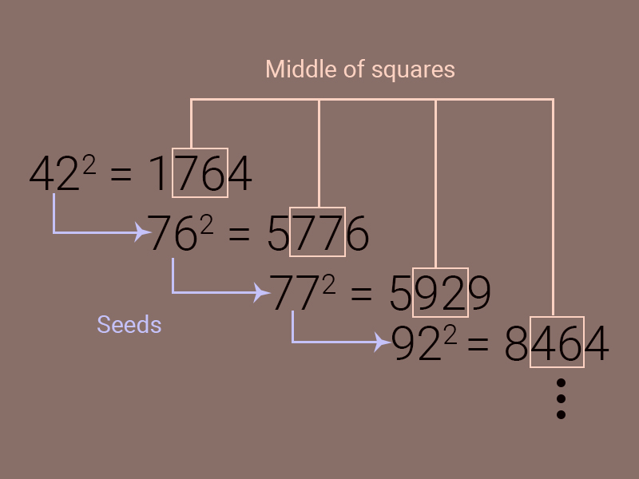

1. [仅仅使用LIFO栈来实现FIFO的队列，然后使用FIFO的队列来实现FIFO的栈](#1-jin-jin-shi-yong-lifo-zhan-lai-shi-xian-fifo-de-dui-lie-ran-hou-shi-yong-fifo-de-dui-lie-lai-shi-xian-fifo-de-zhan)
2. [使用代码片段来实现栈溢出](#2-shi-yong-dai-ma-pian-duan-lai-shi-xian-zhan-yi-chu)
3. [使用尾递归版本的Fraction方法](#3-shi-yong-wei-di-gui-ban-ben-de-fraction-fang-fa)
4. [使用你最熟悉的语言，来实现一个REPL，它将输出任何输出；执行RPN表达式](#4-shi-yong-ni-zui-shou-xi-de-yu-yan-lai-shi-xian-yi-ge-repl-ta-jiang-shu-chu-ren-he-shu-chu-zhi-hang-rpn-biao-da-shi)
5. [如何设计一个磁盘整理碎片工具？](#5-ru-he-she-ji-yi-ge-ci-pan-zheng-li-sui-pian-gong-ju)
6. [编写一个随机生成迷宫的程序](#6-bian-xie-yi-ge-sui-ji-sheng-cheng-mi-gong-de-cheng-xu)
7. [编写一个实例代码能够导致内存泄漏](#7-bian-xie-yi-ge-shi-li-dai-ma-neng-gou-dao-zhi-nei-cun-xie-lou)
8. [生成一系列不同的随机数](#8-sheng-cheng-yi-xi-lie-bu-tong-de-sui-ji-shu)
9. [编写简单的垃圾回收系统](#9-bian-xie-jian-dan-de-la-ji-hui-shou-xi-tong)
10. [编写基础的消息发送broker](#10-bian-xie-ji-chu-de-xiao-xi-fa-song-broker)
11. [编写基础的web服务器，并且绘制出将来的要完成的功能](#11-bian-xie-ji-chu-de-web-fu-wu-qi-bing-qie-hui-zhi-chu-jiang-lai-de-yao-wan-cheng-de-gong-neng)
12. [如何对10GB的文件排序，那么10TB文件如何呢？](#12-ru-he-dui-10-gb-de-wen-jian-pai-xu-na-me-10-tb-wen-jian-ru-he-ne)
13. [如何自动检测冗余的文件？](#13-ru-he-zi-dong-jian-ce-rong-yu-de-wen-jian)

## 1 仅仅使用`LIFO`栈来实现`FIFO`的队列，然后使用`FIFO`的队列来实现`FIFO`的栈
  
```go
// Using two stacks to implement queue
type Queue struct {
    inStack Stack
    outStack Stack
}
func (q *Queue) Enqueue(item interface{}){
    for val, err:= q.outStack.Pop(); err==nil {
        q.inStack.Push(val)
    }
    q.inStack.Push(val)
}
func (q *Queue) Dequeue()(interface{}, error){
    for val, err := q.inStack.Pop(); err ==nil{
        q.outStack.Push(val)
    }
    return q.outStack.Pop()
}
// Using two queues to implement stack
type Stack struct{
    mainQueue Queue
    backupQueue Queue
}
func (s *Stack) Push(item interface{}){
    s.mainQueue.Enqueue(item)
}
func (s *Stack) Pop()(interface{}, error){
    var val interface{}
    err := errors.News("empty stack")
    for v, err := s.mainQueue.Dequeue(); err == nil {
        val = v
        s.backupQueue.Enqueue(v)
    }
    // switch queues
    s.backupQueue, s.mainQueue = s.mainQueue, s.backupQueue
    return val, err
}

```

## 2 使用代码片段来实现栈溢出
对于递归，如果没有递归基，也就是递归的出口。那么就会导致栈溢出。

```C#
public int Fib(n)
{
    return Fib(n-1) + Fib(n-2);
}
```

## 3 使用尾递归版本的Fraction方法
*todo*

## 4 使用你最熟悉的语言，来实现一个REPL，它将输出任何输出；执行RPN表达式

```python
def evaluate_rpn(expression):
    """
    计算逆波兰表达式（RPN）的值。
    :param expression: 逆波兰表达式字符串
    :return: 表达式的计算结果
    """
    stack = []
    for token in expression.split():
        if token in '+-*/':
            # 弹出栈顶的两个元素作为操作数
            b, a = stack.pop(), stack.pop()
            if token == '+':
                stack.append(a + b)
            elif token == '-':
                stack.append(a - b)
            elif token == '*':
                stack.append(a * b)
            elif token == '/':
                stack.append(a / b)  # 注意：这里的除法是浮点数除法
        else:
            # 将数字推入栈中
            stack.append(float(token))
    return stack.pop()

def repl():
    print("简单的逆波兰表达式(REPL)计算器。输入 'quit' 以退出。")
    while True:
        expression = input("请输入逆波兰表达式: ")
        if expression == "quit":
            print("退出REPL。")
            break
        try:
            result = evaluate_rpn(expression)
            print("结果:", result)
        except Exception as e:
            print("错误:", e)

# 启动REPL
repl()
```

## 5 如何设计一个磁盘整理碎片工具？

设计一个磁盘整理（碎片整理）工具涉及到对文件系统、磁盘I/O操作和数据结构的深入理解。磁盘整理工具的目的是重新组织磁盘上的文件，将分散存储的文件碎片整理到连续的存储空间中，以提高读写效率。下面是设计这样一个工具的基本步骤和关键考虑因素：

1. 理解文件系统
文件系统类型：不同的操作系统和存储设备可能使用不同的文件系统（如NTFS、FAT32、exFAT、EXT4等），了解目标文件系统的工作原理对设计整理碎片工具至关重要。
文件分配方式：理解文件系统是如何分配磁盘空间给文件的，包括文件如何分成多个碎片存储在磁盘的不同位置。
2. 分析磁盘使用情况
扫描磁盘：开发一种方法来扫描整个磁盘，识别文件和目录的存储位置，以及空闲空间的分布情况。
识别碎片：分析文件存储的连续性，识别哪些文件被分成碎片存储在磁盘的不同区域。
3. 设计整理碎片算法
数据迁移策略：设计一种算法来重新分配和移动文件，使文件碎片合并，并尽量占用连续的磁盘空间。这可能需要考虑文件的大小、重要性和访问频率等因素。
优化空间利用率：确保磁盘空间被高效利用，避免大量未使用的磁盘空间被浪费。
最小化操作风险：因为文件的移动涉及到数据的读写操作，设计时要确保操作的安全性，防止数据丢失。
4. 用户界面设计
交互式界面：提供一个用户友好的界面，让用户可以轻松地启动碎片整理过程，查看磁盘使用情况和整理进度。
报告和反馈：在整理完成后，提供报告，显示整理前后的磁盘使用情况，包括碎片数量的减少、空间使用效率的提升等。
5. 测试和优化
广泛测试：在不同的环境和文件系统上测试工具的效果，确保它在各种情况下都能正常工作。
性能优化：分析整理碎片过程中的性能瓶颈，优化算法和磁盘操作，以减少整理所需的时间。
6. 安全性和可靠性
数据备份：在执行碎片整理之前，提醒用户备份重要数据，或者提供备份功能。
中断和恢复：确保碎片整理过程可以在中断后恢复，不会因为突然的电源中断或系统崩溃导致数据损坏。
设计磁盘整理碎片工具是一个复杂的工程项目，需要深入理解底层的文件系统和磁盘操作。成功的工具不仅能有效提高磁盘的读写性能，还能保证数据的安全性和完整性。

## 6 编写一个随机生成迷宫的程序


```python
import numpy as np
import random

def generate_maze(size=10):
    maze = np.zeros((size, size), dtype=int)
    
    # 初始化墙壁和路径
    for x in range(0, size):
        for y in range(0, size):
            if x % 2 == 0 or y % 2 == 0:
                maze[x][y] = 1  # 墙壁
            else:
                maze[x][y] = 0  # 路径
                
    # 使用Prim算法生成迷宫
    def check_neighbors(r, c):
        """检查邻居节点，并返回邻居墙壁的列表"""
        walls = []
        if r > 1: walls.append((r - 2, c))
        if r < size - 2: walls.append((r + 2, c))
        if c > 1: walls.append((r, c - 2))
        if c < size - 2: walls.append((r, c + 2))
        return walls
    
    def break_wall(cell, adj):
        """打破两个单元格之间的墙壁"""
        if cell[0] == adj[0]:  # 同行
            maze[max(cell[0], adj[0])][int((cell[1] + adj[1]) / 2)] = 0
        else:  # 同列
            maze[int((cell[0] + adj[0]) / 2)][max(cell[1], adj[1])] = 0
    
    start_cell = (random.randint(1, (size // 2)) * 2 - 1, random.randint(1, (size // 2)) * 2 - 1)
    maze[start_cell[0]][start_cell[1]] = 0
    walls = check_neighbors(start_cell[0], start_cell[1])
    visited = [start_cell]
    
    while walls:
        wall = random.choice(walls)
        walls.remove(wall)
        
        adj_cells = check_neighbors(wall[0], wall[1])
        adj_visited = [cell for cell in adj_cells if cell in visited]
        
        if len(adj_visited) == 1:
            visited_cell = adj_visited[0]
            break_wall(visited_cell, wall)
            visited.append(wall)
            walls.extend([w for w in check_neighbors(wall[0], wall[1]) if w not in visited and w not in walls])
    
    return maze

maze = generate_maze(15)
print(maze)
```

上面的Python程序使用了一种简化版的Prim算法来随机生成迷宫。在这个迷宫中，1代表墙壁，0代表路径。这个特定的实现是为了生成一个15x15的迷宫，你可以通过修改generate_maze函数的size参数来生成不同大小的迷宫。

程序首先初始化一个全是墙壁的迷宫，然后随机选择一个单元作为起点，从这个起点开始，逐步打破墙壁来创建路径。通过保持路径之间的连通性，并确保每次扩展都是随机选择的，最终得到一个复杂且随机的迷宫布局。

这种方法的关键在于维护一个待处理的墙壁列表，选择一个墙壁后检查它连接的两个单元中是否只有一个已经被访问过，如果是，就打破这堵墙，将新的单元加入到已访问的单元中，并将新单元周围的墙壁添加到待处理列表中。这一过程重复进行，直到没有墙壁可以处理为止。

## 7 编写一个实例代码能够导致内存泄漏

内存泄露（Memory Leak) 是令软件开发工程师非常头疼的一件事，在托管开发语言中，比如 `C/C++`，内存的申请和释放都是由开发人员自己处理。因此如果申请的内存没有释放，就会导致出现内存泄露情况的发生。最常见的就是没有显示的调用 `free/delete` 语句来释放指针。

```C++
class MyClass {
    public:
        int MyNum;
        string myString;
}

void CreatePointer()
{
    MyClass* p = new MyClass();
    // do something
    return;
}
```

在这里指针 `p` 在申请内存后，并没有释放这个内存空间。所以当程序中多次调用这个方法之后，就会导致内存空间耗尽，知道出现 `Out of Memory` 这个异常使程序终止。

目前内存托管的开发语言的出现，使开发人员从内存管理任务中解放出来。它们都会带有一个垃圾回收机制(`GC`)。它们会定期清理内存中申请但是不再使用的对象，以便释放出内存。虽然这类开发语言帮我们解决这内存的问题，但是如果使用不当仍然也会导致内存泄露。

```C#
public string Read()
{
    FileStream fs = new FileStream(@"C:\data.txt", FileMode.Open, FileAccess.Read);
    return fs.ReadString();
}
```

在 `C#` 在读取外部资源，比如文件，网络，数据库的时候，如果没有调用 `Dispose` 方法，那么该资源占用的内存是不会被 `GC` 回收的，因此需要使用 `Dispose Pattern`。

还有一种内存泄露比较隐蔽，`GC` 通过扫描不可达的对象标记为待回收的对象。但是如果我们代码的中，如果存在隐藏的引用，也会导致内存泄露。

```C#
class Container<T> {
    private T[] _arr;

    public int Count = 0;

    public void Push<T>(T elem)
    {
        _arr[Count] = elem;
        Count++;
    }

    public T Pop<T>()
    {
        Count--
        return _arr[Count];
    }
}
```

这里我们用 `Count` 来作为一个数组的游标，但是我们要注意的是一点是在 `Pop` 操作之后，如果这个对象不会再使用，垃圾回收也不会将它们回收，因为我们 `_arr` 仍然隐式的引用了这个对象。所以使用不当的话，仍然会导致内存泄露。

## 8 生成一系列不同的随机数
这里介绍三种不使用库函数生成随机数的方法

1. 中间平方数方法

该方法由 `John Von Neumann` 在 1946 年发明的，该方法主要由下面几个步骤完成的
- 将一个 N 位的数字作为种子，比如说 42
- 将这个数平方计算，那么 42 的平方就是 1764
- 将得到的数字取中加你的数字，那么现在就是 76
- 然后将得到的数据作为新的种子，然后继续新一轮的迭代



```C#
public class Random {
    public static int round = 10;

    public static int Next(int seed) {
        for(int i = 0; i < round; i++) {
            seed = NextRandom(seed)
        }
        return seed;
    }

    private static int NextRandom(int seed){
        var result = (seed * seed).ToString();
        if (result.Length % 2 == 1) { // if odded
            result += "0" + result;
        }
        var newSeed = result.SubString(1, result.Length - 1);
        return Int.Prase(newSeed);
    }
}
```

2. 线性共轭生成器
该方法通过线性函数生成一系列随机数， 用数学公式表达如下

```
X = (a * X + c) % m
```
这里包含了三个参数

- `a` 是线性乘数:`0< a <m`
- `c` 是增长数: `0 <= c < m`
- `m` 是模: `0<= X <m` 

```C#
public class Random {
    public static int a;
    public static int c;
    public static int m;

    public static int Next(int X){
        return (a * X + c) % m;
    }
}
```

3. 异或算法

该方法采用了异或（`XOR`) 算法来得到一个随机数

```Csharp
public class Random {

    public static int Next(int seed){
       seed ^= seed << 13;
       seed ^= seed >> 17;
       seed ^= seed << 5;
       return (seed < 0)? ~seed + 1; seed;
    }
}
```

## 9 编写简单的垃圾回收系统

```python
class SimpleGarbageCollector:
    def __init__(self):
        self.managed_objects = {}  # 存储对象及其引用计数

    def add_object(self, obj_id):
        """添加一个对象，引用计数初始化为1"""
        self.managed_objects[obj_id] = 1

    def delete_object(self, obj_id):
        """删除一个对象，即减少其引用计数，如果引用计数为0，则释放资源"""
        if obj_id in self.managed_objects:
            self.managed_objects[obj_id] -= 1
            if self.managed_objects[obj_id] == 0:
                print(f"对象 {obj_id} 不再被引用，进行垃圾回收。")
                del self.managed_objects[obj_id]
                
    def add_reference(self, obj_id):
        """增加对象的引用计数"""
        if obj_id in self.managed_objects:
            self.managed_objects[obj_id] += 1
            
    def remove_reference(self, obj_id):
        """减少对象的引用计数"""
        self.delete_object(obj_id)

# 演示
gc = SimpleGarbageCollector()
gc.add_object("obj1")
gc.add_reference("obj1")
gc.remove_reference("obj1")
gc.remove_reference("obj1")  # 这里引用计数为0，触发垃圾回收

```

## 10 编写基础的消息发送broker

```python
class SimpleMessageBroker:
    def __init__(self):
        self.subscriptions = {}  # {message_type: [subscribers]}

    def subscribe(self, message_type, subscriber):
        """订阅者订阅特定类型的消息"""
        if message_type not in self.subscriptions:
            self.subscriptions[message_type] = []
        self.subscriptions[message_type].append(subscriber)

    def publish(self, message_type, message):
        """发布者发送消息，消息将被转发给订阅了该类型的所有订阅者"""
        subscribers = self.subscriptions.get(message_type, [])
        for subscriber in subscribers:
            subscriber.receive(message)

class Subscriber:
    """订阅者"""
    def __init__(self, name):
        self.name = name

    def receive(self, message):
        """接收来自MessageBroker的消息"""
        print(f"{self.name} received message: {message}")

# 示例使用
broker = SimpleMessageBroker()
subscriber1 = Subscriber("Subscriber 1")
subscriber2 = Subscriber("Subscriber 2")

broker.subscribe("news", subscriber1)
broker.subscribe("news", subscriber2)
broker.subscribe("sports", subscriber1)

broker.publish("news", "Breaking News!")
broker.publish("sports", "Sports News Update")
```
在这个实现中：

SimpleMessageBroker 类负责管理订阅者和消息类型之间的关系，并处理消息的发布。
subscribe 方法允许订阅者订阅特定类型的消息。
publish 方法允许发布者发送特定类型的消息给所有对应类型的订阅者。
Subscriber 类代表订阅者，每个订阅者都有一个receive方法用于接收消息。
这个基础的消息broker实现了最简单的发布-订阅模式，可以作为更复杂系统的基础。在实际应用中，消息系统可能需要处理更复杂的场景，比如消息的持久化、处理大量并发消息、消息过滤、负载均衡等，这些特性可能需要引入更专业的消息中间件，如RabbitMQ、Apache Kafka等。


## 11 编写基础的web服务器，并且绘制出将来的要完成的功能

要编写一个基础的Web服务器并规划未来的功能，我们可以从一个简单的HTTP服务器开始，它能够处理基础的GET请求。随后，我们会列出一些可能的功能扩展，以满足更复杂的Web服务需求。

以下是使用Python内置的http.server模块实现的基础Web服务器的示例代码。这个服务器将能够处理简单的HTTP请求，并返回一个欢迎页面。

```python
from http.server import BaseHTTPRequestHandler, HTTPServer

class SimpleHTTPRequestHandler(BaseHTTPRequestHandler):

    def do_GET(self):
        # 处理GET请求
        self.send_response(200)
        self.send_header('Content-type', 'text/html')
        self.end_headers()
        self.wfile.write(b"Welcome to the Simple Python Web Server!")

if __name__ == "__main__":
    server_address = ('', 8000)  # 监听所有可用的地址和端口8000
    httpd = HTTPServer(server_address, SimpleHTTPRequestHandler)
    print("Web Server running on port 8000...")
    httpd.serve_forever()
```

未来功能规划
将来，为了让这个Web服务器更实用和强大，我们可以考虑添加以下功能：

静态文件服务：支持从文件系统中读取并返回静态文件，如HTML页面、CSS样式表和JavaScript文件。

路由和控制器：引入路由机制，根据URL路径将请求分发给不同的处理函数或控制器，以支持更复杂的Web应用逻辑。

请求数据处理：支持解析HTTP请求中的各种数据，包括URL参数、表单数据和JSON负载，以便于数据处理和CRUD操作。

模板引擎集成：集成模板引擎，如Jinja2，以支持动态生成HTML页面。

数据库连接：提供数据库连接功能，支持Web应用与后端数据库进行交互。

安全性增强：增加安全性相关的功能，如HTTPS支持、用户认证和权限控制等。

API支持：提供RESTful API支持，使得服务器能够作为前后端分离项目的后端服务。

性能优化：引入异步处理机制，提升服务器的并发处理能力。

日志记录：实现详细的日志记录机制，以便于问题诊断和性能监控。

配置和部署：支持通过配置文件管理服务器设置，并提供易用的部署方案。

## 12 如何对10GB的文件排序，那么10TB文件如何呢？

假设我们的内存只有 1 GB，我们的目标是对 10 GB 的文件进行排序，我们采用的方法叫做[外部归并排序算法](https://en.wikipedia.org/wiki/External_sorting)

主要步骤如下：

1. 将 10 GB 的文件分为10次读入内存中，每次只读取 1 GB，并且将使用诸如快排的算法将它们排序
2. 将这些排序好的数据，从内存写入到磁盘文件中。这样我们有了 10 份已经排序好的文件。
3. 分别从这 10 份排序好的文件中读取前面 90 MB 的数据，共 900 MB 的数据进行 10 路归并排序，并且将排序后的结果存放在剩余的 100 MB (1GB - 900MB = 100MB). 
4. 在这时候会出现两种情况：
    a. 100 MB 的空间被填满，则将数据写入到最终的结果文件中，并且释放内存空间
    b. 某个排序好的 90MB 文件已经读写完毕， 则继续从该堆中读取 90MB 的文件，重复 10 路归并算法
5. 重复 3，4 两步，直到所有文件堆读取完毕。

对于 10 TB 的文件，我们可以按照前面的步骤，将其换份10GB的文件，共 1024 份，然后对 10 GB的文件进行排序。排序结束之后，使用 1024 路归并即可完成最终的排序。

## 13 如何自动检测冗余的文件？


1. 生成文件指纹
使用哈希函数：对每个文件使用哈希函数（如SHA-256）生成一个独特的“指纹”或哈希值。哈希值是一个固定长度的字符串，即使是微小的文件更改也会产生完全不同的哈希值。
存储哈希值：为系统中的每个文件计算哈希值，并将文件的路径与其哈希值相关联存储起来，以便后续查找和比较。
2. 比较文件指纹
查找重复的哈希值：通过比较文件的哈希值，可以轻松地识别完全相同的文件。任何具有相同哈希值的文件都被视为重复文件。
处理相似文件：对于需要识别相似但不完全相同的文件（如图片或文档的不同版本），可能需要更高级的算法，如模糊哈希（fuzzy hashing）或特定类型文件的相似度比较工具。
3. 用户交互
报告重复文件：为用户生成重复文件的报告，列出所有找到的重复项及其位置。
选择操作：提供选项让用户选择保留哪个副本，以及如何处理剩余的重复文件（例如，删除、移动到特定目录或重命名）。
4. 实现示例
下面是一个使用Python的简单示例，它展示了如何生成文件的哈希值并识别重复文件：

```python
import hashlib
import os

def hash_file(filepath):
    """计算文件的SHA-256哈希"""
    sha256_hash = hashlib.sha256()
    with open(filepath, "rb") as f:
        for byte_block in iter(lambda: f.read(4096), b""):
            sha256_hash.update(byte_block)
    return sha256_hash.hexdigest()

def find_duplicates(directory):
    """在给定目录中查找重复文件"""
    hashes = {}
    duplicates = []

    for root, dirs, files in os.walk(directory):
        for filename in files:
            filepath = os.path.join(root, filename)
            file_hash = hash_file(filepath)
            if file_hash in hashes:
                duplicates.append((filepath, hashes[file_hash]))
            else:
                hashes[file_hash] = filepath

    return duplicates

# 示例使用
directory = '/path/to/your/directory'
duplicates = find_duplicates(directory)
for dup in duplicates:
    print(f"Duplicate found: {dup[0]} and {dup[1]}")
```

这个脚本遍历指定目录及其所有子目录，为每个文件计算SHA-256哈希值，并检查是否有重复的哈希值，从而识别重复文件。

注意事项
在处理重复文件时，应谨慎行事，特别是在执行删除操作之前，确保已经备份了重要数据。
对于大型文件系统，考虑执行效率和内存使用，可能需要分批处理文件。
对于特定类型的文件（如图片或音频），可能需要特定的工具或算法来识别相似但不完全相同的文件。
