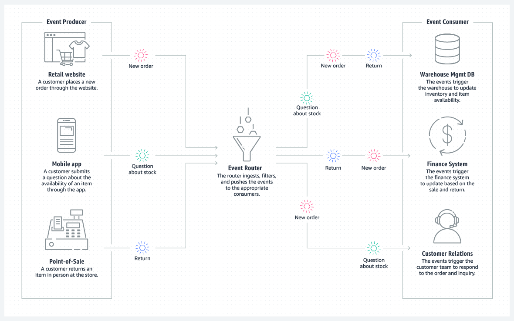

1. [什么时候缓存是无用的，甚至是危险的？](#1-shen-me-shi-hou-huan-cun-shi-wu-yong-de-shen-zhi-shi-wei-xian-de)
2. [为什么事件驱动架构提高可靠性？](#2-wei-shen-me-shi-jian-qu-dong-jia-gou-ti-gao-ke-kao-xing)
3. [如何让代码可读？](#3-ru-he-rang-dai-ma-ke-du)
4. [紧急设计(Emergent Design)和演化架构(Evolutionary Architecture)之间的区别是什么？](#4-jin-ji-she-ji-emergent-design-he-yan-hua-jia-gou-evolutionary-architecture-zhi-jian-de-qu-bie-shi-shen-me)
5. [横向扩展和纵向扩展有什么区别？什么时候使用其中一个，而不是另外一个？](#5-heng-xiang-kuo-zhan-he-zong-xiang-kuo-zhan-you-shen-me-qu-bie-shen-me-shi-hou-shi-yong-qi-zhong-yi-ge-er-bu-shi-ling-wai-yi-ge)
6. [如何处理"故障切换(failover)"和"用户会话(user session)"？](#6-ru-he-chu-li-gu-zhang-qie-huan-failover-he-yong-hu-hui-hua-user-session)
7. [什么是CQRS（Command Query Responsibility Segregation)? 它和最初的有什么区别？](#7-shen-me-shi-cqrscommand-query-responsibility-segregation-ta-he-zui-chu-de-you-shen-me-qu-bie)

## 1 什么时候缓存是无用的，甚至是危险的？

缓存是在软件开发和系统设计中常用的技术，旨在通过存储数据副本来提高数据检索的速度。然而，在某些情况下，缓存可能是无用的，甚至是危险的。以下是一些具体情况：

1. 数据频繁变化
当数据频繁变化时，缓存的数据很快就会过时。在这种情况下，缓存可能会导致用户看到陈旧或错误的信息。例如，股票交易应用中的实时股价，如果使用缓存，可能会导致用户根据过时的信息做出决策。

2. 缓存一致性问题
在分布式系统中，维护缓存一致性是一大挑战。如果系统中的不同部分无法有效同步更新，就可能导致数据不一致。这种情况下，缓存可能会引起错误的结果或数据冲突。

3. 安全敏感数据
对于需要高度安全保护的敏感数据，如密码或个人身份信息，使用缓存可能增加数据泄露的风险。如果攻击者能够访问到缓存的数据，就可能对用户的隐私造成威胁。

4. 缓存穿透问题
缓存穿透指的是查询不存在的数据导致请求直接穿透到数据库，可能会对数据库造成压力。如果没有合适的缓存无效数据的策略，这可能会成为系统的薄弱环节。

5. 缓存资源消耗
虽然缓存可以提高性能，但它也需要消耗额外的内存和存储资源。在资源有限的情况下，不当的缓存策略可能导致资源浪费，甚至影响系统的稳定性。

6. 错误的缓存策略
错误的缓存策略，比如错误的过期时间设置，可能导致缓存无法达到预期的效果。例如，设置了过长的缓存时间，可能导致用户无法及时看到更新的数据；而设置了过短的缓存时间，则可能导致缓存的作用大打折扣。

结论
虽然缓存是一个强大的工具，能够在很多情况下提高系统性能，但在设计和实现缓存策略时，需要考虑上述问题，以避免缓存变得无用或带来潜在风险。正确的做法是根据应用的具体需求，合理设计缓存的大小、类型、过期策略和更新机制。

## 2 为什么事件驱动架构提高可靠性？

事件驱动的架构使用事件来触发和通信各个服务组件， 一个事件可以是状态的改变或者更新，事件即可以是包含状态信息也可以只是一个标识符。一个事件驱动的架构主要有三个重要的组件：事件的生产者，事件的路由和事件的消费者。事件的生产者发布事件到路由，路由包含了过滤器然后将这些事件推送到消费者那边。这样生产者的消费者就解耦了，允许它们各自独立扩容，更新和部署。

使用这个架构的好处是

1. 扩容和宕机是独立
通过解耦服务，让它们只知道事件路由器，而不知道彼此的存在，这就意味着你们的服务是互操作的。但是如果一个服务宕机，剩下的服务仍然可以继续运行。

2. 开发的敏捷性
这也就意味你没有必要再编写代码来 poll, 过滤和路由事件。事件路由自动的过滤和推送事件到消费端，而且它还起初了服务的生产者和消费者之间的同步问题，可以加速开的的流程。

3. 审计更加容易

一个事件路由充当了中心化的角色，可以通过它来审计应用程序和策略。这些策略可以用来限制谁可以推送和订阅事件路由，为数据的访问增加权限控制。

4. 降低成本

事件驱动是基于推送的，所以每一件事都是基于改变才会进行的。通过这种方式，你可以不必要为持续的查询 （poll) 检查事件来付费。这也就意味着更少的网络带宽，更少的 CPU 使用，更少的 SSL/TSL 的握手请求。

## 3 如何让代码可读？

1. 添加合适的注释和文档：合适注释和文档可以帮助他人了解我们代码，并且快速上手。但是注意不要**过度**注释；
2. 一致的缩进换行格式：不同的人有不同的代码风格，但是在同一份的代码创库中应当保证只有一种代码风格，比如缩进的大小，括号换行的位置等等；
3. 使用代码块：很多时候，一些代码行组合起来完成特定的功能。所以可以将这些行的代码组合起来，以便和其他行代码区分开来；
4. 一致的命令习惯：命名是软件开发中头疼的事情，需要保证这些命名规则是一致的，比如说 `strpos()` 和 `str_pos()`不能混合使用，还有驼峰和下划线的区分；
5. `DRY`原则： `Don't Repeat Yourself` 原则是不要尝试重复写同样逻辑的代码，而是只保留一份；
6. 避免深度嵌套：嵌套多层会导致逻辑复杂度和增加，增加阅读者的心智负担；
7. 行长度限制：代码中每一行的长度应当限制在特定的数目，比如 80 或者 120 
8. 文件和文件加组织： 按照功能将代码文件和文件夹组织在一起。

## 4 紧急设计(Emergent Design)和演化架构(Evolutionary Architecture)之间的区别是什么？

紧急设计（Emergent Design）和演化架构（Evolutionary Architecture）是软件开发中两种相关但有所区别的概念，它们都强调了软件设计和架构应对变化的能力。下面是这两个概念的比较：

- 紧急设计 (Emergent Design)
定义：紧急设计是一种在软件开发过程中逐步形成的设计策略，特别是在使用敏捷开发方法时。它强调从简单的设计开始，并随着项目的进展，根据实际需求和问题解决方案的出现而调整和优化设计。
侧重点：侧重于代码层面的设计和重构。它鼓励开发者在开发过程中不断地重构代码，以提高代码的可读性、可维护性和扩展性。
实践方法：通过代码审查、持续重构、测试驱动开发（TDD）和配对编程等实践来实现和维护。
目标：通过持续的小步骤改进来应对需求变化，优化项目的技术实现，而不是一开始就试图设计一个完美的系统。

- 演化架构 (Evolutionary Architecture)
定义：演化架构指的是设计和实施软件架构的过程，使其能够在未来容易地进行修改和扩展。它强调架构应具备适应变化的能力，包括技术变化、业务需求变化等。
侧重点：侧重于整个系统级别的架构设计和决策。它关注于确保系统的各个部分都能灵活适应变化，同时维持系统的整体一致性和性能。
实践方法：通过定义架构决策的健壮性、可扩展性和可替换性等属性，以及使用中间件、微服务架构、模块化设计等技术策略来实现。
目标：创建一个能够随着时间推移而适应新技术、新业务需求而不断进化的软件架构。
区别总结
焦点差异：紧急设计更多关注于代码层面和开发实践，而演化架构更加关注于系统级别的结构和长期的架构策略。
实施层面：紧急设计通常在项目的具体实施阶段中形成和优化，演化架构则需要在项目早期就考虑到架构的可适应性和长期演变。
目标和策略：紧急设计的目标是通过不断的重构和改进来优化项目的技术实现，而演化架构的目标是建立一个能够适应未来变化的稳定而灵活的架构基础。
虽然两者有所不同，但它们都强调了在软件开发过程中应对变化的重要性，并且在实际应用中往往是相辅相成的。紧急设计可以看作是演化架构理念在代码和开发实践层面的体现。

## 5 横向扩展和纵向扩展有什么区别？什么时候使用其中一个，而不是另外一个？

当你的应用由于请求量的增加，需要增加计算资源以便能够处理这些请求。这时你有两种方式方法来完成这个目标：1）横向扩展(`Scale Up`)；2）纵向扩展(`Scale Out`)，它们可以用下面这张图来表示

1. 纵向扩展类似购买性能更加强劲的服务器，比如更快的 CPU，更大的内存等等，这样就能处理大流量请求。
2. 横向扩展类似购买更多的普通的机器，将它们作为一个集群来处理大流量请求。

那么我们一般怎么去选择相应的扩展方式呢？

- 性能：由于横向扩展只要堆积机器即可，理论上来讲可以达到很高的性能表现；但是对于纵向拓展，单台机器的硬件配置是有限的，当我们达到工业界的临界值的时候，就无法再继续扩展；
- 灵活性：如果你的系统原本就是为单点设计的，那么使用纵向扩展就非常容易，代价最小。如果你想灵活的配置启动设置，并且优化成本和性能，可以选择横向拓展
- 系统升级：如果你的系统升级比较频繁，那么单点机器的话就比较困难，几乎不可能有宕机的时间；但是对于水平扩展的机器就没有这个问题。
- 冗余性：横向扩展的的系统可以很好的避免单点故障这个问题。
- 地理分布：如果你的系统是分布在全球以减低延迟，避免自然灾害等等，那么使用横向扩展是一个最好的选择，没有任何理由将系统放在一台机器上。
- 成本：越来越多的多核高性能机器上市，而且也非常便宜。如果单个机器也能满足你的需求，可以尝试使用纵向拓展的方式。

## 6 如何处理"故障切换(failover)"和"用户会话(user session)"？
*todo*
## 7 什么是CQRS（Command Query Responsibility Segregation)? 它和最初的有什么区别？

`Command Query Responsibility Segregation` 是一种特定的架构模式，用来解决应用程序设计中的一种场景的情形。

假设我们有一个电子商务的网站，或许会有一个 `Order` 这样一个实体和 `OrderRepository` 接口负责数据库的读写操作。理论上来讲这是非常理想的解决方案，但是在现实世界中并没有这么简单，因为并不会只有简单的 `Order` 这样的实体，而且在用户接口展示不同数据之间查询和交互。这也就意味着我们需要模糊每个 `Repository` 之间的界限，或者让用户接口处遵循我们的架构的限制。通常的解决方案由两种：

1. 使用不同的 `Repository` 查询得到相应的数据，然后将他们组装起来。
2. 在每个 `Repository` 增加一个查找 （`Finder`）方法，让它来负责查询数据的责任。 

还有一种使用场景是我们的应用程序的读和写是不平衡的，比如说某些情况下，大量的读取请求，但是写的次数比较小。

CORS 是将一种将读写分离的架构，这也就意味着每个方法要么是一个 `Command` 来执行操作，要么是一个 `Query` 返回数据。同时也就意味着 `Command` 不返回数据而 `Query` 不修改数据。 回到之前的电子商务网站的例子，我们需要一个 `Command` 方法它只能增加或者更新 `Order` 实体；还需要增加另外的特定的 `Repository`，它只返回数据的视图。通过分离读写操作，每个方法有了特定的职责，当然实现方式也是多种多样的。

- 可以使用两种不同的模型访问同一个数据库。
- 也可以将数据存放在不同的数据库中，两个数据库之间有一个异步同步数据库之间的工具，这样能够提高读写数据的效率。而且对于扩展应用程序也是非常方便，因为只需要增加读的数据库数量即可。