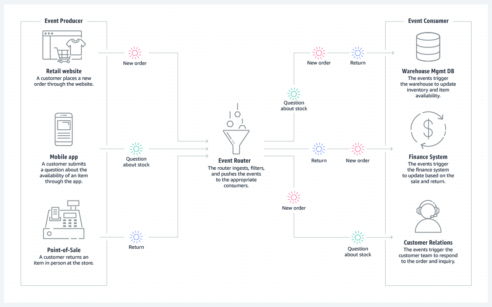
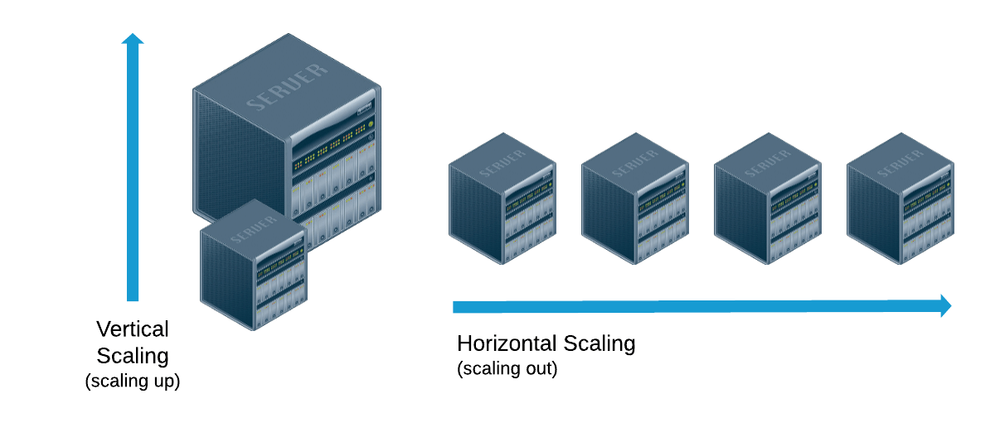

1. [什么时候缓存是无用的，甚至是危险的？](#1-什么时候缓存是无用的甚至是危险的)
2. [为什么事件驱动架构可能提高可靠性？](#2-为什么事件驱动架构可能提高可靠性)
3. [如何让代码更可读？](#3-如何让代码更可读)
4. [Emergent Design 和 Evolutionary Architecture 有什么区别？](#4-emergent-design-和-evolutionary-architecture-有什么区别)
5. [横向扩展和纵向扩展有什么区别？什么时候选哪种？](#5-横向扩展和纵向扩展有什么区别什么时候选哪种)
6. [如何处理故障切换（failover）和用户会话（session）？](#6-如何处理故障切换failover和用户会话session)
7. [什么是 CQRS？它和传统做法有什么区别？](#7-什么是-cqrs它和传统做法有什么区别)

---

## 1 什么时候缓存是无用的，甚至是危险的？

缓存很强大，但不是默认正确答案。

它的本质是：

> 用额外的存储和一致性复杂度，换取更低延迟、更高吞吐或更低下游压力。

所以当这个交换不划算时，缓存就可能无用，甚至有害。

### 什么时候缓存价值很低

#### 1. 命中率很低

如果数据访问非常分散，几乎每次都查不同 key，缓存只是在增加一层额外开销。

#### 2. 数据本身很便宜

如果一次查询本来就极快、成本低、且下游压力可接受，缓存收益可能不明显。

#### 3. 数据变化太频繁

如果数据刚放进缓存就失效，缓存既浪费资源，也难以稳定命中。

### 什么时候缓存是危险的

#### 1. 强一致场景

例如：

- 余额
- 库存扣减
- 权限变化立即生效
- 风控状态

这类数据如果缓存处理不当，可能直接带来业务错误。

#### 2. 缓存一致性难以保证时

典型问题包括：

- cache aside 更新竞态
- 多副本缓存不一致
- 失效广播延迟
- 跨地域缓存陈旧

#### 3. 安全敏感数据

如果缓存中放了敏感数据，又缺少访问控制、隔离或加密，风险会放大。

#### 4. 被缓存放大故障

例如：

- 缓存雪崩
- 缓存击穿
- 缓存穿透
- 热点 key 打爆单点缓存实例

### 现代实践建议

缓存设计至少要回答这些问题：

- 缓存的对象是什么？
- 可接受多长时间的陈旧？
- 失效策略是什么？
- 缓存错了会造成什么业务后果？
- 下游挂掉时缓存是否承担降级职责？

### 面试回答要点

> 缓存不是“加了就更快”的银弹。它适合高重复读、高下游成本的场景；但在强一致、频繁变更或一致性难控的场景下，缓存可能比不缓存更危险。关键是先明确陈旧容忍度和失效策略。

---

## 2 为什么事件驱动架构可能提高可靠性？

注意是“可能”，不是必然。

事件驱动架构（EDA）能提高可靠性的前提，是你用它来做：

- 解耦
- 缓冲
- 异步恢复
- 故障隔离

而不是只是把同步调用换成“发消息”。

### 它为什么可能更可靠

#### 1. 降低同步耦合

服务之间不必同时在线、同时成功。

例如下单后：

- 订单服务写本地事务
- 发出 `OrderCreated` 事件
- 库存、通知、营销等异步消费

这使得某个下游暂时故障，不一定阻断主流程。

#### 2. 提供缓冲能力

消息队列 / 事件流可以吸收突发流量，避免所有压力瞬间压到下游。

#### 3. 更容易局部失败、局部恢复

某个消费者挂了，可以：

- 暂停消费
- 重试
- 从 offset / checkpoint 恢复

而不是让整条同步链路直接失败。

#### 4. 更适合重放与审计

如果事件被持久化，很多系统可以：

- 重放消息
- 重建投影
- 审计处理轨迹

### 但它也可能降低可靠性

如果设计不好，事件驱动也会引入新的风险：

- 重复消息
- 乱序消息
- poison message
- 积压
- 消费延迟
- 事件模式演进困难
- 最终一致性带来的业务复杂度

### 现代实践建议

想让事件驱动真正提升可靠性，通常要配套：

- 幂等消费
- 死信队列
- retry / backoff
- schema 管理
- 可观测性
- 重放和回溯机制

### 面试回答要点

> 事件驱动架构提高可靠性的核心，不是“用了 MQ”，而是通过异步解耦、流量缓冲和消费者可恢复性，减少同步级联失败。但它也会引入顺序、重复和最终一致性复杂度，所以必须配套幂等和监控体系。

---

## 3 如何让代码更可读？

可读性不是“代码看起来整齐”这么简单，而是：

> 维护者能否快速理解代码意图、边界、约束和变化点。

### 最重要的原则

#### 1. 用命名表达意图

好的命名能替代大量低价值注释。

- `x` 不如 `retryCount`
- `data` 不如 `pendingOrders`

#### 2. 控制函数和模块职责

如果一个函数同时做：

- 参数校验
- DB 写入
- 远程调用
- 日志拼接
- 错误翻译

那它大概率难读。

#### 3. 减少嵌套和隐式分支

深层 `if/else`、复杂布尔表达式、隐藏副作用都很伤可读性。

#### 4. 让相同抽象层次的代码放在一起

不要在一个函数里混杂：

- 高层业务编排
- 低层 SQL 拼接
- JSON 细节处理

### 哪些实践很重要

- 一致的格式化规则
- 小而清晰的函数
- 明确的边界和错误处理
- 必要时用注释解释“为什么”
- 保持重复最少但不过度抽象

### 面试回答要点

> 代码可读性的核心是意图清晰、职责单一和抽象层次一致。真正难读的代码通常不是因为格式差，而是因为边界不清、命名差、职责混乱和副作用隐蔽。

---

## 4 Emergent Design 和 Evolutionary Architecture 有什么区别？

这两个概念都强调“系统不要一次性设计死”，但关注层次不同。

### Emergent Design（涌现式设计）

更偏向代码和局部设计层面。

它强调：

> 从尽可能简单的实现开始，在持续反馈、重构和测试保护下，让更合适的设计逐步浮现出来。

它常见于：

- TDD
- 持续重构
- 小步演进
- 避免过早设计

### Evolutionary Architecture（演化式架构）

更偏向系统和架构层面。

它强调：

> 架构要被设计成可以持续变化，并通过技术和治理手段让关键架构特性可持续演进。

常关注：

- 可替换性
- 模块边界
- fitness functions
- 架构治理
- 技术雷达
- 渐进式迁移

### 核心区别

| 维度 | Emergent Design | Evolutionary Architecture |
|---|---|---|
| 焦点 | 代码 / 模块设计 | 系统 / 架构演进 |
| 时间尺度 | 更短期、迭代内 | 更长期、系统级 |
| 主要手段 | 重构、测试、简化 | 架构约束、演进策略、自动校验 |

### 它们的关系

可以理解为：

- Emergent Design 是局部设计如何演进
- Evolutionary Architecture 是整体架构如何演进

两者并不冲突，反而经常配合使用。

### 面试回答要点

> Emergent Design 更强调通过反馈和重构让局部设计自然演进，Evolutionary Architecture 更强调系统级架构要具备持续变化能力。一个偏代码层，一个偏架构层，但底层思想都是拥抱变化而非一次性设计完美方案。

---

## 5 横向扩展和纵向扩展有什么区别？什么时候选哪种？

这两个概念经常被混淆，先统一术语：

- **纵向扩展（scale up）**：给单机增加 CPU、内存、磁盘、网卡等资源
- **横向扩展（scale out）**：增加更多机器 / 实例共同承担负载

### 纵向扩展的特点

优点：

- 简单直接
- 对单体系统友好
- 不需要立刻处理分布式复杂度

缺点：

- 有硬件上限
- 单点风险更大
- 升级常常需要停机或迁移

### 横向扩展的特点

优点：

- 理论扩展空间更大
- 更适合高可用和多地域部署
- 更利于滚动发布和弹性伸缩

缺点：

- 会引入分布式一致性、路由、状态管理等复杂度
- 不是所有工作负载都容易 scale out

### 什么时候选纵向扩展

- 系统规模还不大
- 单机已能满足需求
- 业务还没到值得承担分布式复杂度的阶段
- 需要快速、低风险提升容量

### 什么时候选横向扩展

- 单机已经接近极限
- 需要高可用
- 需要弹性伸缩
- 流量分布在多地域
- 发布和故障恢复要求更高

### 现代实践建议

真实世界里通常不是二选一，而是：

- 先适度纵向扩展
- 到瓶颈后再做关键组件横向扩展

### 面试回答要点

> 纵向扩展简单、适合早期和单机问题；横向扩展更适合高可用和长期规模化，但会带来分布式复杂度。工程上通常先尽量用简单手段解决问题，再在必要时引入 scale out。

---

## 6 如何处理故障切换（failover）和用户会话（session）？

这个问题的核心矛盾是：

> 故障切换要求任意实例都能接手流量，而有状态会话却会把用户绑定到某个实例或某份状态上。

所以总体方向通常是：

> 尽量减少应用实例本地持有的会话状态。

### 常见方案

#### 1. 粘性会话（Sticky Session）

负载均衡器尽量把同一用户请求打到同一台机器。

优点：

- 实现简单

缺点：

- 节点故障时会话容易丢
- 不利于弹性扩缩容
- 不利于多地域和滚动升级

通常只适合作为过渡方案。

#### 2. 集中式会话存储

把 session 放到共享存储中，例如：

- Redis
- 数据库
- 专用 session store

优点：

- 任意实例都可接管
- 故障切换更平滑

缺点：

- 新增基础设施依赖
- session store 自身必须高可用

#### 3. 无状态认证（例如 Token / JWT）

把身份信息放进签名 token，由服务端做验证。

优点：

- 天然适合水平扩展和 failover
- 应用层更无状态

缺点：

- token 撤销复杂
- 权限变更即时失效困难
- 不适合把大量动态会话状态都塞到 token 里

### 最佳实践思路

- 身份认证尽量无状态化
- 需要服务端会话时使用集中式存储
- 把真正动态、频繁变化的状态放后端，不放 token
- 为 session store 本身设计高可用和监控

### 面试回答要点

> failover 和 session 的矛盾在于“服务要能随时切换，状态却不该绑在单机上”。所以现代系统通常尽量无状态化，或者把 session 放进高可用共享存储，而不是依赖粘性会话。

---

## 7 什么是 CQRS？它和传统做法有什么区别？

CQRS（Command Query Responsibility Segregation）指的是：

> 把“写操作模型”和“读操作模型”在职责上分离。

这里的关键不是简单地“分两个类”，而是：

- **Command**：修改状态
- **Query**：读取数据

并且两者可以使用不同的模型、不同的存储、不同的扩展策略。

### 传统做法

很多系统会用统一的领域模型 / repository 同时处理：

- 写入业务规则
- 查询展示需求

这在简单系统里完全可行，但在复杂系统中容易产生冲突：

- 写模型追求一致性和约束
- 读模型追求查询效率和展示便利

### CQRS 的价值

#### 1. 读写优化目标不同

- 写模型适合保持业务不变量
- 读模型适合按页面 / API 查询需求定制

#### 2. 更适合读多写少场景

例如：

- 电商商品详情
- 订单查询中心
- 报表和 dashboard

#### 3. 便于扩展不同侧的能力

例如写模型保持主事务库，读模型同步到：

- 只读副本
- Elasticsearch
- 宽表
- cache / projection store

### 代价和复杂度

CQRS 不是白来的，它会引入：

- 数据同步复杂度
- 最终一致性
- 模型数量增加
- 调试和观测难度提升

### 一个常见误区

CQRS 不等于必须上 Event Sourcing。

两者可以组合，但不是同义词。

### 面试回答要点

> CQRS 的核心是把读和写的职责、模型甚至存储分开，以分别优化一致性和查询效率。它适合复杂查询或读写特征差异很大的系统，但会引入同步和一致性复杂度，所以不应该为小系统过度设计。
