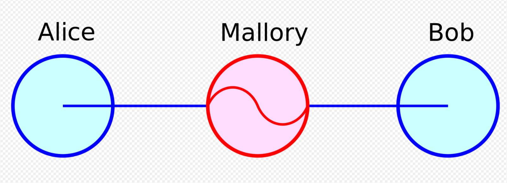

1. [什么是代码安全？它只是开发者的责任，还是也需要专门角色？](#1-什么是代码安全它只是开发者的责任还是也需要专门角色)
2. [为什么密码学不应该自己重新发明？](#2-为什么密码学不应该自己重新发明)
3. [什么是双因素认证（2FA / MFA）？如何在已有 Web 应用中落地？](#3-什么是双因素认证2fa--mfa如何在已有-web-应用中落地)
4. [如何避免日志中泄露敏感信息？](#4-如何避免日志中泄露敏感信息)
5. [请写一个会受到 SQL 注入影响的例子，并说明如何修复。](#5-请写一个会受到-sql-注入影响的例子并说明如何修复)
6. [如何通过静态代码分析发现 SQL 注入风险？](#6-如何通过静态代码分析发现-sql-注入风险)
7. [什么是 XSS（Cross-Site Scripting）？](#7-什么是-xsscross-site-scripting)
8. [什么是 CSRF（Cross-Site Request Forgery）？](#8-什么是-csrfcross-site-request-forgery)
9. [HTTPS 是如何工作的？](#9-https-是如何工作的)
10. [什么是中间人攻击（MITM）？HTTPS 如何缓解它？](#10-什么是中间人攻击mitmhttps-如何缓解它)
11. [如何防止用户会话（session）被窃取？](#11-如何防止用户会话session被窃取)

---

## 1 什么是代码安全？它只是开发者的责任，还是也需要专门角色？

代码安全可以理解为：

> 在软件设计、编码、测试、部署和运行过程中，尽可能减少可被攻击、滥用或误配置利用的缺陷与风险。

它不只是“有没有 SQL 注入”这么窄，而是涵盖：

- 输入校验
- 身份认证与授权
- 密钥管理
- 依赖安全
- 日志与隐私保护
- 供应链安全
- 安全配置默认值

### 这是谁的责任？

答案不是二选一，而是：

> 开发者必须对自己写出的代码安全负责，但组织也必须提供专门能力、制度和平台支持。

### 开发者的责任

- 遵循安全编码规范
- 了解常见漏洞（OWASP Top 10 等）
- 不把敏感信息写进日志或代码仓库
- 正确使用认证、加密和权限控制库
- 在 code review 中把安全作为质量维度之一

### 公司 / 安全团队的责任

- 建立安全开发生命周期（SSDLC）
- 提供 SAST / DAST / SCA / secret scanning 等工具
- 做安全培训和威胁建模
- 建立漏洞响应和应急流程
- 管理基础设施、身份系统、密钥系统和供应链安全

### 现代工程里的更准确说法

今天更常见的理念是 **安全左移（shift left）**：

- 不是等上线前安全团队“找茬”
- 而是让安全能力提前进入设计、开发和 CI/CD 流程

同时也强调 **安全右移（shift right）**：

- 运行时检测
- 攻击面监控
- 异常访问告警
- 事件响应

### 面试回答要点

> 安全不能外包给某个团队，也不能只靠开发者个人自觉。开发者负责把安全写进代码，组织负责把安全做成制度、平台和自动化能力。成熟做法是把安全嵌入整个软件生命周期。

---

## 2 为什么密码学不应该自己重新发明？

因为密码学不是“写一个看起来很复杂的算法”这么简单，而是一个极易因细节失误而彻底失效的领域。

### 为什么自己发明很危险

#### 1. 安全性无法靠直觉判断

很多“看起来很随机、很复杂”的算法，其实在专业攻击者面前非常脆弱。

#### 2. 问题通常不在主算法，而在模式和实现细节

例如：

- IV / nonce 重用
- 随机数不安全
- 填充方式错误
- 密钥派生不正确
- 认证和加密组合方式错误

#### 3. 社区审计极其重要

成熟密码方案之所以值得信任，是因为：

- 被广泛研究
- 经历了长期公开审查
- 有成熟实现和最佳实践

### 现实中的正确做法

- 不自己设计加密算法
- 不自己设计协议
- 不自己实现底层密码原语，除非你就是做密码学基础库
- 使用成熟标准和知名库

例如：

- TLS
- AES-GCM / ChaCha20-Poly1305
- Argon2 / bcrypt / scrypt
- libsodium
- 云厂商 KMS / HSM

### 面试回答要点

> 密码学难点不只是算法，而是协议、随机性、密钥管理和实现细节。自己发明通常不是创新，而是在绕过整个行业已经积累的审计和经验。因此在工程实践里，应优先使用成熟标准和经过广泛验证的实现。

---

## 3 什么是双因素认证（2FA / MFA）？如何在已有 Web 应用中落地？

双因素认证（2FA）指用户登录时需要提供两种不同类别的证明，例如：

- **知道的东西**：密码、PIN
- **拥有的东西**：手机、硬件 token、Authenticator App
- **自身特征**：指纹、人脸等

MFA（多因素认证）是更广义的说法，2FA 是它的常见子集。

### 为什么需要 2FA

因为单靠密码太脆弱：

- 密码泄露
- 撞库
- 钓鱼
- 弱密码复用

### 在已有 Web 应用中的常见落地方式

#### 1. TOTP（基于时间的一次性验证码）

例如 Google Authenticator、Microsoft Authenticator。

优点：

- 成本低
- 不依赖短信
- 生态成熟

#### 2. 短信验证码

实现简单，但安全性弱于 TOTP，因为会受到：

- SIM swap
- 短信拦截
- 社工攻击

影响。

#### 3. WebAuthn / FIDO2

这是更现代、更强的方式，支持：

- 安全密钥
- 平台生物认证
- 抗钓鱼能力更强

### 落地时要考虑什么

- 谁必须启用 2FA（管理员、财务、高权限用户优先）
- 丢设备后如何恢复账号
- 备用恢复码如何发放
- 首次绑定时如何确认设备归属
- 登录风控是否做分级挑战

### 面试回答要点

> 2FA 的目标是降低密码单点失守风险。实际落地中，TOTP 是常见务实方案，WebAuthn 是更现代、更强的方向；同时必须设计恢复流程和高风险场景策略，否则安全措施本身会变成可用性问题。

---

## 4 如何避免日志中泄露敏感信息？

日志泄露是非常常见的安全事故来源。

敏感信息一旦进入日志，问题会被放大，因为日志通常会：

- 长期保存
- 被多人访问
- 被集中采集
- 被复制到多个系统

### 应避免进入日志的信息

- 密码
- token / session ID
- Cookie
- 身份证号、手机号、邮箱全量
- 银行卡号
- 私钥、密钥、证书私密部分
- 受监管个人信息（PII）

### 核心做法

#### 1. 默认不记录敏感字段

这是第一原则，优先“不打”，而不是“打了再处理”。

#### 2. 脱敏

如果业务确实需要部分信息用于排障，可以：

- mask
- 截断
- hash（注意是否会影响排障语义）

#### 3. 做结构化日志和字段级过滤

比把整段对象直接 stringify 到日志中安全得多。

#### 4. 控制日志访问权限和保留周期

日志也是敏感资产。

#### 5. 做自动扫描

在 CI、日志平台或数据管道中识别：

- secret
- token
- PII
- 高风险模式

### 面试回答要点

> 防止敏感信息进入日志，最好的办法不是“加密日志”，而是从源头避免记录，并在必要时做字段级脱敏、访问控制和自动扫描。日志是生产资产，也是一类高风险数据资产。

---

## 5 请写一个会受到 SQL 注入影响的例子，并说明如何修复。

### 不安全示例

```csharp
public User GetUser(string id)
{
    string sql = $"SELECT * FROM Users WHERE id = {id}";
    using var command = new SqlCommand(sql, connection);
    using var reader = command.ExecuteReader();
    return ConvertToUser(reader);
}
```

如果攻击者传入：

```text
1; DROP TABLE Users
```

就可能导致恶意 SQL 被执行。

### 正确修复：参数化查询

```csharp
public User GetUser(string id)
{
    const string sql = "SELECT * FROM Users WHERE id = @id";
    using var command = new SqlCommand(sql, connection);
    command.Parameters.Add("@id", SqlDbType.Int).Value = int.Parse(id);
    using var reader = command.ExecuteReader();
    return ConvertToUser(reader);
}
```

### 还应补充的实践

- 优先使用参数化 API / prepared statement
- 使用最小权限数据库账号
- 对输入做类型校验
- 尽量避免拼接动态 SQL
- ORM 也不能盲信，拼接 raw SQL 一样可能中招

### 面试回答要点

> SQL 注入的本质是把不可信输入当成 SQL 语法的一部分去执行。核心修复方式是参数化查询，而不是手工转义字符串；同时还应辅以最小权限和输入校验。

---

## 6 如何通过静态代码分析发现 SQL 注入风险？

静态分析的核心思路是 **污点分析（taint analysis）**。

### 大致步骤

#### 1. 找 source

识别不可信输入来源，例如：

- HTTP 参数
- 请求体
- Header
- 文件输入
- 消息队列消息

#### 2. 追踪数据流

跟踪这些输入如何经过变量、函数、对象字段传播。

#### 3. 找 sink

识别危险使用点，例如：

- 拼接 SQL 后执行
- ORM 的 raw query API
- 动态 where / order by 组装

#### 4. 识别 sanitizer

看这些输入在进入 sink 前是否经过：

- 参数化处理
- 类型约束
- 安全 API 包装

### 工程中的难点

- 误报和漏报
- 框架封装层多
- 动态语言分析困难
- 自定义 query builder 语义复杂

### 所以正确姿势通常是组合拳

- SAST 做批量发现
- Code Review 做上下文判断
- 单元 / 集成测试覆盖关键 SQL 路径
- DAST / 安全测试验证实际可利用性

### 面试回答要点

> 静态分析发现 SQL 注入，核心是从不可信输入出发做污点传播，检查它是否未经安全处理就流入 SQL 执行点。真正落地时，SAST 很有价值，但通常要和 code review、动态测试一起使用。

---

## 7 什么是 XSS（Cross-Site Scripting）？

XSS 指的是：

> 攻击者把恶意脚本注入到受害者浏览的页面中，并借助浏览器在该站点上下文中执行脚本。

这可能导致：

- 窃取会话
- 发起恶意请求
- 篡改页面内容
- 钓鱼
- 键盘记录

### 常见类型

#### 1. Reflected XSS

恶意输入出现在响应中，通常通过链接触发。

#### 2. Stored XSS

恶意内容被存入数据库，后续展示给其他用户时执行。

#### 3. DOM-based XSS

问题发生在前端脚本对 DOM 的不安全操作中。

### 如何防御

#### 1. 输出时按上下文编码

这是最重要的原则。

- HTML 上下文做 HTML escape
- JS 上下文做 JS escape
- URL 上下文做 URL encode

#### 2. 避免危险 API

例如：

- `innerHTML`
- `document.write`
- 动态拼接 script

#### 3. 使用 CSP（Content Security Policy）

作为重要防线，但不能替代正确编码。

#### 4. Cookie 设置 `HttpOnly`

可以降低 session 被脚本直接读取的风险，但并不能防止所有 XSS 影响。

### 面试回答要点

> XSS 的本质是把攻击者输入当作脚本执行。防御关键不是“过滤所有危险字符”，而是输出时按上下文正确编码，并避免危险 DOM API；CSP 和 HttpOnly 是重要辅助措施，但不是主修复手段。

---

## 8 什么是 CSRF（Cross-Site Request Forgery）？

CSRF 是指：

> 攻击者诱导已登录用户的浏览器，向目标站点发送一个用户本人并不想发出的请求。

其关键点在于：

- 请求是受害者浏览器发出的
- 浏览器可能会自动带上 Cookie
- 服务端误以为这是合法用户操作

### 一个典型例子

用户已登录银行站点，随后访问恶意页面，页面自动提交一个转账表单到银行站点。如果银行只依赖 Cookie 识别身份，而不验证请求来源或 token，就可能被利用。

### 常见防御方式

#### 1. CSRF Token

服务端生成不可预测 token，并要求状态变更请求携带它。

#### 2. `SameSite` Cookie

现代浏览器下这是非常重要的一层防线。

#### 3. 校验 Origin / Referer

可作为辅助校验。

#### 4. 对关键操作做再次确认

例如二次密码、验证码、2FA challenge。

### 现代补充

如果系统完全使用：

- `Authorization: Bearer ...`
- 且 token 不由浏览器自动附带

CSRF 风险通常会下降，但 XSS 风险会相对更关键。

### 面试回答要点

> CSRF 的核心不是窃取数据，而是冒用用户已登录状态发起请求。防御重点是让浏览器自动带上的身份信息不足以单独完成敏感操作，常见做法是 CSRF Token、SameSite Cookie 和来源校验。

---

## 9 HTTPS 是如何工作的？

HTTPS 可以理解为：

> 在 HTTP 之下加入 TLS，让通信具备机密性、完整性和服务端身份认证能力。


### HTTPS 主要解决什么

- 防止窃听
- 防止篡改
- 防止伪装服务器

### 基本过程

#### 1. ClientHello / ServerHello

客户端和服务端协商：

- TLS 版本
- 支持的加密套件
- 随机数参数

#### 2. 证书验证

服务端把证书链发给客户端。

客户端检查：

- 证书是否由受信任 CA 签发
- 域名是否匹配
- 是否过期
- 是否被吊销（视实现而定）

#### 3. 密钥交换

现代 TLS 通常使用（EC）DHE 做密钥交换，生成会话密钥。

这比“客户端生成对称密钥后用服务端公钥加密再发送”的老式简化说法更接近现代实际。

#### 4. 后续数据加密传输

握手完成后，HTTP 数据通过对称加密保护。

### 现代面试里建议补充

- TLS 不只是加密，还提供完整性和身份认证
- 现代 TLS 主要使用前向保密（PFS）
- 证书信任链是核心机制之一

### 面试回答要点

> HTTPS 本质是 HTTP over TLS。客户端先验证服务端证书，再通过 TLS 握手协商密钥，后续用对称加密保护数据，从而实现防窃听、防篡改和身份认证。

---

## 10 什么是中间人攻击（MITM）？HTTPS 如何缓解它？

中间人攻击（MITM）是指：

> 攻击者位于通信双方之间，能够拦截、观察，甚至修改双方传输的数据。




### 如果没有认证会怎样

假如客户端想拿到服务器公钥，但攻击者把自己的公钥冒充成服务器的发给客户端，那么客户端之后加密的内容实际上都会发到攻击者手里。

### HTTPS 如何缓解

关键不只是“加密”，而是：

> **先认证对方身份，再建立加密通信。**

客户端通过证书链验证：

- 这个证书是不是可信 CA 签的
- 证书上的域名是不是当前访问域名
- 证书是否有效

攻击者通常无法伪造一个被浏览器信任、又匹配目标域名的合法证书，因此 MITM 难以得逞。

### 仍需注意的风险

HTTPS 不是万能的，如果出现以下情况仍可能失守：

- 用户忽略证书告警
- 终端设备被植入恶意根证书
- DNS / BGP / 本地代理被结合利用
- 应用自身存在 XSS、恶意扩展等终端侧风险

### 面试回答要点

> MITM 的本质是攻击者冒充通信一方或篡改链路。HTTPS 缓解它，不只是靠加密，而是靠证书体系先证明“你连的是谁”，再建立加密和完整性保护。

---

## 11 如何防止用户会话（session）被窃取？

会话被窃取后，攻击者可能直接冒充用户。

因此保护 session 本质上是在保护“登录态”。

### 常见风险来源

- XSS 窃取 Cookie
- 明文 HTTP 被监听
- 不安全的客户端存储
- session 固定攻击（session fixation）
- 设备被恶意软件控制
- token / cookie 泄露到日志或第三方

### 常见防护措施

#### 1. Cookie 设置安全属性

- `HttpOnly`
- `Secure`
- `SameSite`

这三项几乎是基础配置。

#### 2. 全站 HTTPS

防止会话令牌在传输中被窃听。

#### 3. 防止 XSS

因为很多 session 泄露最终都是 XSS 问题。

#### 4. 登录后轮换 session ID

防止 session fixation。

#### 5. 设置合理的过期和失效策略

例如：

- 空闲超时
- 绝对过期
- 登出即失效
- 高风险操作二次认证

#### 6. 绑定一定上下文（谨慎使用）

可结合：

- 设备特征
- 风险评分
- IP / 地理异常

但不要过度绑定导致正常用户频繁掉线。

#### 7. 不在日志、URL、前端可读存储中暴露高价值令牌

### 面试回答要点

> 防止 session 被偷，不能只靠 `HttpOnly`。真正有效的是组合防护：全站 HTTPS、Cookie 安全属性、防 XSS、session ID 轮换、合理过期策略以及高风险行为的额外校验。会话安全本质上是身份安全的一部分。
