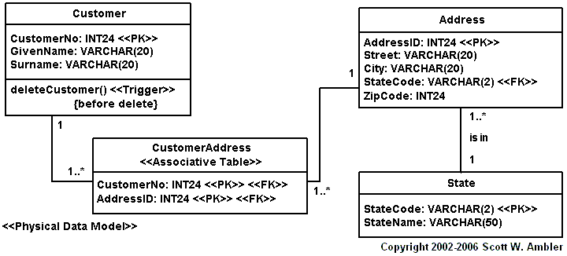
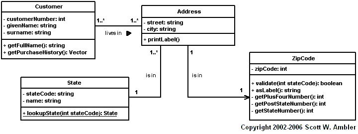

1. [函数式语言是做什么的？什么时候我们需要使用函数语言？](#1-han-shu-shi-yu-yan-shi-zuo-shen-me-de-shen-me-shi-hou-wo-men-xu-yao-shi-yong-han-shu-yu-yan)
2. [Microsoft，Google，Opera和Mozilla公司从他们的浏览器中如何获利的？](#2-microsoftgoogleopera-he-mozilla-gong-si-cong-ta-men-de-liu-lan-qi-zhong-ru-he-huo-li-de)
3. [为什么打开TCP套接字有很大的开销？](#3-wei-shen-me-da-kai-tcp-tao-jie-zi-you-hen-da-de-kai-xiao)
4. [封装对于那些有重要的作用？](#4-feng-zhuang-dui-yu-na-xie-you-zhong-yao-de-zuo-yong)
5. [什么是实时系统？它和普通的系统有什么区别？](#5-shen-me-shi-shi-shi-xi-tong-ta-he-pu-tong-de-xi-tong-you-shen-me-qu-bie)
6. [实时语言(real-time language)和堆内存分配(heap memory allocation)之间的关系是什么？](#6-shi-shi-yu-yan-realtime-language-he-dui-nei-cun-fen-pei-heap-memory-allocation-zhi-jian-de-guan-xi-shi-shen-me)
7. [不可变性是怎么帮助我们提高编写更安全的代码？](#7-bu-ke-bian-xing-shi-zen-me-bang-zhu-wo-men-ti-gao-bian-xie-geng-an-quan-de-dai-ma)
8. [可变性变量和不可变量有什么优势和弊端？](#8-ke-bian-xing-bian-liang-he-bu-ke-bian-liang-you-shen-me-you-shi-he-bi-duan)
9. [什么是O/R阻抗失衡(Object-Relational impedence mismatch)？](#9-shen-me-shi-or-zu-kang-shi-heng-objectrelational-impedence-mismatch)
10. [缓存大小在设计的时候需要考虑哪些原则？](#10-huan-cun-da-xiao-zai-she-ji-de-shi-hou-xu-yao-kao-lv-na-xie-yuan-ze)
11. [客户端渲染和服务端渲染有什么各自弊端，如何取舍？](#11-ke-hu-duan-xuan-ran-he-fu-wu-duan-xuan-ran-you-shen-me-ge-zi-bi-duan-ru-he-qu-she)
12. [如何在不可靠的协议上开发出可靠通讯协议？](#12-ru-he-zai-bu-ke-kao-de-xie-yi-shang-kai-fa-chu-ke-kao-tong-xun-xie-yi)
13. [想象一下如果在你最喜欢的语言移除空引用的问题，你该如何做？会导致什么样的后果？](#13-xiang-xiang-yi-xia-ru-guo-zai-ni-zui-xi-huan-de-yu-yan-yi-chu-kong-yin-yong-de-wen-ti-ni-gai-ru-he-zuo-hui-dao-zhi-shen-me-yang-de-hou-guo)

## 1 函数式语言是做什么的？什么时候我们需要使用函数语言？
函数式语言是一种编程范式，在函数式语言程序是由调用和组合函数而成。这是一种声明式编程式编程语言，是由一系列表达式构成的树组成，通常将一些值转换成其他值。
在函数式编程中，函数被认为是第一等公民，也就意味着它可以和一个变量绑定，作为参数传递到其他函数中，或者从其他函数中返回。
当在函数式语言中，如果所有的函数都是类似数学函数，或者纯函数，也就是说对于任何相同的输入，它的返回值都是一样的，而不会影响任何其他可变的状态或者有其他副作用，那么我们可以叫做纯函数编程。纯函数编程通常有更少的 bug, 非常容易调试和测试。

函数式语言起源于学术界，因此它非常它在编程语言理论研究中广泛应用。函数式语言特别适用于一些对于同一个数据集进行多次操作的场景中，比如机器学习。函数式语言在金融领域的风险控制中也广泛使用，因为每个函数都可以看做关系图中的一个节点。

## 2 Microsoft，Google，Opera和Mozilla公司从他们的浏览器中如何获利的？

在上个世纪的 90 年代，网景公司（netscape）发布一款浏览器叫做 `Netscape Navigator`，该软件风靡全球。这时微软觉得这款软件威胁到 `Windows` 在桌面操作系统的统治地位。于是微软开发出了自己的浏览器 `Internet Explorer`，该软件拥有和 `Netscape Navigator` 同样的功能，最致命的是该软件采用的免费的策略，可以和 `Windows` 操作系统深度绑定。因此在这场浏览器大战中，微软的 `IE` 浏览器笑到了最后。虽然微软没有从浏览器中没有挣到钱，但是通过与 `Windows` 系统深度绑定免费策略，巩固了微软在桌面领域的统治地位。

在微软赢得浏览器大战之后，并没有将更多的资源放在浏览器上。在网景公司倒闭后，成立了 Mozilla 公司，在 2004 年发布了 `firefox` 浏览器。由于插件的机制，该浏览器受欢迎的程度在 2009 年就超过了 `IE` 浏览器。那么 Mozilla 是如何通过浏览器盈利的呢？通过该公司的年度财报我们可以发现其 `95%` 的收益来自于特许权，主要是 `firefox` 浏览器的默认搜索引擎的设置。在 `2014` 年之前，`Mizilla` 于 `google` 达成协议，使用 `google` 作为默认搜索引擎；在 `2014` 到 `2017`, 于 `Yahoo` 达成协议，切换为 `Yahoo` 的搜索引擎；后来继续使用 `google` 搜索引擎。

在 2008 年，`google` 发布了 `Chrome` 浏览器。这是一款一鸣惊人的浏览器，并且在很短的时间内统治了浏览器市场。由于 `Chrome` 的默认的搜索引擎就是 `google`, 因此 `google` 不需要向别的浏览器付费来设置默认浏览器。除此之外，人们在使用 `google` 浏览器的时候，通常也会使用 `gmail`, `google apps` , `google docs` 等服务，这些都会增加 `google` 的收入。还有 google 的 `adsense` 计划会使用 Chrome 来记录用户的数据。更多的数据会有助于更好的市场推广和广告投放。

## 3 为什么打开TCP套接字有很大的开销？

打开TCP套接字涉及到一系列复杂的网络操作和协议交互，这些操作和交互导致了相对较大的开销。以下是导致打开TCP套接字开销较大的一些原因：

1. 三次握手
TCP协议使用所谓的“三次握手”过程来建立一个连接。这个过程包括发送一个同步信号（SYN），接收一个同步-应答信号（SYN-ACK），然后发送一个应答信号（ACK）。这三步操作确保了双方都准备好发送和接收数据，但也意味着在可以开始数据传输之前，必须完成这些网络往返。

2. 资源分配
在服务器端，为每个新的TCP连接分配资源（如内存和文件描述符）也需要时间和处理能力。服务器必须跟踪每个连接的状态，包括序列号、确认号、窗口大小以及其他控制信息。

3. 网络延迟
网络延迟对于TCP连接的建立也有影响。三次握手过程中的每一步都涉及网络请求和响应，这些都受到网络条件的限制，包括带宽、延迟和丢包率。

4. 拥塞控制和避免
TCP协议包括拥塞控制机制，以避免网络过载。在连接建立过程中，TCP开始时会谨慎增加其拥塞窗口大小，这个过程被称为慢启动。虽然这主要影响数据传输阶段，但初始化拥塞控制状态也是连接建立过程的一部分。

5. 加密和安全性协商
如果TCP连接是通过安全层（如TLS/SSL）建立的，那么加密和安全性协商可以显著增加连接建立的时间。在传输层安全性（TLS）握手过程中，客户端和服务器需要交换证书、验证身份，并协商加密密钥，这需要额外的时间和计算资源。

6. 系统调用和上下文切换
在应用程序和操作系统内部，打开和管理TCP连接涉及到多个系统调用，每个调用都可能导致用户态和内核态之间的上下文切换。这些上下文切换会增加额外的CPU开销。

总结
尽管TCP提供了可靠的数据传输服务，确保了数据按顺序、无差错、不丢失地传输，但这些特性是以在连接建立过程中增加复杂性和开销为代价的。为了优化性能，开发者可能会采用各种策略，如连接池、长连接以及使用更轻量级的通信协议（在适当的场合）。

## 4 封装对于那些有重要的作用？

在面向对象编程中，封装（Encapsulation）是一个非常重要的概念。它可以帮助我们隐藏对象中数据的状态，也可以避免对象外部直接访问对象的数据。

封装可以帮助我们隔离暴露 API 的实现的细节，从而让开发人员拥有更多的控制权，从而达到的解耦的目的。假设我们有下面这么一个类。

```C#
public class Car
{
    public float GetFuelPercentage() 
    {
        // 
    }

    private float gasoline;
}
```

现在当客户端使用 `GetFuelPercentage` 方法的时候返回当前汽车中包含的油量，而不用关心这台车究竟使用了哪种汽油。通过这一层抽象，隔离了客户端关心的内容（油量）和不重要的细节（具体什么油）。

另外一个作用就是这个类的作者可以任意修改内部的细节，而不用担心破坏了原本这个类的行为，因为没有任何暴露的接口依赖这些细节。

## 5 什么是实时系统？它和普通的系统有什么区别？

实时系统 (Real-time operating system, RTOS) 是为了实时应用程序设计的操作系统，其中的大部分没有缓冲延迟。在这种类型的操作系统中，处理过程必须要在特定的限制条件中完成，否则系统会奔溃掉。

为什么我们需要实时系统呢？

- 它提供了基于优先级的调度，它允许你将分析的程序从非严格的程序分隔开来。
- 实时操作系统了提供了 API 函数，允许编写更简洁更小的应用程序代码。
- 抽象出时间依赖和基于任务的设计带来了模块之间的依赖的降低。
- 基于事件的 API 鼓励模块的开发者将模块当作任务，这样它们就有了清晰的角色定义，而且允许设计者和团队独立的工作。


实时系统有下面这些组件组成

- Scheduler: 这个组件告诉实时操作系统按照什么顺序处理各个任务，这些任务通常是基于优先级

- Symmetric Multiprocessing: 有很多不同种类的任务可以被实时操作系统同时处理，这样可以并发处理。

- Function Library: 这是实时系统重要的组成部分，因为它可以帮助你链接内核和应用程序代码。使用这些函数应用程序可以将请求发送给内核。

- Memory Management: 这个组件用来给每个应用程序分配内存，这是实时系统最重要的组件

- Fast dispatch latency: 任务的终结后可以被操作系统回收和线程被使用之间有间隔，这个需要被一个队列管理。

- User-Defined data objects and classes: 实时系统使用了 C 和 C++ 这样的编程语言，它们应该要提供基础的数据类型。

实时操作系统和其他操作系统的区别如下：

| 通用操作系统  |  实时操作系统 |
|---|---|
| 为桌面和笔记本设计  | 为嵌入式应用程序设计   |
| 进程基础的调度  | 基于时间的调度比如轮询  |
| 中断的延迟并不认为是重点  | 中断延迟最小化，以微秒计算  |
| 没有优先级颠倒的机制 | 可以实现优先级颠倒  |
| 内核的操作可以或者不可以被抢占 |  内核的操作可以被抢占 |


## 6 实时语言(real-time language)和堆内存分配(heap memory allocation)之间的关系是什么？

实时语言（Real-Time Language）用于编写实时系统的软件，这些系统对于时间的要求极为严格，必须在指定或预测的时间内完成特定的任务。实时系统通常分为硬实时（Hard Real-Time）和软实时（Soft Real-Time）系统，其中硬实时系统对于时间的要求是绝对的，任何违背都可能导致系统失败，而软实时系统虽然也重视时间约束，但偶尔的延迟不会导致灾难性的后果。

堆内存分配（Heap Memory Allocation）是程序运行时从堆内存（一种动态内存区域）中分配内存空间的过程。与栈内存（为函数调用和局部变量分配）相比，堆内存为动态分配的对象提供空间，其生命周期不由作用域决定，而是需要显式地创建和销毁。

实时语言与堆内存分配之间的关系
实时编程语言和堆内存分配之间的主要关系在于如何在满足实时性要求的同时，有效地管理内存。在实时系统中，内存分配（特别是堆内存分配）需要特别小心处理，因为：

确定性和可预测性：实时系统需要保证任务在预定时间内完成，但堆内存分配（和释放）的时间开销往往是不确定的，可能因为碎片整理（fragmentation）、分配策略或内存不足而变化。这种不确定性与实时系统对时间的严格要求相冲突。

延迟：堆内存分配可能引入不可接受的延迟，特别是在内存碎片化严重或内存分配器需要搜索足够大的连续空间时。

内存碎片：长时间运行的实时系统可能遭受堆内存碎片化的影响，导致有效内存的利用率下降，甚至出现内存不足的情况，这对于硬实时系统尤其危险。

应对策略
鉴于堆内存分配的这些潜在问题，实时系统开发者通常采取以下策略：

静态内存分配：尽可能在编译时分配所有必需的内存，避免运行时的堆内存分配。
固定大小的内存池：预先分配固定大小的内存块集合，并从这些池中分配和释放内存，以减少碎片化和分配延迟。
实时内存管理器：使用专为实时系统设计的内存管理器，这些管理器通过减少锁的使用、优化内存分配路径等方式，来减少延迟和提高预测性。
限制动态内存分配：在系统运行的关键阶段避免动态内存分配，或完全不使用动态内存分配。
总之，虽然堆内存分配为程序提供了灵活的内存管理方式，但在实时系统中，开发者必须仔细考虑其对系统响应时间和可预测性的影响，并采取适当的策略来避免潜在的问题。实时编程语言和工具通常提供了支持这些策略的特性和机制。

## 7 不可变性是怎么帮助我们提高编写更安全的代码？

不可变性（Immutability）在软件开发中是一个核心概念，特指一旦数据被创建，就不能被修改的特性。在编程语言和设计模式中应用不可变性可以大大提高代码的安全性、可读性和易维护性。以下是不可变性如何帮助提高编写更安全代码的几个方面：

1. 线程安全
在多线程环境中，不可变对象是天然线程安全的，因为它们的状态不会随着时间改变，从而避免了竞态条件（race conditions）和数据竞争（data races）。这意味着在并发编程中，使用不可变对象可以减少锁的使用，降低死锁（deadlocks）的风险，从而提高系统的稳定性和性能。

2. 防止意外修改
不可变性通过确保数据在创建后不能被修改，帮助开发者避免了因意外修改数据而导致的错误和安全问题。这种特性尤其重要，当多个组件或服务共享数据时，不可变性可以防止“副作用”（side effects）——即一个组件的操作不会意外影响到其他组件的状态。

3. 易于推理和调试
由于不可变对象的状态不会改变，这使得代码更容易理解和推理。开发者可以确定在对象的整个生命周期内，其状态是一致的。这种可预测性大大简化了调试过程，因为系统的当前状态只取决于初始输入和执行的操作序列，而不是不可预知的状态变化。

4. 促进函数式编程
不可变性是函数式编程（Functional Programming）的核心原则之一。在函数式编程中，函数被设计为无副作用的纯函数，这意味着相同的输入总是产生相同的输出，而不依赖于或修改外部状态。这种编程范式促进了代码的模块化和重用，降低了出错的可能性。

5. 便于历史数据的追踪和回滚
在应用不可变性时，每次数据变化都需要创建一个新的数据版本。这种做法便于实现历史数据的追踪和状态的回滚，对于需要高度数据完整性和可追溯性的应用（如金融和审计系统）尤其有用。

6. 增强安全控制
在安全敏感的应用中，不可变性可以防止数据被恶意修改。例如，在权限控制严格的系统中，通过使用不可变对象，可以确保一旦权限设置被创建，就不会被未经授权的操作修改。

结论
虽然不可变性带来了许多好处，但它也可能增加内存的使用量，因为每次数据修改都需要创建新的对象。因此，在实践中，开发者需要在性能和安全性、易维护性之间做出平衡。然而，总体而言，应用不可变性是提高代码安全性和质量的有效策略之一。

## 8 可变性变量和不可变量有什么优势和弊端？

在程序设计中，我们使用变量保存程序运行过程中的中间结果。通常变量是指向内存中的一块区域，因此可以通过赋值的方式修改该内存中的数据。一般而言，变量都是可以修改的。但是编程语言中可以通过添加 `const` 关键字表明某个变量是不可变的，一旦编译器发现重新赋值的情况，就会出现编译失败的错误。

**可变性变量**
Pros:
- 使用方式比较灵活
- 在声明式编程语言中，可变性变量符合思维逻辑

Cons
- 由于存在多个地方可以修改变量，增加了逻辑的复杂度
- 再多线程程序，多个线程同时修改变量会导致资源竞争

**不可变性变量**

Pros 
- 降低了程序的逻辑复杂度，因为每个不可变性变量一处赋值的地方
- 为并发编程，分布式计算提供了便利

Cos
- 修改变量需要重新申请内存空间，内存消耗增加，并且拷贝数据也会消耗时间


## 9 什么是O/R阻抗失衡(Object-Relational impedence mismatch)？

面向对象技术（Object-oriented Technology) 支持基于对象构建应用程序，这些对象既有数据也有行为；关系型技术（Relation Technology)支持将数据以表的形式存储，并且通过特定的数据操作语言来操纵数据库，这个既可以是内部的存储过程或者外部 `SQL` 查询，这两种方式广泛在不同的组织的组织广泛使用。而且通常混合使用它们来构建一个复杂的应用程序，我们也知道将他们两者完美的适配起来并不轻松。我们将这个两个技术之间的差异叫做 `O/R` 阻抗失衡。

为什么存在这样的失衡呢？因为两者的基于的原则是不同的:面向对象技术是基于软件工程的原则；而关系型技术基于数学原则。这样导致了两者并不能无缝工作。在面向对象技术中，你可以通过对象之间的关系来遍历所有的对象，而在关系型技术中，你只能通过表之间的联合来查询。要向很好地使用它们，你需要它们在描述上的差异。

比如说在　Java 中有 `string` 和 `int` 类型，Oracle 数据库中有 `varchar` 和 `smallint` 两种对应类型，通常我们在使用的时候 `JDBC` 对自动帮你做好转换。但是在 Java 中的集合，这个并不是直接和 `Table` 中的概念完美匹配。

假设这里有一张表示应用程序的实体模型



这张图展示了在数据库中四张表和它们之间的关系，但是在 UML 中包含类并不是这四张表



在面向对象技术中看上去更加健壮一些，因为这是这个技术内在的优势，比如你可以看到 `Customer` 和 `Address` 之间的多对多的关系。但是在关系型技术中，需要增加一个 `CustomAddress` 这张表。

那我们该如何克服这个失衡呢？

- 应用开发人员和数据库管理员 （DBA）之间是一致的，也就是两者应当理解这两个技术
- 应当减少数据库的 Schema 和访问数据库之间的耦合性

## 10 缓存大小在设计的时候需要考虑哪些原则？

在设计缓存系统时，确定合适的缓存大小是关键的一步，因为它直接影响到系统的性能和资源利用率。选择缓存大小时需要考虑的原则包括但不限于以下几点：

1. 工作集大小（Working Set Size）
工作集是指在一段时间内频繁访问的数据集合。理想的缓存大小应该能够覆盖大部分的工作集，以减少对后端存储的访问。
2. 命中率与边际效益（Hit Rate and Marginal Benefit）
增加缓存大小通常会提高缓存命中率，但效益是递减的。需要评估增加缓存大小带来的命中率提升是否值得额外的资源投入。
3. 可用资源（Available Resources）
缓存大小不应超过系统可分配的内存或存储资源。在有限的资源下，要平衡缓存大小和其他系统需求。
4. 数据更新频率（Data Update Frequency）
如果数据更新非常频繁，大容量缓存可能会导致更多的数据过时，降低缓存的有效性。对于这种情况，可能需要较小的缓存或更复杂的缓存失效策略。
5. 访问模式（Access Patterns）
数据的访问模式（如顺序访问、随机访问）也影响缓存大小的选择。例如，对于随机访问模式，较大的缓存可能更有效；而对于顺序访问模式，预取策略可能比增加缓存大小更重要。
6. 负载特征（Load Characteristics）
考虑系统的负载特征，包括访问的峰值和谷值，以及负载的变化趋势。缓存大小需要能够应对负载的峰值，避免在高负载时缓存效率低下。
7. 成本与预算（Cost and Budget）
在物理资源有限的情况下，增加缓存大小会增加成本。需要在预算约束下做出平衡，找到性价比最高的解决方案。
8. 回收策略（Eviction Policies）
缓存的回收策略（如最近最少使用（LRU）、最不经常使用（LFU）等）也会影响缓存大小的选择。不同的策略对缓存的利用效率有不同的影响。
9. 系统的扩展性（Scalability）
考虑系统未来的扩展需求，缓存设计应具有良好的扩展性，以便在需要时容易调整大小。
结论
选择合适的缓存大小是一个需要综合考虑多个因素的决策过程。理想的缓存大小应该基于应用的具体需求和资源条件，通过实验和性能测试来细致调整，以达到最佳的性能和资源利用平衡。

## 11 客户端渲染和服务端渲染有什么各自弊端，如何取舍？

客户端渲染(Client Side Rendering, CSR)，它在用户的浏览器中使用 Javascript 代码或者相关的库，比如 Angular，Vue，React 等来渲染网页的页面。


它的处理流程是这样的

- 浏览器向网站发送请求
- CDN 可以接受静态资源，比如 HTML 页面，CSS 样式等静态文件
- 当用户看到页面的加载的过程，也就意味着浏览器已将下载好 HTML 页面和 JS 代码
- 浏览器继续发送请求到服务的 API 来获得数据内容，然后将其渲染在页面上

使用客户端渲染的好处和缺陷

好处：
- 快速的渲染过程
- 很容易导航
- 降低了的服务端的压力
- 适合 Web 应用程序

缺陷
- 首次加载耗时大
- 需要额外的库支持
- SEO 支持不够友好

那么什么时候选择这种方式的渲染呢？

- 如果你的应用程序包含了复合的 UI 设计，也就是说你的应用程序包含了很多页面
- 大量的动态数据
- 如果是大量用户设计的情形
- 移动端的应用程序。 

服务端渲染（Server Side Rendering, SSR) 是一种典型的 Web 应用程序，请求的响应包含了全部的 HTML 页面。


- 用户发送请求到服务端
- 服务端检查资源并且准备好 HTML 的内容
- 编译好的 HTML 发送给客户端的浏览器
- 客户端下载好 HTML 页面并且展示给用户
- 浏览器并且下载好 Javascript 库，让页面可以交互

服务端渲染的好处和缺陷

好处
- 迅速的初始化访问
- SEO支持完备
- 对于静态网站，十分有用

缺陷
- 页面之间的跳转非常费时间
- 使得页面非常容易被攻击
- 缓存起来比较繁杂
- 服务端的资源消耗较多
- 高延迟

那么什么时候选择服务端渲染呢？
- 如果 UI 非常简单，只包含了几个页面和选项
- 少量的动态数据
- 更加希望在服务端渲染
- 少用户的使用场景

## 12 如何在不可靠的协议上开发出可靠通讯协议？

在不可靠的网络协议（如UDP）之上开发可靠的通信协议是网络编程中的一个常见需求。这需要在应用层实现一些核心功能来保证数据的正确、完整传输，即使底层网络协议不能保证这些。以下是开发可靠通信协议时需要考虑的一些关键机制：

1. 确认和重传机制（Acknowledgments and Retransmissions）
机制：发送方在发送数据后等待接收方的确认（ACK）。如果在预定时间内没有收到ACK，发送方将重传数据。
目的：确保每个数据包都被接收方正确接收。
2. 序列号（Sequence Numbers）
机制：每个数据包都被赋予一个唯一的序列号。
目的：帮助接收方检测重复数据包，确保数据包的顺序正确。
3. 校验和（Checksums）
机制：数据包包含一个校验和，该校验和基于数据包的内容计算得出。
目的：接收方可以用这个校验和来检测数据在传输过程中是否被篡改或损坏。
4. 流控制（Flow Control）
机制：控制发送方的数据发送速率，以匹配接收方的处理能力。
目的：防止接收方因为处理不过来而丢失数据。
5. 拥塞控制（Congestion Control）
机制：当网络拥塞时，调整数据的发送速率。
目的：避免过多的数据包同时传输导致网络拥塞。
6. 连接管理（Connection Management）
机制：实现连接的建立、维持和终止的协议部分。
目的：在通信开始之前建立连接参数，如序列号和确认号的初始值，以及在通信结束时正确关闭连接。
7. 超时重传和指数退避（Timeout Retransmission and Exponential Backoff）
机制：设置一个超时计时器，如果在指定时间内未收到ACK，就重传数据，并根据重传次数增加等待ACK的时间。
目的：在网络条件变差时，动态调整重传策略，避免网络拥塞。
8. 有序传递（Ordered Delivery）
机制：即使数据包在网络中乱序传输，接收方也能根据序列号重新排序，以保证数据的顺序。
目的：确保应用层接收到的数据是有序的。
9. 错误恢复（Error Recovery）
机制：通过重传请求和选择性确认等方式，快速恢复丢失或错误的数据包。
目的：提高通信的可靠性和效率。
通过在应用层实现上述机制，可以在不可靠的协议上开发出可靠的通信协议。这些机制的具体实现和优化可以根据应用场景的不同而有所变化，但它们提供了确保数据传输可靠性的基本框架。

## 13 想象一下如果在你最喜欢的语言移除空引用的问题，你该如何做？会导致什么样的后果？

> 空指针是有害的(Null is evil)

几乎所有的软件开发人员都听说过这句话，最著名的是来自霍尔爵士的[一百万美元的错误](https://en.wikipedia.org/wiki/Tony_Hoare#Apologies_and_retractions)。那么该如何在开发语言中移除这个问题呢？

1. 抛出异常

```C#
var contract = repository.Find(42);
contract.Extend(12);
```

如果没有找到一个 `Id=12` 的对象，`Find` 方法就会返回一个 `null` 对象，那么在调用的 `Extend` 方法的时候，就会抛出 `NullReference` 的异常。那么我们应当在 `Find` 方法内部，如果没有找到 `id = 42` 的时候，应该直接抛出一个 `NotFoundException` 异常，而不是返回 `null`。这样设计的话，需要在每个可能返回 `null` 对象时候，检查是否抛出 `NotFoundException` 异常，而且抛出异常会降低程序的性能。

2. 空类型

我们应当抽象出 `Contract` 对象，定义 `IContract` 抽象，它包含的 `Contract` 需要完成的基本操作。对于存在的 `Contract`，返回一个真正能够工作的 `Contract`， 对于 `null` 类型，返回 `NullContract`。

```C#
public class NullContract : IContract 
{
    public void Extend(int months)
    {
        // do nothing deliberately.
    }
}
```

这样的做的，对于 API 上不会有任何改变，但是这样需要为每个类型创建一个空类型，而且如果使用第三方库的话，仍然需要检查是否返回的结果是否为 `null`。

3. MayBe/Optional 模式

`MayBe/Optional` 模式通过容器来包装我们对象，然后通过 `Optional` 类的方法或者属性指示是否出现为 `Null` 类型。

```C#
public class Optional<T> 
{
    private T value;

    private bool isNull;

    public T Value => value;

    public bool HasValue => !isNull;

    public Optional(T val)
    {
        if (val is null)
        {
            isNull = true;
        }
        else
        {
            value = val;
        }
    }
}
```

通过 `Optional` 模式，我们之前的代码可以改写成这样

```C#
Optioanl<Contract> contract = repository.Find(42);
if (contract.HasValue)
{
    contract.Value.Extend(12);
}
```
通过 `Optional` 模式，我们引入另外一种类型，这样在需要 `Contract` 类型的接口中，我们需要考虑其是否可能为 `Null`。