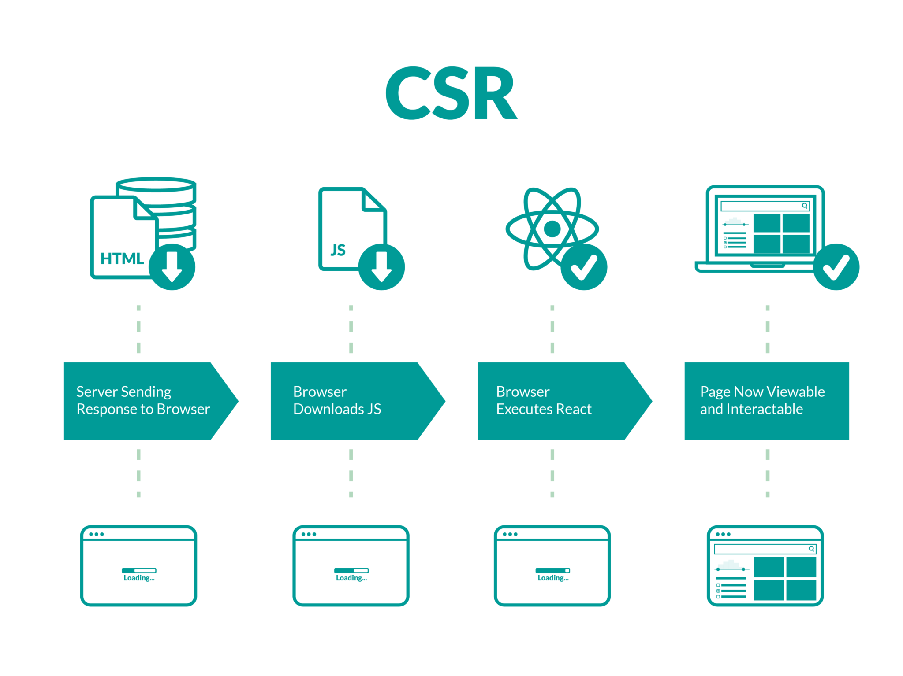
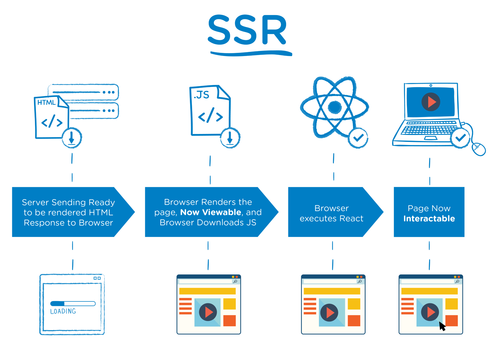

1. [函数式语言主要解决什么问题？什么时候值得使用？](#1-函数式语言主要解决什么问题什么时候值得使用)
2. [Microsoft、Google、Opera、Mozilla 如何从浏览器中获利？](#2-microsoftgoogleoperamozilla-如何从浏览器中获利)
3. [为什么打开 TCP 连接会有明显开销？](#3-为什么打开-tcp-连接会有明显开销)
4. [封装为什么重要？](#4-封装为什么重要)
5. [什么是实时系统？它和普通系统有什么区别？](#5-什么是实时系统它和普通系统有什么区别)
6. [实时系统和堆内存分配之间有什么关系？](#6-实时系统和堆内存分配之间有什么关系)
7. [不可变性如何帮助我们写出更安全的代码？](#7-不可变性如何帮助我们写出更安全的代码)
8. [可变数据和不可变数据各有什么优缺点？](#8-可变数据和不可变数据各有什么优缺点)
9. [什么是 O/R 阻抗失配（Object-Relational Impedance Mismatch）？](#9-什么是-or-阻抗失配object-relational-impedance-mismatch)
10. [设计缓存容量时需要考虑哪些原则？](#10-设计缓存容量时需要考虑哪些原则)
11. [客户端渲染（CSR）和服务端渲染（SSR）各有什么弊端，如何取舍？](#11-客户端渲染csr和服务端渲染ssr各有什么弊端如何取舍)
12. [如何在不可靠的协议之上实现可靠通信？](#12-如何在不可靠的协议之上实现可靠通信)
13. [如果要在你最喜欢的语言里尽量消除空引用问题，你会怎么做？代价是什么？](#13-如果要在你最喜欢的语言里尽量消除空引用问题你会怎么做代价是什么)

---

## 1 函数式语言主要解决什么问题？什么时候值得使用？

函数式编程（Functional Programming）更关心：

- 如何用表达式和函数组合描述计算
- 如何减少共享可变状态
- 如何让代码更容易推理、测试和并发执行

### 它主要解决什么问题

#### 1. 降低状态复杂度

共享可变状态往往是 bug 的主要来源之一，函数式风格通过不可变性和纯函数减少这类复杂度。

#### 2. 提高可测试性和可推理性

纯函数具有：

- 相同输入必得相同输出
- 没有隐藏副作用

因此更容易测试和重构。

#### 3. 更适合数据转换和管道式处理

例如：

- ETL
- 数据分析
- 规则引擎
- 流式处理

### 什么时候值得使用

- 并发和并行逻辑较多
- 数据变换链路复杂
- 希望提升测试性和可组合性
- 领域逻辑中有很多“输入 -> 输出”的纯计算过程

### 但也不是万能的

- 对 I/O 密集、状态机复杂、外部副作用多的系统，纯函数式并不能消灭所有复杂度
- 某些团队如果不熟悉，可能会写出“概念上优雅但维护上困难”的代码

### 面试回答要点

> 函数式语言和函数式风格最主要的价值，是减少共享可变状态、提高可组合性和可推理性。它特别适合数据转换和并发敏感场景，但现代工程中更常见的是多范式混合，而不是纯粹函数式。

---

## 2 Microsoft、Google、Opera、Mozilla 如何从浏览器中获利？

浏览器本身往往不是直接卖钱的软件，它更像：

> 平台入口、默认流量入口、搜索分发入口和生态控制点。

### Microsoft

历史上浏览器帮助微软：

- 强化 Windows 生态地位
- 保护桌面入口
- 推动自家服务与平台能力

今天 Edge 还承担：

- 默认搜索流量导向 Bing
- 与 Microsoft 365、Copilot、企业安全能力联动

### Google

Google 从浏览器获益最直接，因为浏览器能：

- 把默认搜索流量导回 Google Search
- 支撑广告业务数据闭环
- 强化 Gmail、Docs、Drive、YouTube 等生态入口
- 推进 Web 平台标准向有利于其生态的方向演进

### Mozilla

Mozilla 的主要收入长期很大一部分来自：

- 默认搜索引擎合作分成

也就是搜索引擎为成为 Firefox 默认搜索入口而付费。

### Opera

Opera 更多依赖：

- 搜索分成
- 联运合作
- 内置服务导流
- 特定增值服务

### 更抽象的理解

浏览器的商业价值通常不在“浏览器 license”，而在：

- 默认入口控制权
- 搜索分发
- 用户留存
- 数据与生态粘性
- 平台规则影响力

### 面试回答要点

> 浏览器的商业价值更多来自入口而不是软件本身收费。默认搜索、广告生态、云服务导流、操作系统护城河和平台控制力，才是这些公司真正获利的核心。

---

## 3 为什么打开 TCP 连接会有明显开销？

TCP 连接不是“点一下就通”，它要建立一套可靠通信状态。

### 开销主要来自哪里

#### 1. 三次握手

建立连接前要完成：

- SYN
- SYN-ACK
- ACK

这至少引入一个 RTT 量级的延迟。

#### 2. 内核状态和资源分配

双方都要为连接维护：

- socket 状态
- 序列号
- 缓冲区
- 定时器
- 文件描述符

#### 3. 拥塞控制和慢启动

TCP 不会一上来就全速发送，而是逐步探测网络承载能力。

#### 4. 如果上面还有 TLS

那还要额外进行 TLS 握手、证书验证、密钥协商。

### 为什么这在现代系统里仍然重要

因为频繁新建连接会带来：

- 更高延迟
- 更高 CPU 消耗
- 更高握手成本
- 更高资源波动

所以我们才会看到：

- keep-alive
- connection pooling
- HTTP/2 多路复用
- HTTP/3 / QUIC

### 面试回答要点

> TCP 建连的开销来自握手、内核资源分配、拥塞控制初始化以及可能叠加的 TLS 握手。因此高性能系统通常会尽量复用连接，而不是频繁建立和销毁连接。

---

## 4 封装为什么重要？

封装的核心不是“把字段设成 private”这么简单，而是：

> 把变化和细节关进边界内部，只对外暴露稳定、必要的能力。

### 封装带来的价值

#### 1. 降低耦合

调用方不需要知道内部怎么实现，只需要知道如何使用。

#### 2. 保护不变量

对象可以在内部保证自身状态始终合法，而不是任由外部随意改字段。

#### 3. 便于演进实现

只要外部契约不变，内部存储结构、算法和依赖都可以调整。

#### 4. 降低认知负担

使用者看到的是“能力接口”，而不是一堆实现细节。

### 一个简单例子

```csharp
public class Car
{
    private float fuelLiters;

    public float GetFuelPercentage()
    {
        return fuelLiters / 50f;
    }
}
```

调用方关心的是油量比例，不必知道油箱容量、存储字段和计算细节。

### 面试回答要点

> 封装的重要性在于隔离变化、保护不变量和降低耦合。它不是为了“藏起来”而藏，而是为了让系统的外部接口稳定、内部实现可演进。

---

## 5 什么是实时系统？它和普通系统有什么区别？

实时系统（Real-Time System）的关键不只是“快”，而是：

> 必须在规定时间内完成响应，否则系统结果就可能被视为错误。

### 两种常见类型

#### 1. 硬实时（Hard Real-Time）

错过截止时间就可能造成灾难性后果。

例如：

- 飞控系统
- 医疗设备控制
- 工业安全控制

#### 2. 软实时（Soft Real-Time）

偶尔超时会降低体验或质量，但不一定导致系统失效。

例如：

- 音视频播放
- 在线语音
- 游戏交互

### 和普通系统的关键区别

普通系统更关注：

- 平均吞吐
- 平均延迟
- 资源利用率

实时系统更关注：

- 最坏情况延迟（worst-case latency）
- 可预测性（predictability）
- 调度确定性

### 现代补充

“实时”不一定意味着必须使用 RTOS，但如果你真的有严格 deadline，要考虑：

- 优先级调度
- 中断延迟
- GC 暂停
- 动态分配抖动
- 驱动与硬件行为

### 面试回答要点

> 实时系统不是单纯追求更快，而是追求可预测的时间边界。普通系统看平均表现，实时系统更看最坏情况是否仍满足 deadline。

---

## 6 实时系统和堆内存分配之间有什么关系？

实时系统最怕的是 **不可预测延迟**，而堆内存分配常常正是不可预测来源之一。

### 为什么堆分配会成为问题

#### 1. 分配耗时不稳定

堆分配可能受以下因素影响：

- 空闲块分布
- 锁竞争
- 内存碎片
- 分配器策略

#### 2. 释放和回收也可能引入抖动

特别是在带 GC 的运行时里，回收暂停会影响 deadline。

#### 3. 长时间运行后碎片化会放大问题

### 所以实时系统常见做法

- 静态分配
- 启动阶段预分配
- 固定大小内存池
- 避免关键路径动态分配
- 使用可预测的实时内存管理器

### 面试回答要点

> 实时系统关心的是时间可预测性，而堆分配和 GC 往往带来不可预测延迟，所以实时场景通常会限制动态内存分配，转而使用预分配或内存池。

---

## 7 不可变性如何帮助我们写出更安全的代码？

不可变性（immutability）指对象一旦创建，其状态不再改变。

### 它为什么有助于安全和正确性

#### 1. 天然减少并发问题

不可变对象不会被多个线程同时修改，因此更容易做到线程安全。

#### 2. 降低意外副作用

一个函数不会悄悄改掉别人传进来的对象状态，逻辑更可预测。

#### 3. 更容易推理和测试

相同输入更容易对应稳定输出。

#### 4. 有助于权限和审计语义稳定

在安全敏感场景中，不可变配置、不可变权限快照和不可变事件记录都更可靠。

### 但也有代价

- 可能增加对象分配和拷贝成本
- 在超大数据结构场景需要结构共享等技巧

### 面试回答要点

> 不可变性通过消除“运行时被改掉”的可能性，提高了线程安全性、可推理性和状态一致性。它不是绝对免费，但在安全和并发敏感场景中通常非常有价值。

---

## 8 可变数据和不可变数据各有什么优缺点？

### 可变数据的优点

- 更新成本低
- 原地修改高效
- 对某些性能敏感场景更自然

### 可变数据的缺点

- 副作用多
- 并发同步复杂
- 状态变化路径难追踪

### 不可变数据的优点

- 更容易推理
- 更容易并发安全
- 更利于缓存、回滚、事件溯源和函数式风格

### 不可变数据的缺点

- 可能带来额外分配
- 在大对象场景下可能增加内存压力
- 如果语言和库支持差，写起来会显得啰嗦

### 面试回答要点

> 可变数据通常在性能和原地更新上有优势，但带来更高的状态复杂度；不可变数据更利于并发和可维护性，但可能付出额外内存和构造成本。选择应结合问题域和性能边界。

---

## 9 什么是 O/R 阻抗失配（Object-Relational Impedance Mismatch）？

它指的是：

> 面向对象模型和关系模型在表达方式、结构和操作方式上的天然差异。

### 差异体现在哪

#### 1. 对象是图，关系库是表

对象更适合：

- 嵌套结构
- 引用关系
- 行为和状态封装

关系库更适合：

- 表
- 行列
- JOIN
- 集合操作

#### 2. 生命周期和标识方式不同

对象有内存引用，数据库有主键和外键。

#### 3. 继承、多态、聚合映射不自然

很多 OO 特性映射到关系表时会变复杂。

### 它带来的工程问题

- ORM 映射复杂
- 懒加载 / N+1
- 聚合边界不清
- 领域模型和持久化模型互相污染

### 面试回答要点

> O/R 阻抗失配不是 ORM 的 bug，而是对象模型和关系模型本来就不是同一套世界观。解决思路通常不是追求“完美映射”，而是清晰划分领域模型、持久化模型和查询模型的边界。

---

## 10 设计缓存容量时需要考虑哪些原则？

缓存容量设计本质上是在做一个性能 / 成本 / 命中率权衡。

### 要考虑的关键因素

#### 1. 工作集大小（working set）

缓存如果装不下热点数据，命中率就上不去。

#### 2. 边际收益递减

缓存不是越大越好。超过某个点后，再加内存对命中率提升可能很有限。

#### 3. 数据更新频率

更新太快的数据，大缓存未必有意义。

#### 4. 回收策略

LRU、LFU、TTL 等策略会影响相同容量下的效果。

#### 5. 内存预算和系统资源竞争

缓存会和：

- 应用堆内存
- OS page cache
- 其他服务内存

竞争资源。

### 设计方式建议

- 基于真实访问分布测量
- 观察 hit ratio 曲线
- 看 P95 / P99 延迟收益
- 做容量压测和回放测试

### 面试回答要点

> 设计缓存大小时，核心不是拍脑袋定容量，而是理解热点工作集、命中率收益曲线、更新频率和内存预算之间的平衡。缓存容量应由访问模式和测量结果驱动，而不是凭感觉设定。

---

## 11 客户端渲染（CSR）和服务端渲染（SSR）各有什么弊端，如何取舍？

### CSR 的特点



页面主要在浏览器端用 JavaScript 渲染。

#### 优点

- 富交互能力强
- 前后端边界清晰
- 适合复杂单页应用

#### 弊端

- 首屏加载可能慢
- SEO 天生较弱（虽然可通过混合方案改善）
- 前端性能和状态管理复杂
- 对弱网和低性能设备不友好

### SSR 的特点



页面 HTML 在服务端生成，再返回浏览器。

#### 优点

- 首屏更快
- SEO 更友好
- 对内容型站点更自然

#### 弊端

- 服务端压力更大
- 页面间切换在某些场景下不如 CSR 流畅
- 前后端耦合可能更重
- hydration 和同构复杂度不低

### 今天怎么取舍

现代 Web 通常不是二选一，而是混合策略：

- 内容页、营销页：SSR / SSG
- 强交互后台：CSR
- 混合框架：Next.js / Nuxt / Remix 等

### 面试回答要点

> CSR 更适合富交互应用，SSR 更适合首屏速度和 SEO 重要的场景。现代实践通常按页面类型混合使用，而不是把整个站点一刀切成纯 CSR 或纯 SSR。

---

## 12 如何在不可靠的协议之上实现可靠通信？

这其实是在问：

> 如果底层不保证送达、顺序和完整性，应用层怎样补上这些保证？

### 常见机制

#### 1. 序列号

用于识别顺序、乱序和重复包。

#### 2. ACK / NACK

接收方确认是否收到。

#### 3. 超时重传

发送方超时未收到确认则重发。

#### 4. 校验和 / 完整性校验

检测数据损坏。

#### 5. 去重

因为重传可能导致重复送达，接收方要能识别并忽略重复消息。

#### 6. 流控与拥塞控制

避免把接收方或网络压垮。

### 现代工程补充

真正的“可靠”还要说清楚是哪种语义：

- at most once
- at least once
- exactly once（通常是端到端语义，非常昂贵）

### 面试回答要点

> 在不可靠协议上实现可靠通信，核心就是通过序列号、确认、超时重传、校验和和去重机制补齐丢包、乱序、重复和损坏问题。但要先明确你要的可靠语义是什么，因为不同语义的成本差异很大。

---

## 13 如果要在你最喜欢的语言里尽量消除空引用问题，你会怎么做？代价是什么？

这题的核心不是“彻底消灭 null”，而是：

> 让“值可能不存在”这件事在类型、API 和边界上更明确。

### 我会怎么做

#### 1. 默认非空

让引用类型默认不可为空，只有显式声明才允许可空。

#### 2. 用 Optional / Maybe / Result 表达缺失

把“没有值”和“发生错误”区分开。

#### 3. 在边界层尽早校验

例如：

- HTTP 请求
- 配置文件
- DB 反序列化
- 外部 API 响应

#### 4. 使用 Null Object 只处理“合理的空行为对象”

而不是滥用它掩盖真实错误。

### 会带来什么代价

- 类型系统更严格
- 初期代码改造成本高
- 与旧库、旧接口互操作变复杂
- 调用方必须显式处理缺失分支，代码看起来会变长

### 但收益通常更大

- 更少运行时空指针错误
- API 语义更清晰
- 更容易做静态分析和自动重构

### 面试回答要点

> 解决空引用问题的关键不是简单“禁止 null”，而是让缺失性进入类型系统，并在边界处尽早处理。代价是类型更严格、代码更显式，但换来的是更少运行时错误和更清晰的 API 语义。
