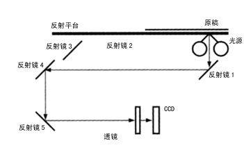

1. [如果你把一面镜子放在扫描仪上，会发生什么？](#1-ru-guo-ni-ba-yi-mian-jing-zi-fang-zai-sao-miao-yi-shang-hui-fa-sheng-shen-me)
2. [假设有一个和你完全一样的克隆人，而他是你的上司，你愿意和他工作吗？](#2-jia-she-you-yi-ge-he-ni-wan-quan-yi-yang-de-ke-long-ren-er-ta-shi-ni-de-shang-si-ni-yuan-yi-he-ta-gong-zuo-ma)
3. [现在请你面试一下我。](#3-xian-zai-qing-ni-mian-shi-yi-xia-wo)
4. [为什么Quora上的回答会比Yahoo Answer上的回答好？](#4-wei-shen-me-quora-shang-de-hui-da-hui-bi-yahoo-answer-shang-de-hui-da-hao)
5. [对手是现代语言，你的任务是要为Cobol辩护，你会如何进行？](#5-dui-shou-shi-xian-dai-yu-yan-ni-de-ren-wu-shi-yao-wei-cobol-bian-hu-ni-hui-ru-he-jin-hang)
6. [10年后的你是什么样子？](#6-10-nian-hou-de-ni-shi-shen-me-yang-zi)
7. [假设你是我老板，我被解雇了，你会如何通知我？](#7-jia-she-ni-shi-wo-lao-ban-wo-bei-jie-gu-le-ni-hui-ru-he-tong-zhi-wo)
8. [我想要重构一个系统，而你想要从头重写。我们来争论一下该怎么弄吧。然后我们反转角色，再争论一下。](#8-wo-xiang-yao-zhong-gou-yi-ge-xi-tong-er-ni-xiang-yao-cong-tou-zhong-xie-wo-men-lai-zheng-lun-yi-xia-gai-zen-me-nong-ba-ran-hou-wo-men-fan-zhuan-jiao-se-zai-zheng-lun-yi-xia)
9. [老板要你对公司撒谎，你的反应是什么？](#9-lao-ban-yao-ni-dui-gong-si-sa-huang-ni-de-fan-ying-shi-shen-me)
10. [如果你可以穿越到以前，你会给年轻时候的你什么建议？](#10-ru-guo-ni-ke-yi-chuan-yue-dao-yi-qian-ni-hui-gei-nian-qing-shi-hou-de-ni-shen-me-jian-yi)

## 1 如果你把一面镜子放在扫描仪上，会发生什么？

对于纸张来说，扫描结果基本上是纸面上内容。纸的特点是：表面粗糙，是漫反射材料。而镜子这类物品是镜面反射，跟纸这种漫反射的物品扫描出来的结果是不一样的。大家可想像一下在阳光下看镜子，如果太阳光刚好反射到眼睛时，感觉到非常亮，当没反射到眼睛里时，看到就是反射物。    但是在扫描仪内，唯一亮的就是光源，其他地方都是黑色，所以要么镜面把光源的光反射到CCD上了，要么把其他黑色的地方反射到CCD上了，因此扫描镜子的结果大抵有两种，要么全黑，扫描亮度几乎0，要么全亮，扫描出来的值近乎255。

从这里可以看到，如果扫描物是纸张，纸是漫反射材料，会有一部光沿图示方向，从反射镜1、4、5到CCD，然后成像，纸上的内容会对光反射率不一样，从而可以实现内容的扫描。    如果扫描物是镜面，光源的光被反射到其他地方了，而不是反射镜1，所以CCD得到的是纯黑色。

## 2 假设有一个和你完全一样的克隆人，而他是你的上司，你愿意和他工作吗？
*todo*
## 3 现在请你面试一下我。
*todo*
## 4 为什么Quora上的回答会比Yahoo Answer上的回答好？
*todo*
## 5 对手是现代语言，你的任务是要为Cobol辩护，你会如何进行？
*todo*
## 6 10年后的你是什么样子？
*todo*
## 7 假设你是我老板，我被解雇了，你会如何通知我？
*todo*
## 8 我想要重构一个系统，而你想要从头重写。我们来争论一下该怎么弄吧。然后我们反转角色，再争论一下。
*todo*
## 9 老板要你对公司撒谎，你的反应是什么？
*todo*
## 10 如果你可以穿越到以前，你会给年轻时候的你什么建议？
*todo*