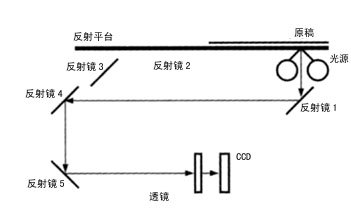

1. [如果把一面镜子放在扫描仪上，会发生什么？](#1-如果把一面镜子放在扫描仪上会发生什么)
2. [如果有一个和你完全一样的克隆人，而且他是你的上司，你愿意和他共事吗？](#2-如果有一个和你完全一样的克隆人而且他是你的上司你愿意和他共事吗)
3. [现在请你来面试我。](#3-现在请你来面试我)
4. [为什么 Quora 上的回答通常比 Yahoo Answers 更好？](#4-为什么-quora-上的回答通常比-yahoo-answers-更好)
5. [如果对手是现代语言，你要为 COBOL 辩护，你会怎么说？](#5-如果对手是现代语言你要为-cobol-辩护你会怎么说)
6. [10 年后的你会是什么样子？](#6-10-年后的你会是什么样子)
7. [如果你是老板，而我被解雇了，你会如何通知我？](#7-如果你是老板而我被解雇了你会如何通知我)
8. [我主张重构，你主张重写。我们来辩论一下；然后反转立场再辩一次。](#8-我主张重构你主张重写我们来辩论一下然后反转立场再辩一次)
9. [如果老板要求你对公司撒谎，你会怎么做？](#9-如果老板要求你对公司撒谎你会怎么做)
10. [如果能回到过去，你会给年轻时的自己什么建议？](#10-如果能回到过去你会给年轻时的自己什么建议)

---

## 1 如果把一面镜子放在扫描仪上，会发生什么？

这个问题考察的是你能否把物理直觉讲清楚，而不是死记答案。

### 简化解释

普通纸张是 **漫反射** 材料，扫描仪打出的光会向多个方向散射，其中一部分会被光学系统接收，所以能形成图像。

镜子则主要是 **镜面反射**，光会按照特定角度反射，而不是像纸那样散开。

### 所以会发生什么

在大多数平板扫描仪里，镜子通常不会像纸一样“正常成像”。更常见结果是：

- 大片区域非常暗
- 某些角度下可能出现很亮的反射区域
- 很难得到“镜子表面本身”的内容

### 为什么

因为扫描仪的光学路径是围绕漫反射目标设计的，而不是围绕镜面反射目标设计的。

### 面试回答要点

> 扫描仪更适合扫描会漫反射的物体。镜子会把光按特定方向反射走，所以通常不会像纸一样形成正常图像，结果往往是异常偏黑或局部强亮。

---

## 2 如果有一个和你完全一样的克隆人，而且他是你的上司，你愿意和他共事吗？

这是一个典型的自我认知题，不是脑筋急转弯。

### 一个成熟回答的思路

我会愿意，但我也会意识到这既有优势也有风险。

#### 可能的优势

- 沟通成本低
- 工作节奏和标准更容易对齐
- 对问题的判断可能更接近

#### 可能的风险

- 缺少视角多样性
- 相同盲点可能被放大
- 如果我有坏习惯，对方大概率也有

### 更好的延展

我更看重的不是“上司像不像我”，而是：

- 是否值得信任
- 是否能帮助团队做更好的判断
- 是否能补足团队能力结构

### 面试回答要点

> 我愿意，但不会把“相似”当成天然优势。高效合作需要信任和判断，也需要差异化视角。这个问题本质上考察的是自我认知和对团队多样性的理解。

---

## 3 现在请你来面试我。

这题考察的是你能否站到面试官视角，理解招聘的真正目标。

### 我会怎么设计这场面试

我会从四个维度来评估：

#### 1. 技术判断

- 请讲一个你做过的系统设计决策
- 你为什么选这个方案，而不是另外几个？
- 后来证明这个决策对还是错？

#### 2. 问题排查能力

- 如果线上延迟从 100ms 突然变成 2s，你会怎么排查？
- 你如何区分应用问题、数据库问题、网络问题和下游依赖问题？

#### 3. 工程成熟度

- 你如何保证代码上线质量？
- 你如何看待测试、可观测性、回滚和技术债？

#### 4. 协作与成长

- 你如何处理意见分歧？
- 最近半年你在哪个方面成长最快？
- 你最愿意和什么样的人一起工作？

### 我会特别关注什么

- 是否结构化表达
- 是否能讲清权衡
- 是否有真实经验而不是背概念
- 是否能诚实面对错误和不确定性

### 面试回答要点

> 这题的重点不是列题库，而是体现你知道“面试真正要识别什么”：技术深度、问题解决能力、工程判断、协作能力和成长潜力。

---

## 4 为什么 Quora 上的回答通常比 Yahoo Answers 更好？

这个问题本质上是在问：

> 一个知识社区的内容质量，由哪些机制决定？

### 常见决定因素

#### 1. 激励机制

如果平台奖励高质量、可验证、可追溯的回答，内容质量通常更高。

#### 2. 身份机制

真实身份、专业背景和长期声誉会提高回答者的责任感。

#### 3. 排序和推荐机制

高质量平台通常更擅长把好内容放到前面，把噪声压下去。

#### 4. 社区文化

如果社区鼓励深入、专业和建设性讨论，平均质量就会更高。

#### 5. 反馈闭环

点赞、评论、编辑、举报、折叠等机制都会影响内容生态。

### 更抽象的理解

知识平台质量往往不是“用户更聪明”，而是：

- 进入门槛
- 声誉系统
- 排序算法
- 社区规则
- 管理执行力度

共同塑造的结果。

### 面试回答要点

> Quora 这类平台内容质量更高，通常不是偶然，而是因为它在身份、激励、排序和社区文化上，更有利于优质内容持续积累。平台机制最终决定了社区会生产什么样的内容。

---

## 5 如果对手是现代语言，你要为 COBOL 辩护，你会怎么说？

一个好的回答不是硬吹 COBOL，而是承认上下文。

### 我会怎么辩护

#### 1. 它在特定领域极其成功

COBOL 长期服务于：

- 银行
- 保险
- 政府核心系统
- 大规模批处理

如果一门语言几十年后仍支撑关键业务，它至少说明：

- 它在那个问题域里非常实用
- 它的稳定性和可维护性被验证过

#### 2. 它体现了“业务可读性优先”

COBOL 设计目标之一就是让业务处理逻辑接近自然语言，这在大型商业系统里很有价值。

#### 3. 技术选择不能脱离迁移成本

现代语言可能更优雅，但：

- 重写成本高
- 业务风险大
- 核心逻辑迁移可能出错

所以“老”不等于“该立即替换”。

### 但我也不会回避它的局限

- 生态老化
- 人才供给不足
- 与现代工程工具链整合不如新语言方便

### 面试回答要点

> 为 COBOL 辩护，不是说它比现代语言全面更好，而是承认它在高稳定性商业批处理领域长期创造了巨大价值。真正成熟的工程判断，不会只按“新旧”给技术贴标签。

---

## 6 10 年后的你会是什么样子？

这题看的是长期视角、成长方向和价值观。

### 一个成熟回答应体现什么

- 有方向感
- 不空泛
- 也不把未来说得过于确定

### 示例思路

#### 技术上

我希望自己不只是“会用很多工具”，而是：

- 能主导复杂系统设计
- 能做关键技术判断
- 能帮助团队提升工程质量和交付能力

#### 职业上

我不执着于 title，但希望自己成为：

- 值得信任的资深工程师 / 架构师 / 技术负责人
- 能把复杂问题拆清楚的人
- 能培养别人的人

#### 个人上

我希望仍然保持：

- 学习能力
- 好奇心
- 稳定的生活节奏
- 工作与生活的平衡

### 面试回答要点

> 10 年后的目标不必是某个固定职位，而应体现你希望成为什么样的专业人士：更强判断力、更大影响力、更能带人，也更能长期稳定地成长。

---

## 7 如果你是老板，而我被解雇了，你会如何通知我？

这是一个职业伦理和管理成熟度问题。

### 正确方向

如果必须解雇，我会尽量做到：

- 尊重
- 直接
- 清晰
- 体面
- 合规

### 我会怎么做

#### 1. 选择合适场景

私密、及时，不在公开场合，不拖延到最后一刻。

#### 2. 直接表达决定

避免模糊措辞和绕圈子，让对方清楚发生了什么。

#### 3. 解释边界

在合适范围内说明原因，但不做羞辱式展开，不把对话变成辩论赛。

#### 4. 提供后续支持信息

例如：

- 补偿和流程
- 设备交接
- 人力资源联系人
- 推荐信或职业支持（如果适用）

#### 5. 保持尊重

这类对话的目标不是赢，而是把伤害降到最低，并保持人的尊严。

### 面试回答要点

> 解雇通知最重要的是尊重和清晰：尽快、私密、直接、合规地沟通，并给出后续安排。管理成熟度很大程度体现在你如何处理最困难的人事时刻。

---

## 8 我主张重构，你主张重写。我们来辩论一下；然后反转立场再辩一次。

这题考察的是：

> 你能不能理解双方立场的合理性，而不是执着于单一答案。

### 站在“重构”立场

我会说：

- 风险更可控
- 可以渐进推进
- 业务不中断
- 能保留现有系统中被验证过的业务逻辑
- 更容易边改边学

### 站在“重写”立场

我会说：

- 原系统架构前提可能已经失效
- 技术债可能高到局部修补不再划算
- 某些关键能力可能必须重建而不是修补
- 新系统有机会重新定义边界和模型

### 反转立场时的关键

真正优秀的回答不是“我其实只相信其中一个”，而是：

- 能指出重构的盲点：拖得太久、边改边烂、局部最优
- 也能指出重写的盲点：高估自己、低估迁移、失去业务细节

### 一个更成熟的结论

很多现实方案其实是：

- 不是纯重写
- 也不是纯原地重构
- 而是增量替换、绞杀者模式、模块化迁移

### 面试回答要点

> 这题没有标准答案，关键在于你能否看见重构和重写各自的收益、风险和适用边界。成熟做法往往不是极端二选一，而是根据系统状态选择渐进替换路径。

---

## 9 如果老板要求你对公司撒谎，你会怎么做？

我的底线是：

> 我不会主动参与欺骗，尤其是涉及法律、合规、财务、客户信任或安全问题时。

### 我会怎么处理

#### 1. 先澄清问题

有时候“撒谎”其实是沟通含糊、表达不完整或管理层压力下的错误措辞，需要先确认真实意图。

#### 2. 尝试提供诚实但更合适的表达方式

例如：

- 不隐瞒事实
- 但用准确、边界清晰的方式表达当前状态

#### 3. 明确底线

如果要求确实是不诚实、误导甚至违法的，我会明确拒绝。

#### 4. 必要时升级处理

如果问题严重，我会通过：

- 上级更高层
- HR
- 合规 / 法务 / 举报机制

寻求支持。

### 面试回答要点

> 面对要求撒谎的情况，专业做法不是情绪化对抗，而是先澄清、再提供诚实替代方案，并在必要时明确拒绝和升级处理。职业操守和法律边界不能为了短期压力而牺牲。

---

## 10 如果能回到过去，你会给年轻时的自己什么建议？

这题看的是反思能力，而不是煽情能力。

### 我会给自己的建议

#### 1. 更重视基础

框架会变，但：

- 数据结构
- 网络
- 操作系统
- 数据库
- 系统设计

这些长期回报更高。

#### 2. 更早练习表达和协作

职业发展不只靠写代码，还靠：

- 说清问题
- 写清设计
- 推动共识
- 处理分歧

#### 3. 不要把忙碌误认为成长

很多时候真正重要的是：

- 是否在做高复利的事
- 是否在建立长期能力
- 是否在保护身体和注意力

#### 4. 更勇敢地接受不确定性

很多机会不是因为准备完美才值得抓住，而是因为值得，所以边做边学。

### 面试回答要点

> 这个问题最好的回答通常会体现你已经从过去的经验里提炼出可迁移的方法论，而不仅仅是泛泛地说“要更努力”。
